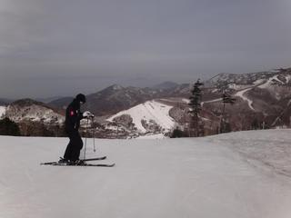
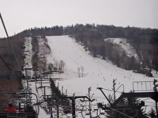
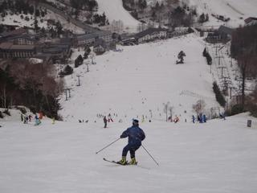
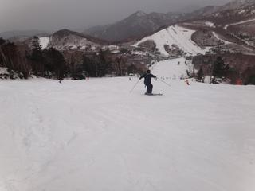
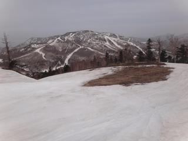

# 5月3日の志賀高原スキー場は

📅 投稿日時: 2011-05-03 21:26:37

🏷️ カテゴリ: [2011スキー滑走日記](ca488c98cfb9169941c3e73770dcefb56.md)

朝は晴れましたねー

その後はうす曇って感じでしたが．

あ，この3連休．一の瀬ファミリーは朝6時から8時まで

早朝スキーやってます．

緩斜面のペアリフトのみですが．

一般営業は8時半からってことになってますが．

実際は8時15分ごろからクワッドリフトに乗れました．

ちょいと早めに始めてるようです．

気温はこの時期にしては比較的低めでしたね～．

朝は，水溜りに氷が張っていたので，氷点下まで落ちてた

みたいで．

んで，当然．

朝は固めです．

しっかり固いです．

9時ごろには，ゲレンデの下半分が緩み始め，

9時半には，メインバーン上も緩み始めましたね…

で．今日は．

お客さんが多かったですね～．

あ，リフト待ちが出るほどではないです．

待っても1分待たない程度．

でも．

ゲレンデは，昨日までみたいに気ままに大回りが

できる状況ではなかったです．

というわけで．

10時半ごろには，メインバーン上部は，かなり

でこぼこした感じになってきました．

でも，気温がこの時期にしては低めなので．

壊滅的にどぼどぼになることはなく．

ちょっとあれたバーン状況．

で．

パーフェクターも滑ってみましたが．

ここはコース入り口にちょっと土が出てます…

一の瀬～高天ヶ原の間で，土が出てるのはここだけ．

うーん．やっぱり今年は雪が多い．

しかし．

パーフェクターは全面非圧雪．

でこぼこです．

す，滑りにくい…

で．この日は昼に切り上げたので．

午後の状況はわかりませんが．

とりあえず，人がちょいと多めという以外は．

この3連休も，かなりのGoodコンディションは

間違いないです．
