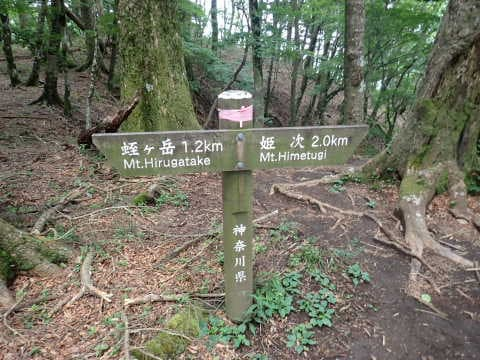

# 蛭ヶ岳まで全力で往復してみた，その2…山頂到着！最初と最後が急な山だけど，中間点は緩くて楽．

📅 投稿日時: 2022-09-15 03:55:27

ヤバい…

仕事が終わらない（涙）

そして土日も出張だったので，あんまり

睡眠時間が取れてないし，疲れが

取れてない…（泣）

すごい眠い…

でも．

こんな時間になっているというのに

記事を書いてしまう自分．

今日は記事を書けたけど，

（でも，写真は多めながら文章は

いつもより短め…）

明日は書けるかなぁ…

とりあえず，蛭ヶ岳レポート，続きです！

ーー

ってなことで．

林道から登山道に入りますが…

これが八丁坂ルート．

林業用のモノレールかな？

のレールに沿って，そこそこの

斜度がある斜面をえんえん登ります．

この八丁坂ルート，

3kmの間に標高600mから1340mへ，

約740m登るので，そこそこの斜度が

続きますが…

幅は広いし，斜度はありながらも

登りやすい道ですね．

この，スタートから八丁坂分岐までが

このコースで一番標高差があるところで，

標準コースタイムでは駐車場から

八丁坂分岐まで3時間14分．

はっきり言って，青根スタートの

蛭ヶ岳．この取りつきの八丁坂が

一番きついところ．

今回は，午後に仕事をせねばならず，

午前中に帰るという使命（？）を負っているので．

淡々と休まず登り続け…

1時間以上歩いたころ，登り坂が終わり，

朝日が差し込む，開けた場所に出ました！

ってなことで．

スタートから約1時間半，

6:15には八丁坂分岐到着！

一番苦しい，八丁坂分岐までの

道を歩き終えました…

ここからは，歩きやすい緩やかな斜度の

木道がしばらく続きます…

ここら辺は平坦なので，スピードアップ！！

八丁坂分岐から姫次まで，距離は1kmちょい

ありますが…

この近辺は平らなので楽‘です．

八丁坂分岐から10分ちょい，6:27には

姫次へ到着！

ここにはベンチとかがあるので．

スタートから2時間弱．

ここでちょいとひと休み…

そして姫次から先は，時折緩やかに

下ったりしながら，ほとんど標高を

登らなくていい平穏なルートが

続くので…かなりいいペースで歩けます．

…これ，コースタイムは長いけど．

丹沢山よりは楽だな…

姫次2km地点を，姫次通過から約30分弱，

6:55に通過！

ただ．

このあたり．

「ボッチの頭」から先は，

また登り坂が始まります…

ここまでくれば，あと山頂まで1kmを

切っていて，見晴らしも良くなってきて

ラストスパートと言えるん

だけど…

ところどころ，かなり急な階段とかが

現れて．

この山，最後に結構体力を使うな…

そして，山頂に近づくにつれ．

残念ながらガスが出てきて．

…山頂が見えない（涙）

でも．

最後の階段を登り切って…

ゴール！！

7:28に，蛭ヶ岳山頂に到着しました！

…でも．

ガスで何にも見えない…（涙）

（続く）

## 💬 コメント一覧

### 💬 コメント by (スシネコ)
**タイトル**: Unknown
**投稿日**: 2022-09-15 08:43:35

おはようございます。相変わらず、お仕事が激務というかご無体というか、尋常ではない世界のご様子。心中お察し申し上げます。

私は蛭ヶ岳に行くときは早戸川沿いから入るのですが林道が長いのが難点でした。青根まで行くのが億劫でしたがこのルートはいいですね。神奈川に戻ったら使わせていただきます。

このルート、ヒル出没はどうでしょうか。なにせこれが苦手なもので･･･

### 💬 コメント by (Skier_S)
**タイトル**: ＞スシネコさま
**投稿日**: 2022-09-16 01:48:54

この2週間はちょっと仕事がきついです…

あと2週間，きつそうな感じ．

3連休2回とも，全部仕事でつぶれるかも（涙）

青根ゲート前駐車場は良いですよ．

背の高い草が生い茂ってる場所ではないので，ヒルの心配はそれほどなさそうです…

