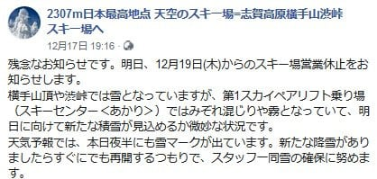
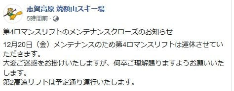
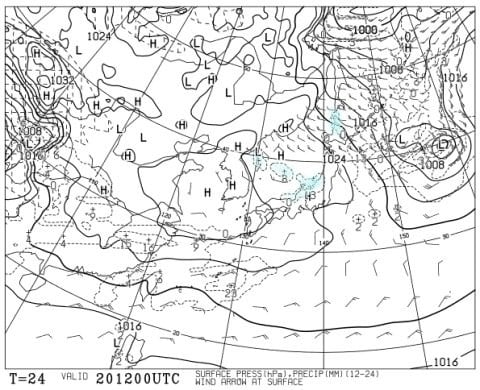
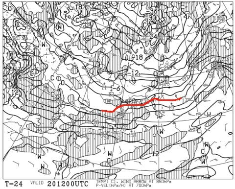
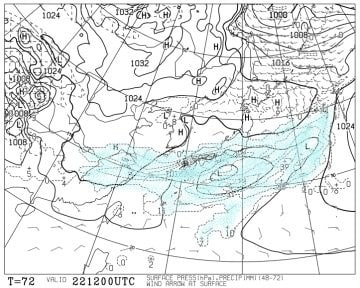
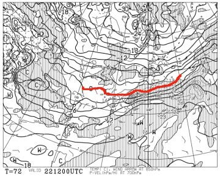
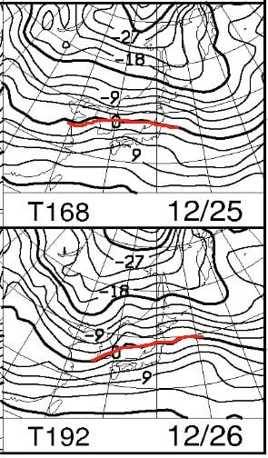
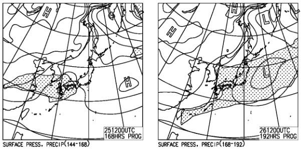
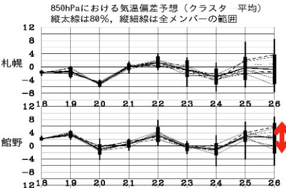

# 志賀高原はもしかすると20日にちょっとだけ雪が積もるか？…そして，22日日曜も午後は雪降りになりそう（そんなに積もらないけど）

📅 投稿日時: 2019-12-20 03:04:01

🏷️ カテゴリ: [日記](cc4b5682fb7b8b144980957a978653fb0.md)

なんということか…っ！！

17，18日の雨でやられてしまい．

横手山が営業休止になってしまったようです（涙）

もう，12月も下旬というのに…っ！！

（[横手山Facebook](https://www.facebook.com/yokoteyama2305/?ref=py_c)より）

そして．

焼額も20日は第4ロマンスが動かないようで．

メンテナンスのための営業中止といってますが．

…まさか，雪不足だからじゃないよね…（泣）

（[焼額山Facebook](https://ja-jp.facebook.com/yakebitaiyama/posts/2591754424253221?__xts__[0]=68.ARAcwZzVuUUeJD4JH_za5RofXf8oaddLU-V1tzsbwjWM8gW3B3phd1G8UPMsa9dssU6n-u8z38TMfu1G2b2t9mmyKYuo8_gIsM1tf9xIU0x0EBrzhtKHaU8Ho1P3wjL1AECh7gBi5X4DjbsO3hxd_HcWxDbz5CtMUP3NDq3ZMsU7cxePjofHpvm5ei80Pdsk8arwGhtyI_QZEoDY8mt91snpgJ5XFLY9_XVvjXa-UGQUVtjVU_0wjmhLtsrKbNoE6Zev0blvZchaVEC0a1reCzP0LG_p_i6TB6FKNaG7TdyJM_mK20F9vuBjx4KM9sGD9e3XWDtPa50UMgJEm9LBwQ&__tn__=-R)より）

とりあえず．

本日木曜は，予想通り

雪は1mmも積もらなかったようです（泣）

…でも．

曇の予想だったのが，今日は一日晴れだったようで．

そこは予想外しましたが…

でも，雪が降ってないということは

変わらず．

ゲレンデ状況は，やはり先週より悪化しているようです（激涙）

あぁ…

もう，12月も下旬というのに．

なぜ，だんだんコンディションが

悪化していくんだ！？？

で．

20日（金）の天気図を見てみると…

うむ？水色の降水域が，昨日の予想図より

ちょっと広がって，志賀高原にまで

近づいているように見えますよ…？？

一応，850hpa気温図を見ても

赤い0℃線は志賀高原よりかなり南まで

下がり，気温は冷えてくれそうなので．

昨日段階では，20日の予想は

　天気は曇り時々雪がぱらつくが，

　積雪の気配全く無し（泣）

と書きましたが．

これを，

　天気は曇り時々雪がぱらつき，

　午前中にはちょっとだけ積もるかも…

と修正しますっ！！

…でも．

本当にギリギリの風向き．

西風すぎる…

もう少し風向きが北に回ると，

10cmくらいは積もってくれそうなんだけど．

逆にちょっとでも西に回ると，

0cmです．積もりません．

…ってな感じで．

20日に，志賀高原で積雪があるかどうかは，

かなりきわどいところ．

風向きがわずかでも北に回るか，

西に回るかで全然積雪が変わります．

…ここは必死に踊って，風向きを

北向きにしたいところ…

そして．

21日土曜の予想は変わらず．

　朝にもしかしたら2-3cm積もってるかも？

というレベルの積雪．

昼間は全く積もりそうにありません（泣）

しかし．

22日日曜の予想がちょっと変わりました．

地上天気図を見ると…

日本海側に降水域がかかる冬型

パターンではないですが．

南岸低気圧による降水域が

志賀高原にかかってます！

これ…気温が高いとヤバいんだけど．

850hpa気温図を見ると，赤い0℃線は

なんとか志賀高原より南なので．

雪です．

液体ではなく，雪がふりますっ！！

…ただ．

冬型の雪と違って，ウェアに着くと

びしょ濡れになっていくような

ちょいと湿り気味の雪だと思いますが…

とりあえず，

22日（日）は，午前は曇り，午後から湿った重い雪が降り始める．

　リフトストップまでに5～10cmくらい積もるかも…？？

という感じの天気です！

…が．

全然まだ積雪が足りない…

冷え込みだ．

これから，冷え込みが来るのか…っ！？？？

と．

この先の天気図を見ると…

…

…

…え？？

な，なぬ～っ！！？？？

来週火，水の25，26日．

また，0℃線が志賀高原より北に

上がっちゃってるんですがっ！！？

これ，降ると雨ですけどっ！！？？

…恐る恐る地上天気図を見てみると…

…

…

…（涙）

25日はいいのですが．

26日は，網掛けの降水域が志賀高原にかかってます（涙）

この天気図だと．

26日は雨になりそうです…（泣）

でも．

まだ，26日の予想850hpa気温．

この図で示すように，ばらつきが大きく．

運が良ければ，平年並みの気温に

なってくれそうなので．

まだ，分からない．

26日，空から降ってくるのが雪なのか，

液体なのか．

まだ，分からない．

とりあえず．

20日が北風になって，ドサドサ雪が降り．

そして，26日も液体じゃなく固体が降るかどうか．

皆さんの行動にかかっています．

そうです．

雪が降るかどうかなどという

受け身ではいけません！

雪を降らせるのです！！

このBlog読者の，止まることを知らない

猛烈に強烈かつ熱烈で激烈な，

冷え冷え降れ降れ積もれ積もれ踊りで，

スキー場に雪を降らせるのですっ！！！！！！！←ダメだ．ヤバい宗教と化してきた…

## 💬 コメント一覧

### 💬 コメント by (ジョナサン)
**タイトル**: おはようございます
**投稿日**: 2019-12-20 05:59:49

私のホームゲレンデはまだオープンすら出来ない状態です(涙)イエティから始まり毎週滑ってきたのですが、年末最悪スキー場難民になりそうです。私もスーパー冷え冷え降れ降れ積もれ積もれ踊りを徹夜で踊ります！！はい、決して信者ではありませんよ(笑)

### 💬 コメント by (つーちゃん)
**タイトル**: Unknown
**投稿日**: 2019-12-20 13:10:12

26日の気温は、お前達の行い次第だと言わんばかりの振れ幅ですね

日頃の行いには気を付けなくては、、、

流石に年末までには、十分降るだろうなんて思ってまししたが

なんか嫌ーな感じがしますね

いつになったらSさんの生家1ゴンが動くのやら(T_T)

### 💬 コメント by (Skier_S)
**タイトル**: 雪が降ってほしい…
**投稿日**: 2019-12-20 23:38:48

＞ジョナサンさま

あら．

ホームゲレンデまだオープンせずですか…

志賀高原はなんだかんだ言って，どれだけ雪が少なくても

どこかそこか滑れるところはありますから．

一体いつ1ゴンが動くのか…

また激しく踊り続け，雪を読んでやって下さい！！

### 💬 コメント by (なるなる)
**タイトル**: Unknown
**投稿日**: 2019-12-20 23:55:15

過去、何だかんだあっても、この週末はほぼ全山滑走可能な状況だったような…

今年はダメですね…

前々から調整して、休みも確保して明日から3連休で志賀高原行く予定だったのに…(激涙)

なんだかなぁと、飲みに行ってしましました。もぅヤケ酒です。

そうは言っても志賀高原が大好き。S様には敵いませんが…

もぅ雪が無くても良いじゃないか、志賀高原に行ければ良いじゃないかと、明後日行きます。

お会いできたら、ご挨拶させていただければと思っています。

### 💬 コメント by (Skier_S)
**タイトル**: ＞なるなるさま
**投稿日**: 2019-12-21 23:56:41

もう，今の志賀高原．かなりやばいです…

土曜から3日間の予定だったんですね…

ご愁傷さまです．

あまり滑れるところはないですが，日曜ぜひお越しください．

お待ちしてます（笑）．

### 💬 コメント by (Skier_S)
**タイトル**: ＞つーちゃんさま
**投稿日**: 2019-12-22 00:01:12

すみません．つーちゃんコメントに回答忘れてました（謝）

しかし，今日のヤケビひどかったですね…

いつになったらイチゴンが動くのか．

大みそかまでイチゴンが動かなかったら，

これまでの最悪記録です（涙）

でも，そのくらい行きかねない感じ…

