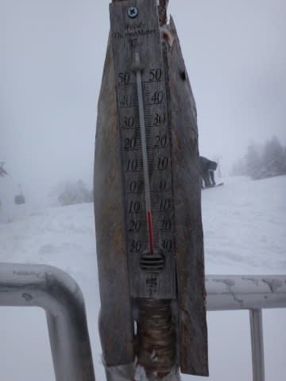
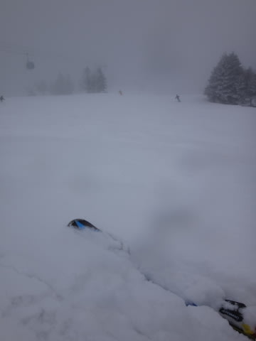

# 4月6日の志賀高原詳細…うはははは！4月なのにぱふぱふ軽雪だぁっ！！！！

📅 投稿日時: 2014-04-08 03:24:12

🏷️ カテゴリ: [2014スキー滑走日記](c992167609b6415052179ee69ea1ea7d8.md)

えー．

新しい職場がかなりご無体な今日この頃．

皆様いかがお過ごしでしょうか．

何時に更新してるんだ？

って感じですが．

そこは根性で．

この日曜日の志賀高原の詳細レポートをば…

で．

昨日の速報版で書いた通り．

たぶん，神様がカレンダーをめくり忘れてて，

2月だと勘違いしたんじゃないか…

って一日でしたっ！！

まず．

朝．

うっすらと5cmほど，すごーい軽い，冷え冷えの

いい雪が積もってますな～

そして，ゲレンデに出ると…

うむ．

昨日ほど低くないとはいえ，マイナス5度以下．

この時期としては，十分な冷え込みですな．

朝イチは，薄日が差す中…

今日も，超快適デリシャスよだれじゅるじゅる

ラッキー大回りバーンがお出迎え！

いい感じで冷えて締まってます！

エッジが気持ちよく食い込み，快楽の大回りが

堪能できる，最高コンディション！

今日って，4月？

4月にこんなにいい雪質の圧雪バーン滑れていいんだっけ？？

…って喜んでいたら．

30分ほどで太陽さんは雲にお隠れあそばし…

そのあと，なんだか降ってきちゃったんですが！

それも，激烈に冷えた，いい感じの雪が降って

きてるんですけど…！！

おかげで，ゲレンデは冷え冷えいい雪が

パフパフに積もってきてるんですが…

4月に，こんなに雪質がよくていいの？？

んで．

ゲレンデは，午前中にはちょっと人が多かったけど…

当然，いつもの日曜のパターンで．

昼にはみんな帰ってしまい，昼からはがらがらになってくるわけで．

またもや，ゲレンデは貸し切り状態．

そして，貸し切り状態のゲレンデは，さらに雪の勢いが

ましてきて…

そして．

午後のほうが気温が下がってるんですけど？

4月の昼間に，マイナス10℃ってどういうこと？？

それで，だ．

人がいなくて．

冷え冷えの雪がものすごい勢いで降っているということは．

ゲレンデには最高の雪が，誰にも散らされることなく

積もり続けるということで．

なぜ，4月の午後に．

ゲレンデが冷え冷え雪質の

ブーツパフになるのだ！？

なぜ，4月の午後にパウダーが滑れるのだ？？

…東京では，もう桜が散り始めているというのに．

なにか，季節を間違えてないかい？？

さらに．

午後にはうっすらと日が射すタイミングも…

4月に，こんな最高のコンディションで滑れて

いいんでしたっけ？？？

…って感じで．

この日はほぼ一日雪が降り続けたけど．

人も少なく，リフトストップまで，こんなありえない

雪で滑れたという…

信心深いスキーヤーに対する神様からのプレゼント

としか思えない，たいへんステキな一日を過ごしたのでした…

しかし，しかしだ．

第1ゴンドラがこの日で営業終了して．

こんな状況のゲレンデがこの日でクローズなんて．

もったいないお化けが5億2000万人くらいの団体になって．

焼額スキー場を襲ってきたとしても．

私としては「当然だよなぁ…」と．

黙って見過ごしてしまいそうな感じではある．

＃というより，もったいないお化けと一緒に焼額を襲いたい気分

とりあえず．

この日で．

わが愛する焼額第1ゴンドラの，

今シーズンの営業が終わったのでした…

ありがとう～第1ゴンドラ！

また来シーズン！！

## 💬 コメント一覧

### 💬 コメント by (Sora)
**タイトル**: 今週末予想いかがでしょうか
**投稿日**: 2014-04-08 20:46:42

初めまして。志賀高原レポに特化しているのがユニークですねー。しかも、週末天気予報を突っ込んでレポするところも、私の関心事とぴったりです。ただ、スキーシーズンも終わり近くになって、当ブログに出会ったのが残念です。

先週は、私も晴れ/雪になるのではと見込んでましたが、用事で志賀に行けず。SkierSさんのレポでよけい残念さが増しましたよ（笑）。このままでは春スキーをせずに終わってしまうので、今週末の金、土、日には出動するつもりでいます。晴れの予想だと思いますが、現地の雪質はどの程度まで緩むでしょうか。

### 💬 コメント by (Skier_S)
**タイトル**: Soraさま
**投稿日**: 2014-04-09 00:56:57

初コメントありがとうございます．

ようこそ，この駄文置き場へ…

志賀高原の天気予想がツボって，

結構志賀に行かれるんでしょうか？

この週末は，金曜から行くんですか？？

…いい読みですね～．

金曜朝はいい雪が降ると思いますよ～！

午前中は雪が降り，この時期にしては

恵まれてるかと．

雪がやむのは昼か夕方か，まだ微妙．

…気温が終日氷点下なので，下地は

アイスバーンでしょうか…

土曜は晴れて，朝はアイスバーン．

昼近くまで気温は低めですが，

昼頃には緩み，午後は緩んだ春の雪に．

でも，壊滅的にザブザブにはならなさそう．

日曜は晴れで，この日も朝はアイスバーン．

この日も昼近くには日差しで雪が緩み，

昼からは春の雪でしょう…．

土日とも，4月にしては気温が低いので，

雪に板が潜ってしまうほどのザブザブには

ならないと思うのですが…

まだ，日曜の気温は予想ブレが大きいです．

ってことで．

また，水曜か木曜の夜に天気予想の記事

書きますので，よろしくです～

### 💬 コメント by (Sora)
**タイトル**: 今晩は
**投稿日**: 2014-04-09 18:20:40

金曜朝は雪が？！　非常に心強い見通し、ありがとうございます。

志賀高原は、降雪が早く残雪が遅いので、初スキーと春スキーで出動する場合が多いです。今年は2月途中で行きましたが。

はい、木曜日の夜SAで車中泊で、金曜日の午前中から滑り出す予定をしてます。で、SAでどれだけ早起きするかは、SkierSさんの直前予報で決めたい（笑）と思ってます。楽しみにしてます。

### 💬 コメント by (Skier_S)
**タイトル**: Soraさま
**投稿日**: 2014-04-10 00:26:48

うーむ．

雪の降り始めと降り終わりが

予想より早まり，木曜の夕方には

やんでしまいそうです…

でも，金曜朝はアイスバーンの上にうっすら

圧雪，ってところかな～．

朝イチ勝負です．

昼には下地のアイスバーンが出て

カリカリになっちゃいます．

金曜昼は晴れるので，日の当たるところは

昼間は緩むけど…

日が当たらないところは終日固いまま，

夕方にはカリカリバーンになります．

また，直前に詳細予想しますので～！

