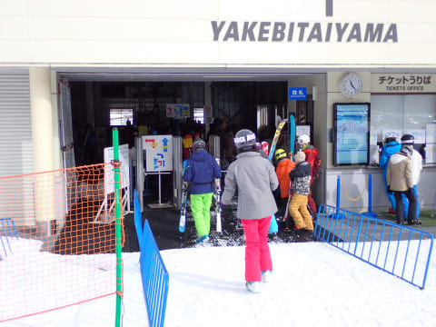

# 2024/1/3，正月休みラストの志賀高原焼額山スキー場，速報レポート…積雪はなく，オープンしたコースも雪が薄くなってきたところも（涙）．正月休みで一番混まなかった

📅 投稿日時: 2024-01-04 02:18:47

🏷️ カテゴリ: [2024スキー滑走日記](c453f687e8a0f05679e95831d0a02cd0c.md)

ということで．

6日間の長きに渡る（体感は一瞬だったけど）

志賀高原滞在を終えて，

先ほど帰宅しました…

…で．

今日も帰宅が遅かったので，

本日の志賀高原，速報モードにて…

えー．

まず．

今日はちょっと都合により，

ゲレンデ出動が朝11時ごろと，

営業開始から2時間半後という，

屈辱のスタートでしたが…

昨日はかなり人が多かった11時でも，

第1ゴンドラは待ちがゲート内に

収まっていて…

3が日ラストデーは，もう帰っちゃった

人が多いのか，昨日までに比べかなり

人が少ない感じ…！

ゲレンデの人口密度も，昨日までに

比べると少ないよ！

第2高速も，第2ゴンドラも，今日は

そこまで待ちが長くならず…

気温は最高気温が0℃程度と高めだった

ものの，日が差さなかったので雪は

そこまでひどくならず…

午後まで比較的締まった雪で，

かつ人が少なめというのもあり，

バーンはそこまでひどく荒れることなく，

フラット目のバーンが夕方まで続きました！

最後まで大回り板で行けるほど，バーンは

いい感じのコンディションだったんですが…

ただ．

1/2，1/3の2日間，まったく積雪がなかった

ので…

人工降雪がないバーンは，ところどころ

うっすら地面が見えかけてきているところが

出てきました…（涙）

GSコースも，オリンピックコースと

分かれる部分付近の，ゴンドラを

くぐるあたりとか，

オリンピックコースへ合流する

あたりに，数か所ヤバいところが

あったし…

パノラマコースも，2高降り場に向かう

落ち込み部分，ところどころわずかに

雪が薄いところが…

そのほか，白樺コースもところどころ

雪が薄かったし．

ブナコースとの分岐直後は

石も浮いていて危ないところも（泣）

…ってな感じで．

雪が薄いところがあるのは残念ながらも…

今日はバーンもフラットで，人もいなくて

いい感じで飛ばせる，かなり楽しい感じ！！

ゴンドラも待ち時間が少なく，

効率よくグルグルできたし…

ゴンドラ営業終了時間まで，

今日もしっかり滑りました～！！

で．

この後の志賀高原ですが．

…明日，4日の朝までに，10～15㎝ほど

積もってくれるかな？？

…その後は，7，8日がそこそこ冷え込んで，

7日にはまた積雪がありそう…！

これからしばらくは，雨が降ったり

雪が解けたりするほどの高温もなさそう

だし．

ちょっとずつでも，積もってくれれば

ゲレンデ状況は改善していきそうです…

ってなことで．

とりあえずは，7日の雪に期待！

## 💬 コメント一覧

### 💬 コメント by (きーさんハント)
**タイトル**: Unknown
**投稿日**: 2024-01-04 07:54:50

ブログお疲れ様です。毎日参考にさせてもらってます。今朝は焼額山の積雪は昨夜から20センチ程度積もったのではないでしょうか、現在も麓ですら、降り続いてます。おそらくコースが更に増えるかもです。また宜しくお願いします。

### 💬 コメント by (Skier_S)
**タイトル**: ＞きーさんハントさま
**投稿日**: 2024-01-05 11:17:58

コメントありがとうございます～！

積雪は10cm～15cmほどだったようです．

残念ながら，雪不足のところを覆うほどは積もらなかったようです．

ただ，3連休には焼額はコース拡大を狙っているようなので…明日6日の第3高速運転に期待！

