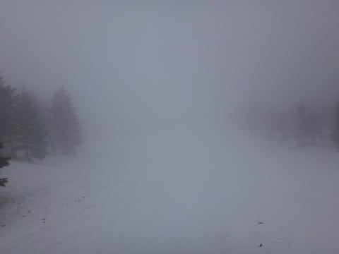
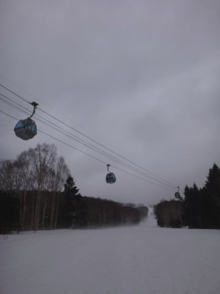

# 4月8日土曜，志賀高原は曇り＆ガス，夕方は小雨

📅 投稿日時: 2017-04-11 08:22:51

えー．

本日．

なぜか会社から始発で帰る羽目になり．

…始発で家に帰ると，定時に出社するためには

自宅滞在時間が1時間しか取れないことを知ったSkier_Sです．

それでも．

着替え＆シャワーを浴びて，出かけるまでの

短時間で更新する自分，偉い！！←自分で誉めておく．

で．

時間がないので（涙）

土曜の写真ピックアップ＆ショートコメントで…

土曜の朝…

じゃなかった．

昼は．路面は完全ウエット．

凍結など一切なし．

うーん．

気温が高い…

ってことで．

ゲレンデに出ると…

山頂の気温が+10℃！

暖かいよ…

そして．

ゲレンデの雪質は…

多くは語るまい．

まぁ，前日に雨が降った，気温+10℃の

雪です（涙）．

ゲレンデは，昼過ぎには山頂付近にガスが

出始め，前が見にくいよ…（涙）

ただ，ガスが出たのはコースの上半分だけ．

真ん中ぐらいから下半分は，ちゃんと見えてました…

しかし．

雪も悪けりゃ天気も悪くなりそうなので，

ゲレンデに人がいない…

本日，臨時営業になった理由である，

某団体の研修会の人がいるタイミングだけ

ちょっと人がいる感じで．

それ以外はもうガラガラ…！

雪はちょいと重めで板が走らないなぁ…

と，思っていたら…

ありゃ？？

午後3時半ごろに，雨が…（涙）

まぁ，せいぜいポツポツレベルで，本降りにはならなかったのが

救いかな…

ってことで．

この日も16:15のゴンドララストまで滑りました…

これにて，私の今シーズンの焼額は終了（涙）．

ありがとう，焼額～！！

…でも．

一の瀬は16:40まで営業！

いつも通り，滑り終わったら速攻で瞬間移動だっ！！

小雨の一の瀬も，雪質はしっとりと重い

春の雪です…

ただ，板が潜ってしまうほどのザブザブ雪じゃ

ないってのが，今年は例年に比べると

すごいところかな～．

という感じで．

まさかの予期せぬ午後だけ日帰りで，

焼額に今シーズンのお礼とお別れを告げてきた，

この週末だったのでした…

では，これから会社へ出勤です（涙）．

今日は普通に夜に帰りたい…
