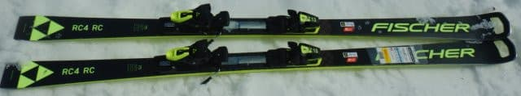
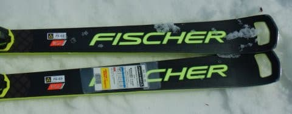
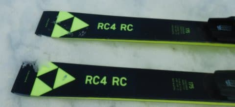
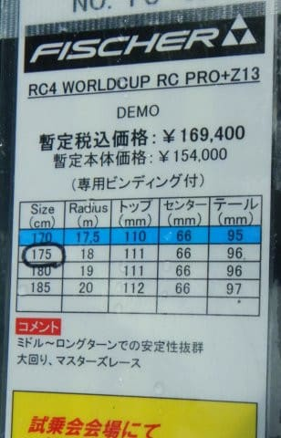
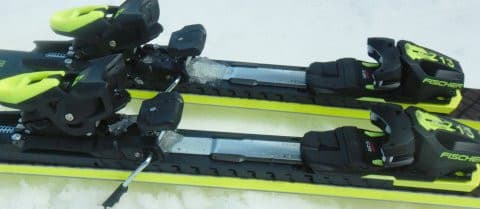
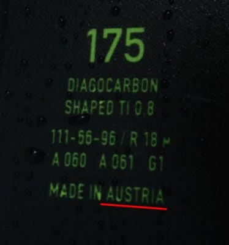

# 2023シーズンモデルのスキー板，試乗レポートその25…FISCHER RC4 Worldcup RC PRO

📅 投稿日時: 2022-07-09 05:07:40

🏷️ カテゴリ: [スキー板試乗](c0bd8048615710cee890e403a36cc9a2b.md)

今日も明るくなるまで起きていてしまった…（涙）

でも．

どうして人間は寝なくてはならないのか．

いつも思うんだけど…

人間って寝なくて良くて，ご飯食べなくて

よかったらものすごく時間を効率よく

使えるのに←寝ないで食べなかったら死ぬから

平日はご飯を食べる時間も取れないので，

カプセル一個飲んだら三日くらい食べずに

済む薬出ないかな？と思う今日この頃…

最後に家の食卓に座ってご飯を食べたのは

いつだろう？と，振り返って見ると．

先週だと，日曜の夕食一回だけか…（泣）

…まぁ，スキーシーズンになると，

土日も完全に出かけて家でご飯を食べる

ことは無いので．

それに比べるとマシかな…？　

ってなことで．

本日も2023シーズンモデルのスキー試乗レポート．

今回はフィッシャー編です．

2023シーズンからオーストリア製になった

RC4シリーズ．

小回り用のSCはかなり良くなったけど…

果たして大回り用のRCはいかに？

○FISCHER RC4 Worldcup RC PRO 175cm 

基礎大回り用

FISCHERのRC4シリーズは，

大回りRC，小回りSC，小回りベースオールラウンドのCTと

3種類あり，

そのうち，RCとSCにはそれぞれ

シッカリしたM/Oプレートがついた「Pro」と

優し目のM-trackがついたバージョンの

2種類がありますが．

こちらはロングのRCでM/Oプレートがついた

「RC PRO」になります．

この板も，見た目は2022シーズンモデルと

ほぼ同じで，テール部分のコスメがわずかに

変わった程度なんですが…

SC PROと同じく．

2021&2022シーズンのウクライナ製から，

2023シーズンはオーストリア製に

変わってます…

SC PROのほうも見た目は22シーズンも

23シーズンもほぼ変わらないのに，

履いた感じが全然違う

という，衝撃的な試乗結果でしたが．

果たして，RC PROの方も2022シーズン

モデルと変わったのかな…？

と，滑り出してみますが…

うむ？

自分が普段履いている，2021シーズンモデルの

RC PRO 185cmとくらべて，

ちょっと柔らかく感じる…

というか，しっとりさがあるので，

コアが突っ張る感じの2021シーズンモデルより

しっとりとたわんでいく感じ…！！

それでもやわらかすぎることは無く．

適度なメタルのばね感があり，

トップからテールまでのエッジが

しっかり均一に効いてくれて，

板がかなり長く使える感じ…

返りはそんなに早くないけど，適度な

ばね感があって気持ちよく返ってくるので，

切替がすごい楽…！

そして，安定感もあり，春のグサグサ雪を

蹴散らして滑って行ってくれますが…

ただ．

春のグサグサ雪では，この板を十分に

たわませられるほどの足場をしっかり

作ることができず，ちょっとまっすぐ

走り気味かな…

M/Oプレート付きは張りが強いので，

気温10℃を超えた，日差しの強い昼ごろの

ザブザブ雪で滑る板じゃないかな．

やっぱり…

ってなことで．

あまり本領を発揮できるコンディションじゃ

なかったってのもあるのか．

SC PROを試乗した時は，乗った瞬間から，

オーストリア製の2023シーズンモデルの方が

圧倒的に良いと思いましたが，

RC PROの方は，多少しっとり感と

上品さを感じたものの，

2021＆22シーズンモデルとの差は，

SC PROほど感じませんでした…

もう少し雪質がいいコンディションで

試乗すると違いが分かったかも…？
