# 2024/6/8(土)の月山スキー場，詳細レポート続き…大斜面も幅も狭くなり，かなりの藪漕ぎ（涙）．6月下旬並みのコンディション

📅 投稿日時: 2024-06-11 02:30:08

🏷️ カテゴリ: [2024スキー滑走日記](c453f687e8a0f05679e95831d0a02cd0c.md)

ってなことで．

[昨日の記事は](e84b5941bb3176aa01c8c0c2fae6e7730.md)，6月8日(土)の月山スキーの

沢コースの状況まで書いたところで，

軟弱な私は力尽き，記事が中途半端な

ところで終わりましたが…

今日も夜は遅いけど．再び体力を振り絞って，

昨日の続き，月山の大斜面の状況です！！

えー．

大斜面に出るには，かなり長い距離を

トラバースしないといけないのですが．

この写真で赤く記した，リフトを降りてから

直接ゲレンデに突っ切るコースを通ってから

ちょっと登ってトラバースルートに出る

ルートと，

水色で記した，かなり歩いて登って

ゲレンデに出てから，トラバースルートに

滑り降りる二つのパターンでこの日は

大斜面に行くことができました…

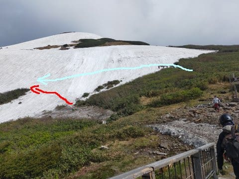

今回は，この水色ルートで上に出て，

そこからトラバースするパターンで

行きますか．

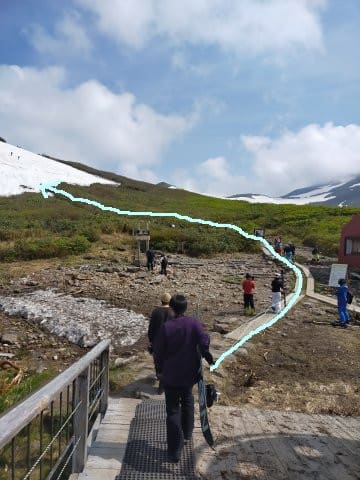

リフトから降りて，木道を歩いて登り…

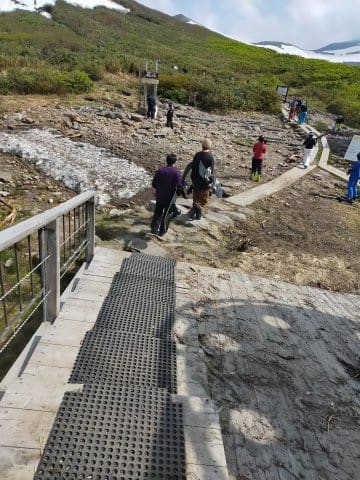

その後は，こんな感じの足場の悪い

ゴロゴロ石の上を，バランスを崩して

転ばないように注意して歩いていくこと

しばし．

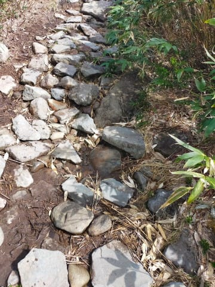

リフト降り場からこれだけ登って，

やっと雪のある所に到着です…！

リフト降りてから3分ほど登るかな？

…結構疲れます…

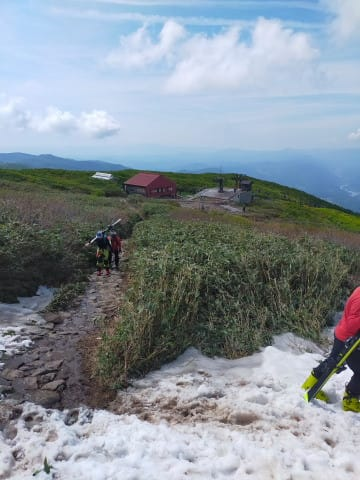

で．

ようやくここで板を履くわけですが．

大斜面はまだまだはるか先．

これから，写真の向こう側にひたすら

トラバースしていきます．

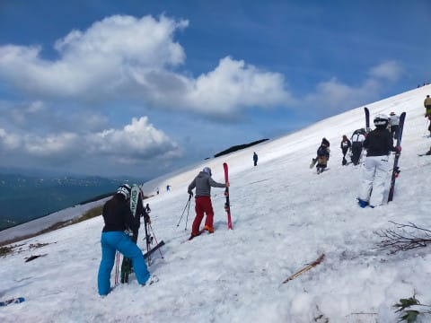

こいつがトラバースルートですね…

ずっと向こうまで，ひたすら斜面を

横切っていきます．

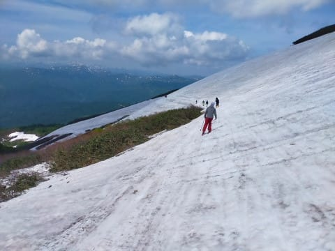

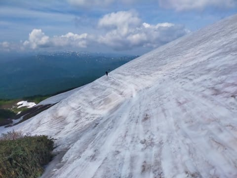

トラバースルートの途中から，沢コースを

見下ろしますが…

沢コースも狭くなりましたね（涙）

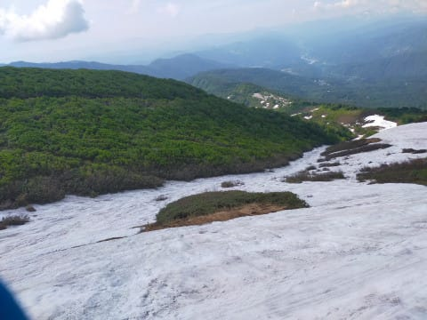

トラバースを終えると，大斜面の上に

出ます！！

…ここからは，結構広く見える大斜面．

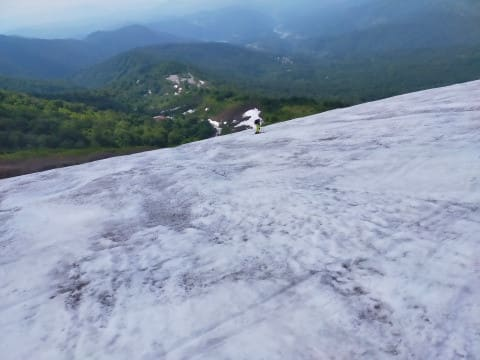

大斜面らしく，全面コブになってますが…

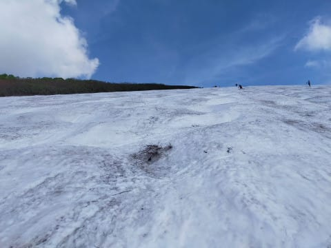

途中，もうかなり狭いボトルネック箇所が

2か所あります…

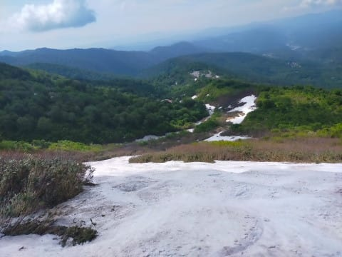

このボトルネック箇所を抜けた後．

しばらくまたコブ斜面が続いて…

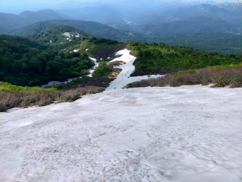

そしてまた今度は，コブライン1本しか

無いような狭いところを通って…

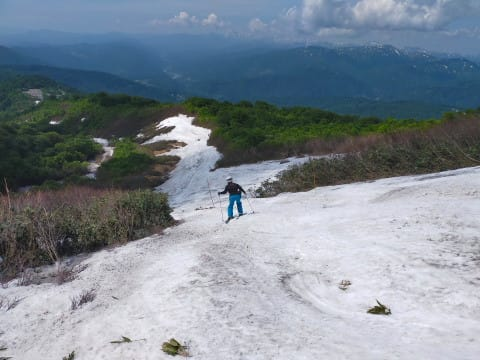

大斜面の下に出ましたが．

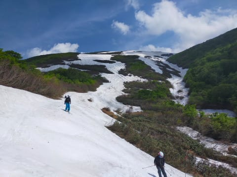

振り返ってみると…

矢印のあたりとか．

もうすぐ切れそうですね（涙）

これ，普段の年なら，6月下旬の

雪の量なんですが…（泣）

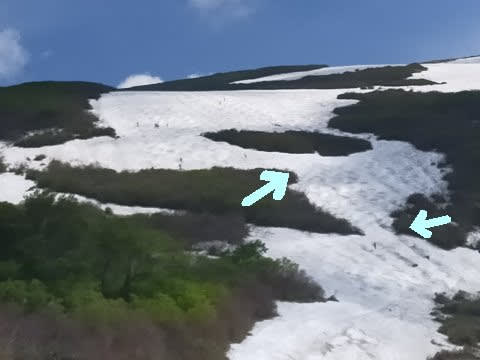

でも．

ここまではコースは実際に切れて

ないから良かったのだ．

ここから先を見ると…

…

…

なんだか，リフト乗り場まで，

全面藪で閉ざされている気がするの

だが…？？

どうやってリフト乗り場まで行くんだ？？？

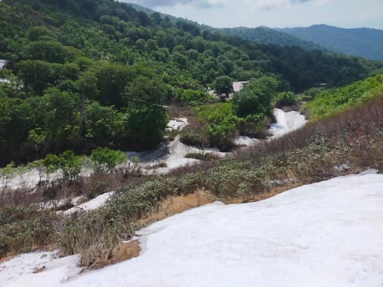

…と，思ったら．

人が降りてきて…

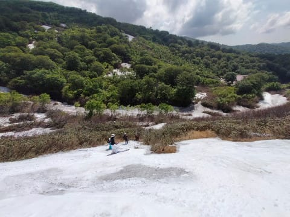

え？？

なに？？

そこを通るの！？？

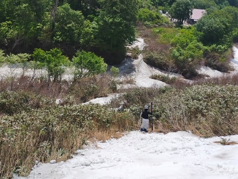

なんと．

ここ数年，大斜面は藪漕ぎが入る

前にクローズになってたけど．

今日は藪漕ぎしないと大斜面を

滑れないようです…！

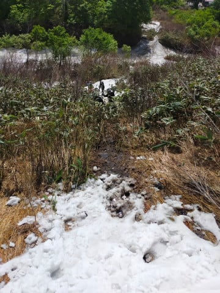

ってなことで．

藪に突っ込んでみますが．

足元はどろどろの斜面でツルツル

滑るし，かなり危険…（泣）

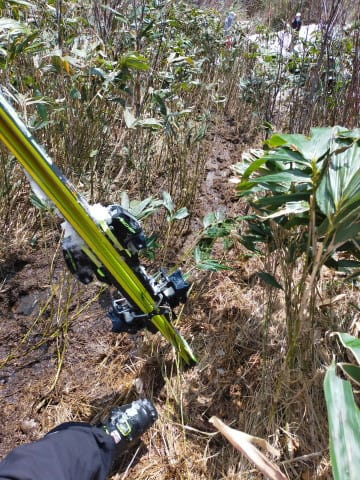

ブーツは半分泥に潜るし，

ブーツの泥はウェアのパンツに

盛大に着くし…

ウェアも板もブーツもドロドロにする

覚悟がないと，大斜面は滑れません（涙）

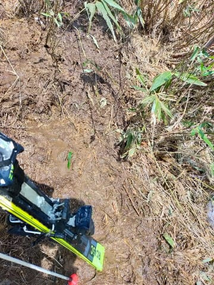

何とか転ばずに藪を掻き分け，

無事下に出ることができたら…

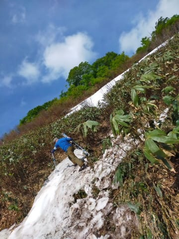

そこからリフト乗り場の下まで

滑り込んで…

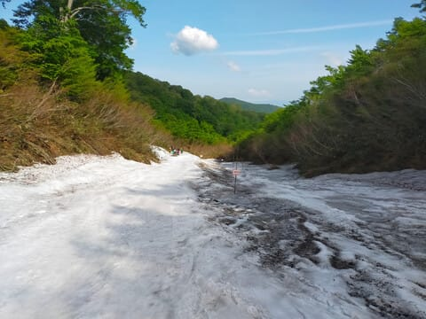

そして，板を脱いで．

また，この目の前の泥だらけの

坂道を登って…

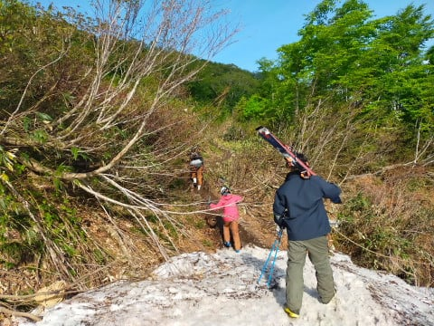

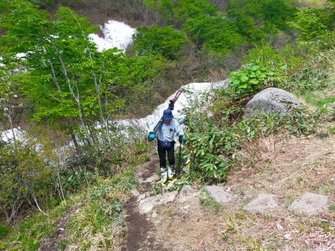

これで，ようやっとリフト小屋の下に

出られるので．

ここからまた，板を担いでエンヤコラと

リフト乗り場まで坂道を登っていきます

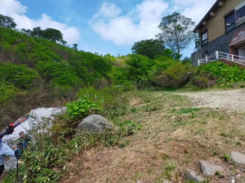

という感じで．

ブーツとウェアをドロドロにする

覚悟が必要だし．

泥で滑って転んで泥だらけになってる

人もいたし…

リフトを降りてからリフト乗り場に

達するまで，かなり過酷な大斜面の

道でした（涙）

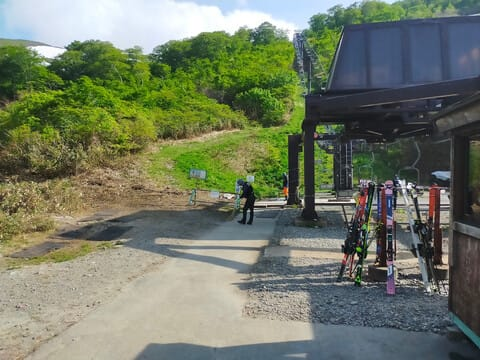

…ってなことで．

土曜月山の，大斜面編を書くだけでまた

かなり長くなってしまい．

今日もまた体力が尽き，記事は

ここまでで一旦一区切り…

取り合えず．

月山は今日からもうリフト運休になり，

リフトが滑れなくなっているので．

今シーズンはもうこの記事を参考に

滑りに行くことはできないわけですが．

月山を知らない人に，

最終形態の大斜面がいかに過酷だったか

を伝えるため，

長々と記事を書いてしまった，

Skier_Sだったのでした…

PS.最終形態じゃなく，板を履いて

リフトに乗り降りできる状況なら月山は

かなり楽しいよ！！

最終形態になってから滑りに行くのは，いろいろ

自虐的嗜好を持っている人だと思う…（個人的偏見）
