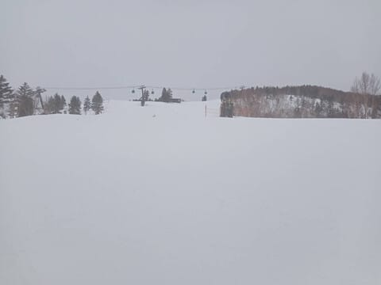

# 4月5，6日の週末の志賀高原スキー場の天気は…土曜は晴れて朝はいい感じだけど昼は雪が緩む．日曜は雨っぽい（涙）

📅 投稿日時: 2025-04-03 01:58:23

えー．本日2日の水曜日の志賀高原ですが．

昨日の記事で，

山頂付近や横手山方面は雪だろうけど．

麓までちゃんと雪のまま一日過ぎてくれるか，

かなり微妙な気温…（涙）

と予想しましたが…

果たして雪のままで過ぎてくれたのか？？

特派員のレポートを見てみると…

朝は山頂では0℃ぎりぎりだったようで．

天気は山頂では雪，麓では雨

という，悲しい予想が当たって

締まった天気だったようです…（泣）

天気が悪かったので，滑っている

人は少なく．

コースはどこに行ってもガラガラだった

とのこと…

ただ，夜の間はふもとまで一応雪だったのか，

新雪が5cmほど積もった上に今日は朝圧雪が

かけてあったらしく，唐松コースとかは

いい感じのシマシマだったようですが．

新雪が積もった後の気温上昇だったので，

オリンピックコースの緩斜面やイースト

コースはかなりのストップ雪だったよう

です…（泣）

雨はザーザーぶりにならず，ずっと霧雨が

降り続くような感じだったので，

雪はそんなにひどくやられてなさそう

ですが…

とりあえず終日霧雨が降り続く，スキーヤー

にとって厳しい天気だったようです（泣）

ってな感じで，ちょっと残念な感じの

天気だった水曜ですが．

これから週末までに雪が降って

ゲレンデ状況は改善するのか？？

土日は冷えるのか？？？

…そろそろスキー場の天気が気になる人の

絶対数が減ってきて，この天気予想の読者も

減ってそうな予感がするけど．

逆に言うと，この時期にスキー場の天気を

気にする人はスキー〇カばっかりだと思うので．

スキーバ〇に向けて，水曜深夜恒例の天気予想，

行ってみましょう！

まず．3日(木)の850hPa気温ですが．

うむ．赤い0℃線ぎりぎり志賀高原にかかって

いるので．これなら，志賀高原は降っても

液体じゃなく，ちゃんと雪になりますね…

かなり重いベタつく雪ですけど．

そして，木曜の地上天気図は…

志賀高原に降水域がかかってますね．

うーん．一日雪がちらついたり止んだり…

という感じでしょうか．

続いて4日(金)の850hPa気温は．

この日も赤い0℃線は志賀より南．

むしろ志賀高原には-3℃線が近づいて

来ているので…

これなら降ればいい感じで雪になる気温．

なのに，この日の地上天気図では，

志賀高原には降水域がかかっていなくて…

日中はほぼ降らなさそう(泣)

こういう冷えた日には降ってほしいのに…

で，肝心の週末の5日(土)の850hPa気温を

見ると．

あぁぁ…

赤い0℃線は志賀よりかなり北，青森付近まで

上がってますね…（泣）

これは降れば液体の気温です…

でも，この日の地上天気図を見ると．

志賀高原に降水域がかかっていないので…

何とか液体が降る危機は逃れられそう．

そして，6日(日)の850hPa気温図は．

うーーーむ．

この日も，志賀高原にかかるのは水色の

+3℃線．

…これはヤバい．降れば液体の気温

なんだけど…

ドキドキしながら，この日の地上天気図を

見てみると…

うぎゃーーー！！

本州全域，降水域に覆われててる…

これは…空から降ってくるのは液体ですね(泣)

あぁ…なぜ冷える日に降らず，こんな日に降るの？？

ってなことで．

まとめると．

3日(木)：朝の気温は-3℃程度．

　昼間もぎりぎり0℃をキープ．

　朝イチはちょい硬めのバーン．

　天気は終日雪がぱらついたり止んだり．

　昼は硬めバーンの上に，うっすら

　新雪が積もっていくか…

4日(金)：朝の気温は-3℃ほど？

　昼間も基本的にマイナスキープ．

　朝イチは，昨晩から積もった雪が圧雪された

　締まった硬いバーンにうっすら新雪が乗った，

　そこそこのバーンを楽しめるか…

　昼間も気温が低く，雪はそんなに緩まない．

　朝は雪が降るかもしれないけど，

　基本的に曇り，午後はちょっと日が射す

　タイミングもあるかも

5日(土)：朝から晴れ！

　朝の気温はこの日も-3℃ほど．

　朝イチは昨日わずかに積もった雪が

　圧雪されたいいバーンで．

　朝は気温も低く天気も良く，結構

　楽しめそう…！！

　ただ，晴れの一日で，気温も昼間は

　+5℃以上に上がりそうなので…

　昼前には雪が緩んで，午後は完全に

　春の雪になり，午後はちょっと

　荒れ気味のバーンになりそう．

6日(日)：微妙だけど，朝から液体が降ります．

　それも嫌がらせのように通常営業開始

　くらいのタイミングで降り始めるかも…

　終日雨が降ったりやんだりで，

　今の天気図だと，時折強く降りそう．

…ということで．

土曜はまだマシながらも，日曜はちょいと

残念な天気になりそうです（涙）

うーん．

でも，まだ日曜の雨の降りはじめとか，

多少ズレる可能性もあるから，

何とか日曜は昼くらいまで降らずに

もってほしいところだけど…

期待薄…

もう，春ですねぇ…（泣）

## 💬 コメント一覧

### 💬 コメント by (Movers and Packers in Karachi)
**タイトル**: Unknown
**投稿日**: 2025-04-03 16:17:47

Nice reading experience thanks for sharing 

Movers and Packers in Karachi

### 💬 コメント by (アツシ)
**タイトル**: Unknown
**投稿日**: 2025-04-04 01:47:02

今週は、日曜日が仕事なので代わりに金土で滑ります。コンディション的にはちょうど良い感じですね😁

### 💬 コメント by (Skier_S)
**タイトル**: 今週末も志賀高原！
**投稿日**: 2025-04-05 00:46:09

>Movers and Packers in Karachi

Thank you for your comment!

I' m pleased if this article is  helpful to you...

but I wonder how you can reach this JAPANESE-ONLY blog??

>アツシさま

写真＆レポートありがとうございました～！

明日の午前中まではいいと思いますよ～！日曜はダメダメな感じの天気なので，金・土で大正解だと思います．

うらやましい…

