# 2019/12/21(土)の志賀高原，焼額山スキー場は…晴天だけど，激混み(涙）．バーンはカリカリ＆モサモサの修行状態…

📅 投稿日時: 2019-12-21 23:54:08

🏷️ カテゴリ: [2020スキー滑走日記](c282e9230de179e245c7334eabeb0a3b3.md)

ということで．

いつも通り志賀高原にやってきていますが…

…雪，少ないですね（激烈涙）

もしかしたら．

4シーズン前の激烈小雪の時より，

ひどいかもしれません…（強烈涙）

普通なら，そろそろ第1ゴンドラが

動いてもいい時期というのに．

ゴンドラが動くどころか．

人工雪以外で滑れるバーンは全くなし（泣）

…まだ，冷えていて，人工雪が打てるだけマシ

と自分を慰めるしかない状況です…

ってなわけで．

朝．

志賀高原に登ってくる道は…

…雪，無いね（涙）

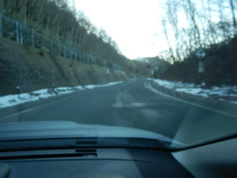

途中，本日より営業開始の

サンバレーを通過しますが…

うむ．

右側の天然雪エリア．

12月第1週より雪が減って，

ほとんど積雪0ですね…

何とか左側の人工雪エリアのみ

白くなってますが…

雪は薄そうな感じ…

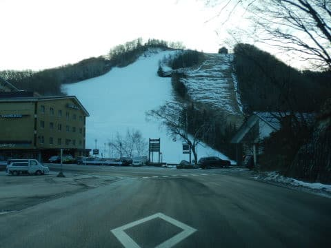

もう，高天ヶ原までやってきても，

全く路上に雪はありません（涙）

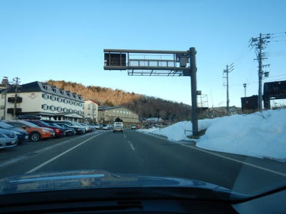

（とはいえ，トンネル手前などうっすら

　雪が残っているところもあるので，

　夏タイヤで来るのは無理なので，ご注意を）

ゲレンデの雪は大丈夫か…？

と，心配しながら，焼額のリフトスタートに

並びますが．

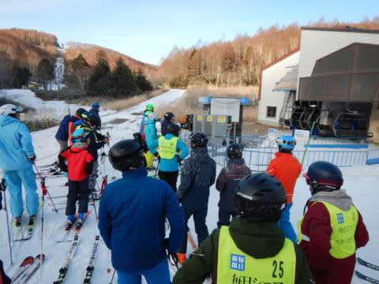

本日も営業しているのは，第2高速リフトと

第4ロマンスリフトのみ．

人工降雪を打っていない第1ゴンドラ，第2ゴンドラ，

第3高速は，全くもって滑るのが無理な状況．

人工雪が着いてないSGSコースはこんな感じなので，　

まだまだ全然滑れなさそう…（激涙）

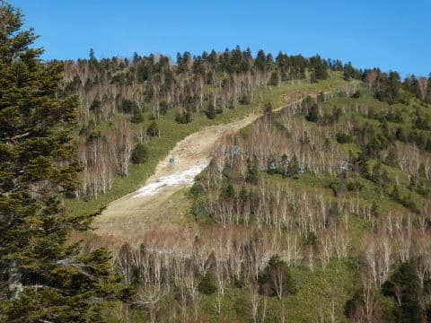

ってな感じで．

朝イチリフトに乗って，山頂に向かいますが…

無駄に晴天なのが悔しい…

晴れなくていいから，ドサドサ雪降って（懇願）

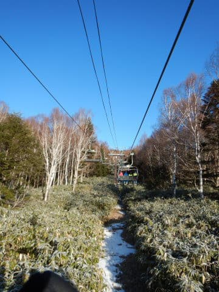

でも．

あさイチのゲレンデは…

そう！

今日も見事なシマシマです！

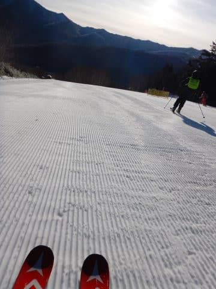

もう，悲しいくらいの晴天のシマシマです！

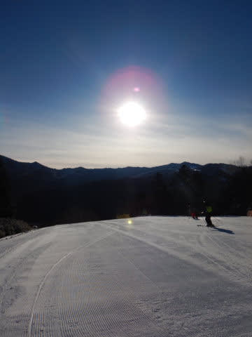

いや…

ホントに晴れなくていいから，吹雪いて

くれたほうが，むしろうれしいんですけど…

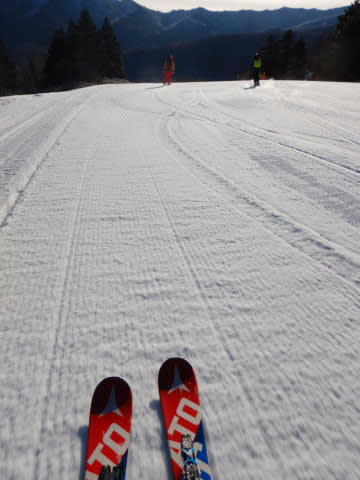

とはいえ．

あさイチの晴天フラットバーンは

気持ちいい！！

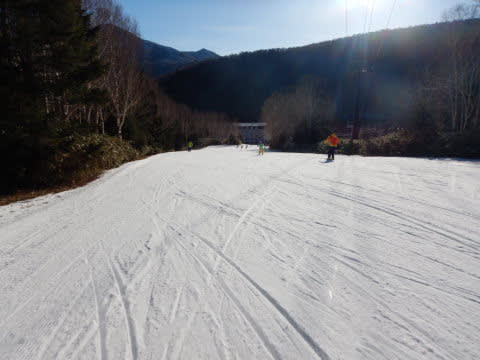

人が少なくて…

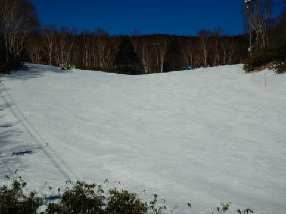

人工雪なので，ちょっと硬めですが．

締まったいいバーンを飛ばせます！！

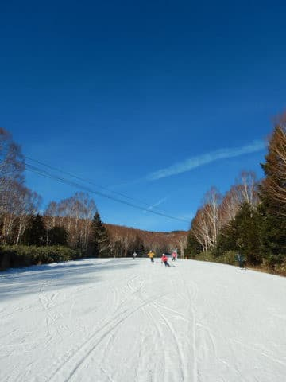

いや…朝イチ，気持ちいいよ…

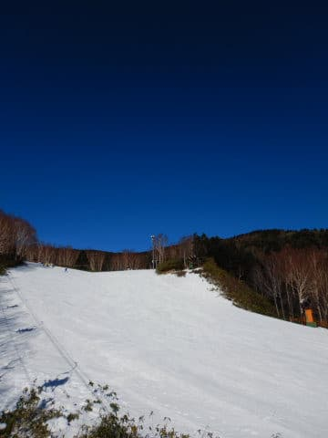

と，思っていたら．

…2-3本滑っただけで，第4ロマンスリフト，

早くも混んできました…

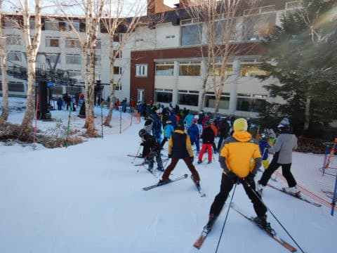

ってなことで．

第2高速側，唐松コースを滑ってみると…

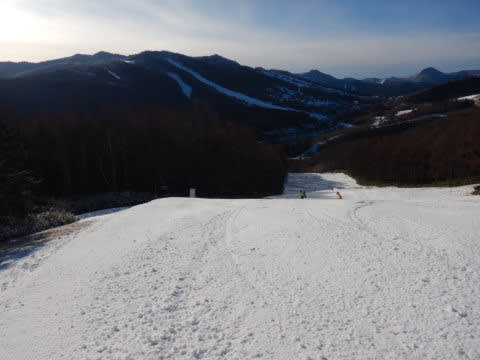

…

うぎゃーーーー！！

殺人コロコロバーンっ！！

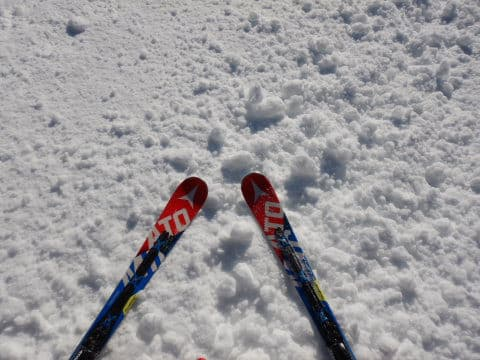

なんだー！これはー！！

と叫びたくなる，全面殺人コロコロバーン！

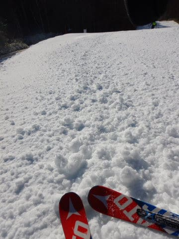

誰がここまで全面的に殺人コロコロを

敷き詰めたんだ…

と問い詰めたくなる，手ごわいバーン（涙）

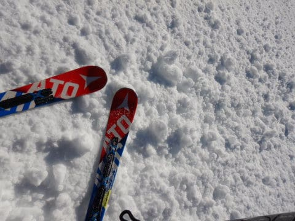

ただ，第4ロマンス側，サウスコースより

バーンコンディションが手ごわいからか．

リフト待ちは少なかったのですが…

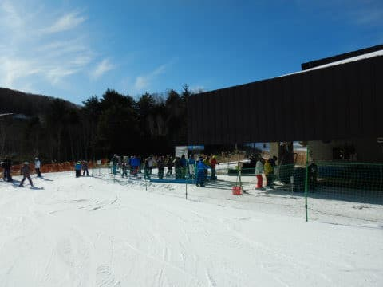

上から見て右側は人工雪が着いておらず，

コース幅も制限されている状況で．

かなり厳しめのバーンコンディション…

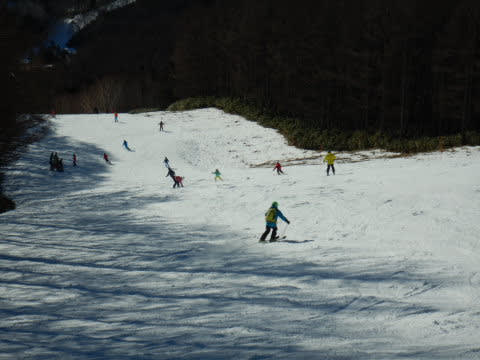

さらにしばらくすると．

殺人コロコロは潰れてなくなって

いったものの…

バーンは，エッジに削られたツルツルバーンと，

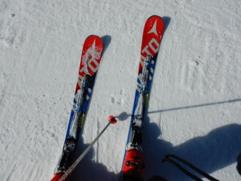

削りくずのモサモサが溜まった部分が

交互に現れる，さらに厳しい状態になっていき…

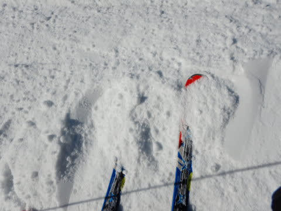

早くも午前中に，コースが荒れ始めて

来ました（激泣）

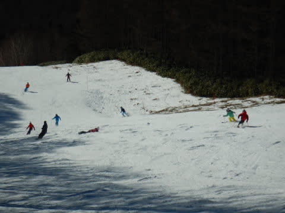

だもんで．

第4ロマンスのサウスコースに逃げようと

しても…

雪はこっちの方が多少マシとはいえ．

コース上の人口密度も高めで…

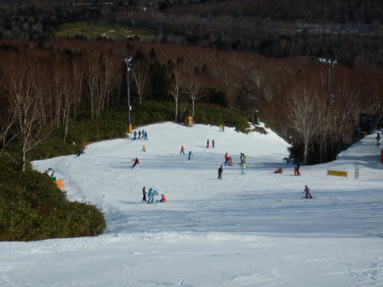

さらに…

うぎゃーーっ！！！

なんだこりゃーーーー！！！

リフト10分以上待ち！

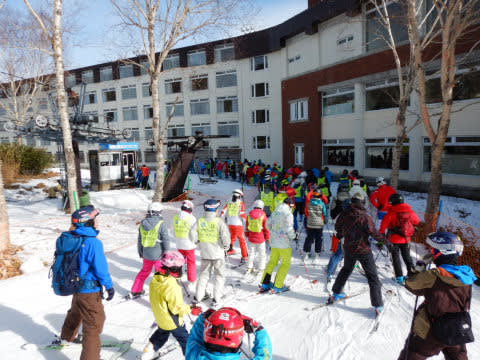

この10分待ちに懲りて，

しばし第4ロマンス側に下りませんでしたが．

昼前に最大30分待ちまで

行ったようです…（恐怖）

ってなことなので．

そこまではリフト待ちがひどくなく，

1～2分程度待ちの第2高速を利用して，

唐松コースをひたすら滑り続けますが．

コースはかなり荒れてきており…

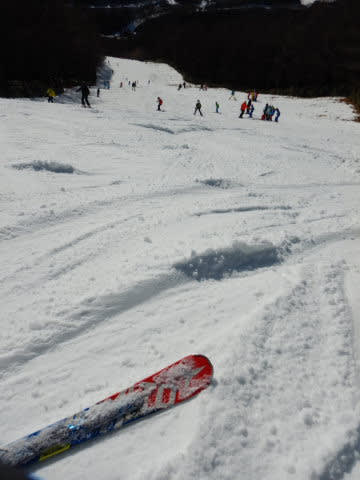

昼頃になると．

南斜面の唐松コース．

日差しで雪が緩み始め．

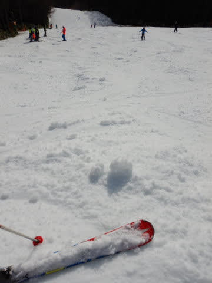

…ふぎゃーー！

柔らかい雪で大勢の人が滑るからか．

一気にゲレンデがコブになり始めて

来ましたよ！？？

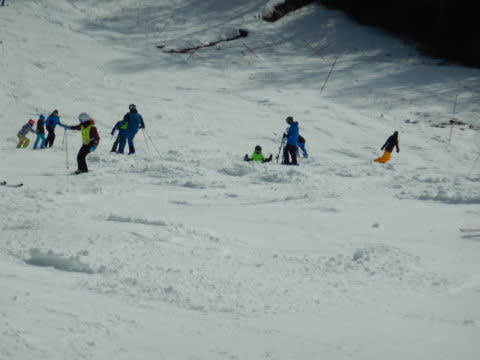

午後2時ごろには．

急斜面は，完全こぶ斜面と化し…

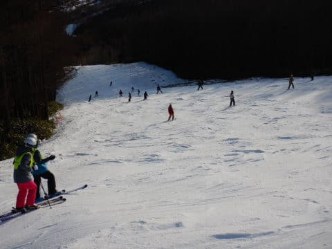

それでさらに，コブ溝はエッジで磨かれて，

ツルツルになっていくという…

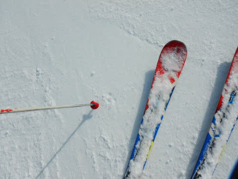

滑れるコースの少なさ，

リフト待ち，

コース混雑，

荒れ荒れバーンコンディションと．

…これは，何かの修行ですか？？？

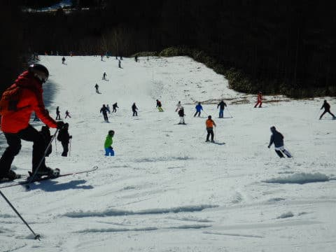

…あんまり楽しくない（涙）

リフトが空いたであろう，

午後3時ごろ．

唐松よりマシだろう…と第4ロマンス側，

サウスコースに降りてみますが．

こちらも夕方まで，意外と人口密度が

高いままで…

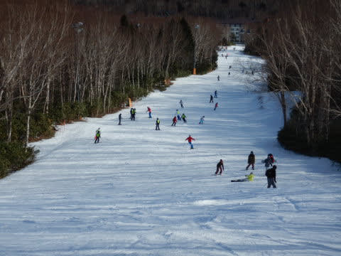

斜面も，結構もさもさ＆ツルツルの

難しめのコンディション（涙）

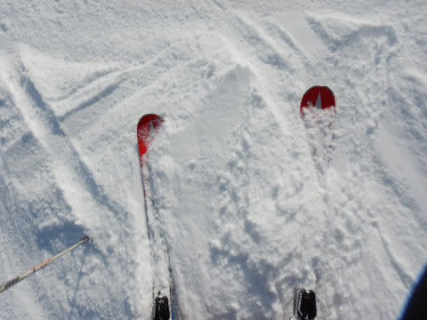

そして，リフトも午後3時過ごろまで，

5分近い待ちがありました…

ってなことで．

また，唐松コースへ戻りますが．

あんじゃ，こりゃーーー！

もう，最後は全面コブ．

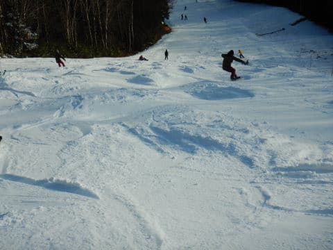

コブ溝は人工降雪のツルツルという，

とても厳しいコブ（涙）

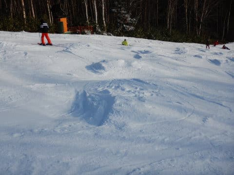

なんで…

なんで，12月下旬に．

こんな人工降雪しかない，

混雑したツルツルコブコブバーンを

滑らなくてはならないのか…？

と，涙を流しながら．

今日も夕日が暮れる，ラストリフトまで

滑り続けたのでした…←それでも最後まで滑るのね…

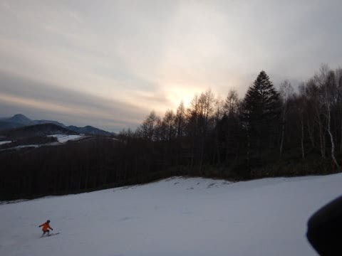

…晴れなくてもいいから，

雪が降ってほしい…

で．

明日は午後から雪か？

…と，予想しましたが．

低気圧接近が当初予想より

遅くなったので，明日の雪の

降り始めは夕方，リフトストップ後に

なりそうです…

そして．

やっぱりほとんど積もらなさそうです（涙）

あぁ…

明日も今日とほとんど変わらないコンディションに

なりそう…（泣）

## 💬 コメント一覧

### 💬 コメント by (yumi)
**タイトル**: Unknown
**投稿日**: 2019-12-22 06:21:23

Ｓさぁ～ん😭😭😭

私たち、４ロマ ほぼ最長待ちに 引っ掛りましたぁ～💧😭💧

フッ👀‼️っと後ろを見ると、さらに人の列😅

このまま 乗らずに帰る😤😤😤

・・・って

車、２高側じゃん💦

### 💬 コメント by (若杉勲72)
**タイトル**: Unknown
**投稿日**: 2019-12-22 07:09:30

ゆみりん、お疲れ様。こんな日はのんびり布団干しですよ。いかんいかん、20000m監視員に見つかっちまう。

### 💬 コメント by (Hide)
**タイトル**: Unknown
**投稿日**: 2019-12-22 12:57:24

S 様

今年はヤバ～い感じがプンプンしますね・・・。

2015/16シーズン以上かもですね。

ちょっと心配です。

### 💬 コメント by (かず)
**タイトル**: Unknown
**投稿日**: 2019-12-22 20:40:25

いまだ待機中です…水曜までの雪どうでしょうか？ここがダメだとかなり年末厳しいですね…年始雪予報ありますけど

### 💬 コメント by (Skier_S)
**タイトル**: 雪が…雪が足りないっ！！
**投稿日**: 2019-12-23 02:16:44

＞yumiさま

4ロマ30分待ち，ご愁傷様でした．

今日も混みましたね…

高天ヶ原はまあまあでした．

＞若杉さま

のんびり布団干しですか…（笑）

でも，今晩は積雪がありそうなので，

明日がいい日になることを期待！

＞Hideさま

もう2016シーズンを超えそうな感じです．

すでに23日のゴンドラオープンは厳しそうなので，

そうなると2016シーズンを超えます…

心肺です．

＞かずさま

24日に降る雪の様子を見てから判断でしょうか…

12月27日も降りそうなので，ホントならその

両方の降りっぷりを見てから判断したいですね（笑）

