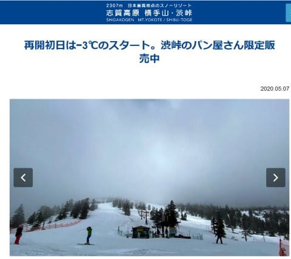

# 2021シーズンモデルのスキー板，試乗レポート…OGASAKA TC-SK + SR585

📅 投稿日時: 2020-05-08 01:36:04

えー．

8連休明けで．

本日から仕事に復活した，Skier_Sです…

8連休明けで，職場に行かねばならぬ用事があり，

本日は在宅勤務じゃなかったのですが．

…8日間溜まっていた山のような仕事が

待ち構えており．

本日も帰宅は深夜コースでした…（涙）

昨日までの，[人生最高にのんびりゆっくり過ごした
8連休](e201e1bf0da5c01c9c80527e29eba02d6.md)の後，いきなりのトップギアでの

全力疾走は辛い…（泣）．

てことで．

昨日の予告通り，

志賀高原の渋峠スキー場が．

スキー場が位置する，長野・群馬県ともに

特別警戒都道府県には入っておらず．

さらにスキー場は長野・群馬両県のコロナ特措法による

営業休止の要請・指示対象に入っていない…という

ことで．

長野・群馬地元民限定で，本日，再オープンしました！！

（[横手山・渋峠スキー場ホームページ](https://yokoteyama2307.com/news/8780/)より）

動いたのは，渋峠ペア1本のみですが．

再オープン初日の本日．

朝から気温は-3℃と冷え冷え！

本日は，朝方はかなり冷え込み，標高が低い蓮池

でも気温は0℃近くに冷え込んでいて．

そして，山頂付近では早朝は雪が降っていたようで…

そのため，渋峠は．

とても5月のGW連休後と思えない，

木々に雪が積もった，真冬のような

景色だったようです！！

（以上2枚，志賀高原麓在住の某特派員より）

いや．

ホントにこれ，5月の連休後の景色なの？？？

…ただ，真冬並みに寒かったので，

遅いペアリフトは辛く，

さらに雪はカリカリツルツルだった

ようですが…

いやーー．

しかし．

雪が少なくて途方に暮れていた，

2月や3月あたりの頃．

誰がGW過ぎまで，こんな雪がたっぷりの

ゲレンデ状況になると予想しえた

でしょうか…！！

すばらしぃっ！！！

…首都圏在住の自分は行くわけにいかないのが

残念ですが…（涙）

ってなことで．

スキー業界のちょっとだけ明るい話題の後は．

本日の本題，2021年モデルのスキー試乗レポートです！

今回は，今シーズン私が唯一試乗した，オガサカの板．

TCシリーズの小回り板です．

では，どうぞ～！！

○OGASAKA TC-SK + SR585 165cm

基礎小回り用

オガサカの基礎用というより，技術選を狙った

かなりハイスペックな基礎板である，TCシリーズ．

その中の小回りスペシャル板が，TC-S〇シリーズで．

2019シーズンはTC-SA，

2020シーズンはTC-SSだったのが，

来シーズンはTC-SKって名前になるようですね…

で．

このTCシリーズ．

2021モデルは，プレートが

強めのSR585プレートと，

優し目のFM585プレートの

2種類から選べるようです…

SR585プレートってのも，来シーズンの

デビューの新モデルのようですが．

これが，今シーズンの一番強いプレート，

メタル入りのGRプレートの後継になるのかな？

で，今シーズンの中間の強さのFL585プレートは

来シーズンは無くなるようで，

今シーズンの一番優しいFM-600プレートが

モデルチェンジして，来シーズンは

FM585プレートとなるようです…

ってなことで．

今回試乗したのは，強めのプレート，SR585 が

着いたモデル．

ビンディングは，チロリアの

Freeflex DEMO 14が着いてました．

ってなことで．

こいつを履いてみたところ…

これは，かなりコアの張りが強い板ですね…

硬いなりに，たわませれば板にそれなりの

ばねっぽい反力が返ってくるメタルの

張りではなく，

曲がらない木の棒のような感じの，

コアがしっかりした張り．

張りがかなり強いので，低速では

たわませることが難しいです．

そこそこの低速で，谷回りで板を動かして

いく自由度もあるけど，

低速では，動かして行っても板にたわみが

出ない感じで．

たわみを出すためには，かなりのスピードと

力が必要になります…

何もしなくてもオートマチックで回っていく

板ではなく，自ら積極的にたわみを出して，

それに乗って回っていく板．

そのたわみを出すのには，正しいポジションに

乗り続ける技術と，かなりのスピードと，

適切なタイミングでそれに負けない圧を

板に加えられるパワーが求められる，

そんな感じの板．

プレートが強いからなのか…

私にはかなり手ごわい感じ．

ゲレンデで気楽に履こうとか，

全くそういう気にさせない，

かなりガチで本気の上手い人がしっかり使い

こなして，性能を出せる板．

ゆっくり滑ったら，板が全くたわまないので，

あまり楽しく滑れません…

ただ，かなりのスピードを出して，

しっかり正しいタイミングで，正しく

抑えてたわみを出していけば，

ガッツリしたグリップの中，

大回りから小回りまで，たわみの通りに

切れて落ちていけるので，

かなり強い圧をもらえるハイスピードで，

その真価を発揮します．

そのハイスピードのなかでも，

ずらそうと思えば板を動かしていけるけど，

動かすには適切なポジションに乗って，

しっかり力を加えてずらして行く

必要があるので．

パワーのある人なら，板を動かして

弧を描いていくことも可能．

かなりのスピードで仕掛けていけば，

強い圧をもらってガッツリグリップで

しっかりした足場を作って，板が

切れて回っていくし，

その圧に負けない力があれば，その

ハイスピードでしっかりした足場が

ある中で，板を動かしていくこともできるし．

とりあえず，この板のSRプレート付き．

かなりハイレベル＆体力のある人向けの

板のようで．

私のようなお気楽素人には履きこなせそうにない，

もっと上級者向けの板だと思いました…（涙）

もしかしたら，強いSRプレートじゃなく，

優しいFMプレートなら，

私でももう少し何とかなったのかも

しれませんが…
