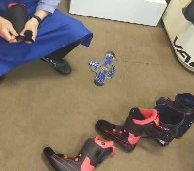
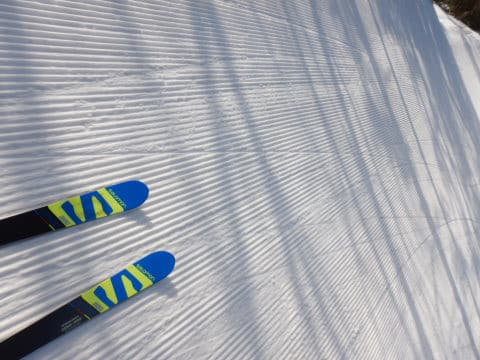

# REXXAMブーツ，R-evo 130Mを1シーズン履いてみて

📅 投稿日時: 2021-06-07 02:13:46

🏷️ カテゴリ: [スキー雑談](c1f9d2cb7478308da16419928ea3945e9.md)

えー．

昨日の記事で．

「土日どちらかの更新は休み！」

と書いたばかりというのに．

なるべくスキー試乗レポートは，普通の

記事に混ぜて上げるつもりでいたところ．

ここ3日連続スキー板試乗レポートが

続いていたことに気づき．

3日試乗レポートが続いた後に1日休載だと，

「毎日試乗レポートばっかりでつまらない！」

…と，言われそうな気がしたので…

今日は試乗レポート以外の記事で更新！

…その代り明日更新休むかも…

ということで．

今シーズンに入る前，[長岡のエキップさんで
作ってもらったREXXAMブーツ](e84a3c4f3e87605ea154c49f2e9927b90.md)．

R-evo 130Mを，この一シーズン履いた

わけですが…

足型にしっかり合わせただけではなく，

自分の骨格や動きに合わせ，インソールの

角度やカントの角度をしっかり

合わせてもらったこのブーツ．

まず，[シーズン最初の頃にも書いた](e3075b660005b16ea867e1a7cfa899be0.md)ように，

谷回りの捉えの早さが圧倒的に違う

ことに驚いたわけで．

これまで，自分で動かして谷回りを捉えて

行ったものが，何もしなくても谷回りで

捉えてくれる！

板をほんのちょっと返すだけで，板が

回り始める！

…と，びっくりして．

この時点ですでに，周りから

「滑り変えた？」

と言われるほどの効果が出てたわけですが．

谷回りで余計なことをしなくて

良くなるということは．

このブーツを履けば，

ひたすら板の真上からまっすぐ乗る以外，

ほとんど何もしなくていい

ということがわかり．

このブーツの滑りに合わせて，自分の

滑りのポジションも変わっていったようで…

シーズン途中で一度エキップさんにブーツを

見てもらったところ．

やっぱりカントとか変わってて．

カントやフットベッドの角度などを

再調整してもらいました…

（ブーツを最初に買った時もブーツ代だけで

　工賃不要だったけど，ブーツを作った後も

　いつでも無料でこういう調整をしてもらえる

　ところがすごくありがたい…）

そして．

ブーツを再調整してもらい．

さらに滑りとブーツがフィットしていくと…

うはーー！

板をさらにしっかり踏んで行けて，

むちゃくちゃありえないほどたわむ！

このブーツの履き始めの時もかなり踏めると

思ったけど．

さらに板がたわませられる！！

小回り板がたわみすぎて，回りすぎるっ！！

普段ロング用に履いていた，182cmの

SALOMON X-race Masterも柔らかく感じ，

大回りができない！！

もう，これ，完全に小回り板だよね！？？

（マイルド化が進んで柔らかくなっている…とは考えない．うん．考えない）

ということで．

SXが剝離してしまったというのも

あるけども．

シーズン終盤は，回りすぎる小回り板の

SXの出番が一気に減って．

ほとんど182cmの板しか履いてなかった

です…

（4月に入ってからというもの，レポートの写真がほとんど

　X-Raceだったことにお気づきでしょうか…）

しっかり板が踏めるようになると．

板が勝手に回ってくる小回り板より，

自分で板をおさえて回れる，大回り板の方が

面白くなってくるという…

そして．

今まで履いてた板が，全部柔らかく感じる

ようになったので．

だんだん強い板が欲しくなっていく…

という恐ろしい事態に！！

…この年齢になって，今までよりもっと

強い板が欲しくなっていくとは…！！

他にも，私がお勧めしてエキップさんで

ブーツを買った某女性．

これまでどうやっても直らなかったX脚が，

ブーツを変えただけであっさり直り，

そしてやっぱり谷回りの捉えが早くなって，

滑走スピードも一気にアップしてました…！

（ブーツを変える前と後のビデオをみんなに見せてあげたいくらい）

ということで．

スキーは，板を替えるより．

練習するより．

ブーツをかえた方が，はやく上手くなる

ということが分かった，Skier_Sだったの

でした←いや，普通は練習しないと上手くならないから！！

とりあえず．

良いブーツというものが，ここまでスキーを

楽しくしてくれると思わなかった…

今まで，このブーツを知らずにスキーを

滑っていたのがもったいない…！

## 💬 コメント一覧

### 💬 コメント by (naoちゃんねる)
**タイトル**: Unknown
**投稿日**: 2021-06-07 19:03:04

私も今シーズンは、ブーツをエキップさんで買って調整して貰って、滑りが良くなった…かな？😅

と感じています。

いやー、下手くそですが、滑るのが楽しくてしょうがなくなりました。

ブーツって本当に大事なんですねー！！

### 💬 コメント by (なんちゃってレーサー)
**タイトル**: 物欲選手権，楽しみにしてます
**投稿日**: 2021-06-08 00:54:32

この名前で，私がだれかわかってもらえるのか....(笑)

それはさておき，ブーツの調子，相変わらず良いようですね．

今のREXXAM自体が相当出来の良いブーツなので，かなり楽にスキーができると思います．

私は反応の良いブーツに変えてから，スラロームの練習か大会以外で，小回り板を履く気が失せました．

簡単に曲がってしまうので退屈だし，たくさんターンする必要があって疲れてしまうので．

今の大回り板であきたらないのであれば，S/RACE PROの187cmか190cm，行っちゃいましょう！

いっそ，FISでもいいかも．

焼額山ならフリー滑走でも楽しく遊べるはず．

### 💬 コメント by (Skier_S)
**タイトル**: ホントにエキップさんはおススメ！
**投稿日**: 2021-06-08 02:18:05

＞naoちゃんねるさま

いや…ブーツ新しくしてから，滑り変わりましたよね．

ホントに良いブーツはスキーが楽しくなりますよね．

もっと早くにいいブーツを履いていれば，もっと早く上手くなれた

気がします…．

やっぱりブーツが一番大事ですね！！！

＞なんちゃってレーサ―さま

うーむ．

どなたか分からないですが（笑）．

ブーツの調子，いいですよ！再調整してから，さらに良くなった感じが…

REXXAMはこれまでノーマークでしたが，いいブーツです！

…そして．ちゃんと踏めるブーツになったら，小回り板を履く気が

失せるというのはよく分かります．

私も来期は完全に大回り板がメインになるかも…？

### 💬 コメント by (西舘)
**タイトル**: Unknown
**投稿日**: 2021-06-08 08:26:58

Sさん更新しちゃってる。

いつも楽しく拝読しています、今日の記事はいろいろ思い出したりもして、更に楽しかった。

だけど私は少しでもSさんに寝て欲しい。

記事更新は嬉しいけど、どうぞ気にせず寝てください！

### 💬 コメント by (ikkun)
**タイトル**: Unknown
**投稿日**: 2021-06-08 15:40:44

私しはダルベロからの昨年ポイント割引最終日に……２ｼｰｽﾞﾝ前の120  260ラストを買いました……だから175GSデモでもいけたのかな？と(笑)しかし「固いからね」と使ってる先輩お二人に(笑)だから130って(・・;)  ヤバいです(笑)

### 💬 コメント by (Skier_S)
**タイトル**: 更新しちゃいました
**投稿日**: 2021-06-09 01:13:16

＞西舘さま

私も夜は寝たいです…

でも，なぜか更新しないと落ち着いて寝られないので（笑）．

ホントに死にそうなときは更新せずに寝ます…

＞ikkunさま

あら，REXXAMブーツ履いてらっしゃるんですか？

私はずっとフレックス130のブーツを履いてきていたので，

あまり硬さは感じなかったのですが，

むしろ最近，板が踏めるようになってきたので，もっとブーツが硬くてもいいかも？

と思うようになってきました…

危ない傾向です．

### 💬 コメント by (ikkun)
**タイトル**: Unknown
**投稿日**: 2021-06-09 10:39:05

おはようございます(  -_・)?お話ししなかったですか？(笑)  スキー学校に入った時もレグザムの95？でした「柔らかいよ」と云わ グリーンのダルベロ～の レグザムに戻りました( *´艸｀)  ……そのおかげか？買ったそのスキー中心のスポーツ屋さんから仕事頂いてしまった４月(^-^)v繋がりとは不思議ですね

### 💬 コメント by (Skier_S)
**タイトル**: ＞ikkunさま
**投稿日**: 2021-06-10 02:09:12

今，REXXAMブーツだとはちょっと覚えて無かったです…

でも，フレックス95はちと柔らかすぎではなかったでしょうか（笑）．

### 💬 コメント by (ikkun)
**タイトル**: Unknown
**投稿日**: 2022-06-15 10:23:00

確かに❗どこかが痛い？でも我慢して履く時代は過ぎ去った？と言えますか？(笑)私しも２season履きましたが、直す事ありませんまあ120ですが( *´艸｀)

### 💬 コメント by (Ski)
**タイトル**: ＞ikkunさま
**投稿日**: 2022-06-16 00:46:11

ブーツを直さないで履ける素直な足がうらやましいです…

私はどれだけ直しても必ず痛くなる足なので（涙）

