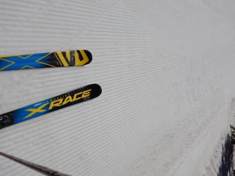
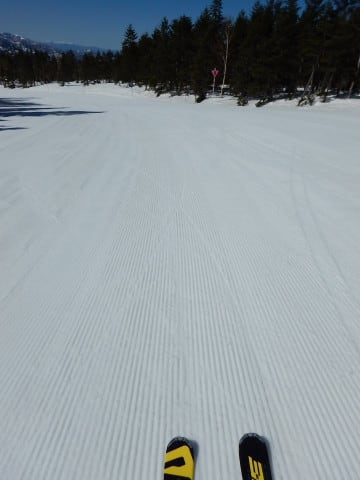
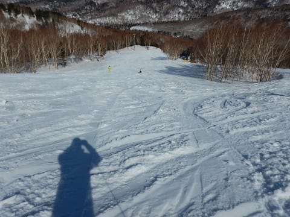

# 2019/4/20(土)の志賀高原スキー場は…終日晴天！朝はちょっと締まり気味だったけど，午後はザクザク（涙）

📅 投稿日時: 2019-04-21 00:21:10

というわけで．

今日も一日，志賀高原を滑っていたわけですが．

…春ですねぇ．．．

もう，すっきり晴天．

いい感じの春スキーの一日でした．

まず．

朝，志賀高原に登ってくる道に…

全く雪がありませんね（涙）

まぁ，4月も下旬だから，

これが普通ですけど…

で．

早朝営業を滑っている人を横目に．

早く滑りたいオーラを出しながら，

通常営業開始を待つわけですが．

うーむ．

こういう，ちょっと早めに着いたとかの

場合でも．

焼額シーズン券をもっていれば．

別料金を払わずに早朝ゴンドラに

飛び込めるんだなぁ…

来シーズンは焼額シーズン券を…

…いや．

買わない．

買わないぞ！

同じスキー場で使えるシーズン券を2枚も

持つなんて馬鹿なこと，しないぞっ！！←ホントか？

ってことで．

通常営業開始と同時にゴンドラに飛び乗り，

山頂に飛び出すと…

…朝8:30に，気温プラス2℃ですかっ！（涙）

朝はマイナスだと思ってたのに，

プラスですか…

気温高すぎ…（泣）

でも．

早朝はかなり冷え込んだらしく．

朝はガリガリ電動マッサージバーン

だったようで…

気温が上がった8:30でも，下地は

緩み切っておらず，しっかり硬め！

下地がしっかりしているのに，

表面が適度に緩んで，ちょうどいい感じに

エッジが食い込むバーン！！

いや，ちょうどいいよ！

いい感じに傾けるよ！！

天気は晴天ぴかぴかで．

景色も最高にいいし．

いや，春スキーとしては理想的な

朝ですね～！！

来週にGWを控えているので．

GW直前にお出かけしようという人は

少ないからか．

ゲレンデはいつに増してがら空き！

特に，第2ゴンドラが動いていないので．

第2ゴンドラ側のパノラマ～サウスコースは

朝からゴーストタウン状態なんですけど…！？？

だもんで．

通常営業開始から1時間ほどたっても．

いい感じのシマシマが残ってるんですが！

9時過ぎには，さすがに緩んできたけど…

それでも人が少なくて，ゲレンデが

荒れてないので．

まだ好き放題傾けるよ！

いや～．

天気も良くていい感じ…！！

…

…

と，思っていたのも10時過ぎくらいまで．

それを過ぎると…

ちょっと雪が重くなって荒れ始めて

来ましたね…（涙）

だもんで．

今日は一の瀬の試乗会もあるので．

一の瀬へ移動！！

なんと．

先週で終わりの予定だった，

焼額～一の瀬をつなぐ一の瀬山の神リフトが．

週末とGWに動くことになったようで…

ダイヤモンドスキー場も，ちゃんと

雪を寄せて，山の神側のコースに

雪をつけてますね～．

素晴らしい！

中央エリアも，やればできるじゃないか！！←なぜいつもそんなに上から目線？

ってなことで，やってきました

一の瀬へ！

一の瀬ファミリーの正面バーンは…

試乗会をやっているせいか，意外と

人がいますね．

11時前の正面バーンは，

意外と雪が締まってますよ！

結構硬く締まって，表面はうっすら緩み始めて

エッジが利く，ちょうどいいバーンじゃないですか！！

と，気持ちよくガンガン滑ってましたが…

さすがに昼頃には緩み始めてきて…

午後2時ごろには．

あぁ…ザブザブ＆小回り道に

なってきました（涙）

まぁ．

でも．

張り付く雪ではなく．

板が滑ってくれたから，

張り付いて滑らない雪に比べれば，

100億倍くらいマシな感じで．

まだ楽しめる！

楽しめるのだ！

さらに．パーフェクターコースが，

人が少なかったので

比較的荒れずにいてくれて．

午後3時ごろまで，そこそこ滑りやすい

状況をキープしてくれたので．

この時期の午後としては，

まぁ悪くない感じだったかな～．

ってな感じで．

試乗会が3時に終了したので．

焼額に戻ってくると…

うむむむ…

これは…

かなり荒れてますね（涙）

午後3時の段階で，気温が+10℃と

ありえないほどの高温だったので，

かなり雪が緩んじゃったようです…（涙）

でも．

張り付き雪でないだけマシ！

板が滑って，スキーになるだけ

と，自分に言い聞かせながら．

残り営業時間1時間．

かなり荒れてしまった焼額スキー場を．

夕日が傾き始める，16時の最終ゴンドラまで

今日もしっかり滑り倒したのでした…

うむ．

まぁ．

雪は荒れたけど．

天気も良く．

ガラガラで．

板も滑ったし．

この時期としては，良かったん

だろうな…←先週土曜の午前が超絶に良すぎたので，何となく納得できてない

明日も終日晴天ですが．

明日は朝から気温が高く．

早朝営業から緩み始めそう…

で．昼前にはざぶざぶ雪になっちゃいそうです（涙）

せめて，雪がストップ雪にならないことを祈るばかり…

## 💬 コメント一覧

### 💬 コメント by (ノーザンレインボー)
**タイトル**: Unknown
**投稿日**: 2019-04-21 04:27:45

おはようございます。昨日は突然お声がけさせて頂き、失礼しました。銀のお札、ありがとうございました。さっそく今日からヘルメットに付けて滑ります。だけどsさんと初めてお話しするが一の瀬とは思わなかったです…

### 💬 コメント by (michi)
**タイトル**: Unknown
**投稿日**: 2019-04-21 11:45:51

Ｓさんは来シーズンはヤケビのシーズン券は必須でしょう（笑）

早朝、１時間遅れとかでも気にせずに入れるし、ナイターも行けるし、ドリンク券も10枚付くし、間違いなく買いです。

Ｓさんの場合、毎週来られるので、板も預かって貰えるので楽になるんじゃないですか？預かってもらう板が多くてヤケビに4〜5本なんて事態になったりして（汗）

うちは来シーズンもヤケビシーズン券を購入予定です。

### 💬 コメント by (Goku)
**タイトル**: Unknown
**投稿日**: 2019-04-21 20:51:49

今年の試乗会はこの時期としたら相当恵まれた条件になりましたね。

しかもパーフェクターまで滑れるとは。

しかもいつもは土が出る部分も今年は出ていないなんて驚きです。

来週からいよいよＧＷですが、滑れない私は後半にＢＢＱだけやりに行きます。

### 💬 コメント by (Skier_S)
**タイトル**: 今日は終日曇り空
**投稿日**: 2019-04-22 02:48:40

＞ノーザンレインボーさま

土曜はお会いできて良かったです～．

しかし，一の瀬で，かつ試乗板を履いていたのに．

良く私を発見できましたね…

また志賀高原でお会いしましょう～！

＞michiさま

うーーむ．

今シーズン，すでに焼額ナイター4日，早朝7日．

これでGWに5日ほどは早朝に行きそうだから…

どうやら，焼額シーズン券の方が安かったようです（涙）

でも，GWに5日も早朝に行かなければいいんだ！

GWは早朝に行かずに，朝はのんびりとしようかな…←それは不可能でしょ

＞Gokuさま

午後はさすがにザブザブになりましたが，

土曜昼ごろまではいいコンディションでした～！

GWまでパーフェクターやらオリンピックコースが

滑れるとは，

今年はやっぱり恵まれてます…

GW後半のBBQ，楽しみにしています！！！

