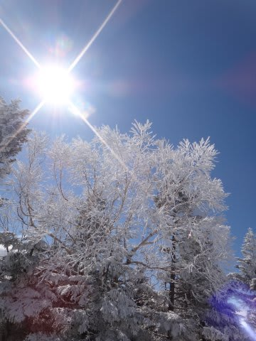
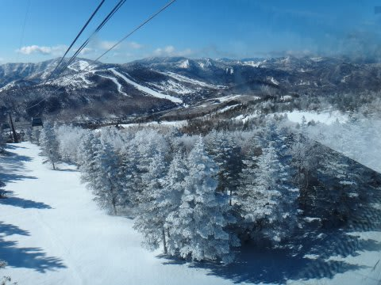

# このGWは運転距離3100km以上(疲れた)

📅 投稿日時: 2013-05-09 02:00:59

🏷️ カテゴリ: [日記](cc4b5682fb7b8b144980957a978653fb0.md)

というわけで．

10連休という，ありえない長期休みが取れた(強引に取った，という説もあり)

GWが終わったわけですが．

あー．

あれです．

いつもどおり，計算の合わないGWだったわけで．

会社の人「GW，いつもどおりスキーに行ってたの？」

Skier_S　「もう，10連休で9日間スキーしてましたよ！スキーしていないのは1日だけですね～

　　    　   うち，8日間は早朝スキーやって…もう，スキー漬けで幸せでしたよ～！」

会「実家には帰らなかったの？」

S「妻実家＠関西某所に2泊してますが…」

会「じゃぁ，ずっと自宅に帰らずに，スキー場と実家をはしごしたんだ！」

S「いや…途中で一回，自宅＠K奈川に帰って1泊してますよ」

会「…け，計算が合わないんだけど…」

とりあえず，このGWのプランの条件は．

　・妻子をいったん妻実家＠関西某所に預け，4-5日後にピックアップ．

　・天気予報から，雪がよさそうな3連休と1，2，3日は絶対早朝から滑る！

　・唯一雨が降りそうな天気図だった30日に移動を集中させる

　・最低2日間は，家族でスキー！

　・これら条件を満たした上で，可能な限り滑る！

というもので．

…これら条件をすべて満たした上で．渋滞にはまったく巻き込まれない移動時間を選択したという．

…きわめて綿密なプラン作成の勝利なのだっ！

うははははっ！

＃プランの勝利ではなく，ひたすら深夜移動を繰り返した体力勝負の勝利だったのでは…←自己突っ込み

ちなみに，GW期間中に車で走った距離は3100km．

10日間での運転時間は45時間を越えてます…

さて．

10日間のうち9日間，志賀高原で滑って(うち8日間は早朝から)，かつ関西で2泊，関東で1泊して．

かつ車の中で45時間過ごしたという．

私がどのように移動したか，分かった人，いますでしょうか(笑）．

＃GWの写真と思えない…やっぱり今年のGWは恵まれてたなぁ．

## 💬 コメント一覧

### 💬 コメント by (gokuraku skier)
**タイトル**: Unknown
**投稿日**: 2013-05-10 05:27:23

行動計画は聞いてはいたものの本当に実行するとは・・・

恐ろしい体力＆気力ですね。

特に４日ＰＭから５日早朝にかけての移動は「どこでもドア」使ったんですか(笑)

### 💬 コメント by (千春)
**タイトル**: ぜひ行程表を！
**投稿日**: 2013-05-10 11:38:43

こんにちは、千春です。

GWのかぐらでケガをしたのに諦めきれず、今週末まだ滑りたいと思ってます（笑）

ところで、このGWのSkier_Sさんの行動、

タイムスケジュールを披露してくださいませんか!?

きっと、私のアホー、アホー！な行動、

　朝：ハンターマウンテン

　昼：エーデルワイス

　夜：ミネロナイター

とは比べ物にならないくらいの行程なんでしょうね！

楽しみにしています。（勝手に尊敬と親しみ感じてます）

### 💬 コメント by (Skier__S)
**タイトル**: 私はアホですから…
**投稿日**: 2013-05-11 00:50:27

>gokuraku skierさま

いやー．

月山日帰りやら，志賀高原日帰りでナイターストップまで…(朝3時発，帰宅深夜2時)

とか，いろいろアホな伝説を残しているので，この程度は驚くには値しないかと…(笑）．

>千春さま

あらら．怪我しちゃいましたか．

私も実は，5月1日に今シーズン4度目の転倒をかましてしまい，

人生初めて，スキーで足をちょっと痛めてしまいました…

ひざが痛くて歩いたり階段を上り下りしたりできなかったんですが，

スキーで滑っても痛くなかったのでラッキー！

今でも，階段の上り下りでかなり痛いです(涙)．

いやー．

でも．

私の移動は，千春さんの一日3スキー場ほど激しくは無いですよ(汗)．

私は昼間に移動すると，滑る時間が短くなるのでもったいない！

って人間なので，なるべく夜に移動しますから…(笑）．

とりあえず，私の移動の正解は，本日の記事に書きましたので，

バカにしてやってください(笑）．

