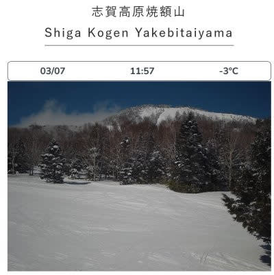
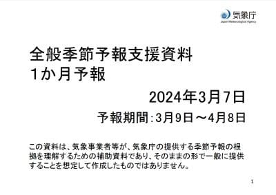
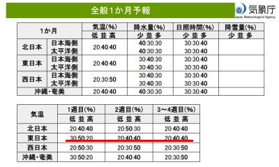

# 気象庁1か月予報が出たよ！…3月は大体平年並みの気温になりそう．ひどい高温も続かないけど奇跡の大雪の可能性も低そう

📅 投稿日時: 2024-03-08 03:07:12

えー．

本日の志賀高原．

朝は私の予想通り，積雪1－2cmの

うっすら新雪が積もったようで．

圧雪の上にうっすら冷えた新雪という，

予想通りの雪質だったけど…

でも，天気は予想を外しました(涙)

終日曇り時々小雪の予想が，

朝のうちは曇りだったものの，

ライブカメラを見るとじきに晴れて，

いい天気になったようです…

まぁ，いい方向に外れたから良しと

しましょう．←自己正当化

いや，でも今日滑れた人がうらやましい…

で．

金曜は，関東で雪が予想されてますが…

金曜は雪になるとしたら夜に降りそうなので，

金曜夜から土曜にかけてスキー場に行く人は，

首都圏の交通混乱を避けるため，

ちょいと早めに移動した方が良いかも…

まぁ，そこまで積もらないと

思いますが．

わずかな雪でもノーマルタイヤで

坂道を登れなくなった車とかが

あったらアウトなので…

で．

土日も北陸や北信では大雪になりそうな

予報が流れてますが．

うーん．

私が天気図を読んだ限りでは，志賀高原は

そこまで積もらなさそうなんだけどなぁ…

最新の天気図を見ると．

土曜はそこそこ降る．

朝までに5－10cm程度，

昼間も雪が降り続け，昼間だけで10cm，

多ければ20cmくらい積もるかな…

かなり寒いし雪が降るので，久しぶりの

根性のないスキーヤーふるい落としデー

になるかも？？

そして，日曜は朝までの積雪が

運が良ければ20cm．悪ければ10cm．

日曜は午前中は雪がぱらつくけど

積もるほどじゃなく，

午後は西風になり志賀は晴れていきそう．

ってな感じで，大雪警報が出るほど

ドサドサ積もるって予想じゃないけど…

まぁ，運が良ければ土日トータルで50cm

くらい積もる計算ですね．

そのくらい積もってほしい…(懇願)

とりあえず，冷え冷えの土日なので，

トップシーズンの雪で滑れる週末だと

思います！！

で．

本日は木曜なので，

気象庁の1か月予報の発表日です…！

果たして，このトップシーズン並みの

コンディションがもう少し続いてくれるのか？

見てみると…

うーん．

まぁ，3月は平年並みかわずかに高いくらいの

予想で．

そこまで冷え冷えにならないし，

異常高温が続く天気にもならなさそう…

異常高温が続かなさそうなのは

安心だけど．

逆に言うと激冷えが続く奇跡の

3月ってのも望み薄な感じかも…(ちょい涙)

とりあえず．

このあとは来週12日の火曜日に雨か雪が

ぎりぎりの際どい日がまたやってきて．

この日が雪ならラッキー，

雨ならまたガチガチのアイスバーンに

なりそうですが．

来週末の16日前後は，ちょっと気温が

上がりそう．

うーん．

やっぱり冷え冷えのトップシーズン雪は，

今週末が今シーズン最後になる可能性も

あるので．

なんとしてでも今週末は滑りに行くべし…！

私は今のところ，今週末は志賀に行けそう

です～！！

## 💬 コメント一覧

### 💬 コメント by (地元民)
**タイトル**: Unknown
**投稿日**: 2024-03-08 19:12:38

長野地方気象台に勝てるか?!

真剣勝負っすね。

### 💬 コメント by (だい)
**タイトル**: Unknown
**投稿日**: 2024-03-08 21:50:01

お久しぶりです。だいです。

土曜午後～夜の寒冷渦のコース次第では志賀でも50cmOVERありそうなので、是非予想を覆して奇跡の大雪になり4月に繋げて頂きたいところですね。あわよくば白樺再オープンも…

私は根性のないスキーヤーなので、土曜午後は奇跡のどか雪を眺めつつお茶の予定です！

### 💬 コメント by (Skier_S)
**タイトル**: 今週末も志賀高原！
**投稿日**: 2024-03-08 23:40:52

＞地元民さま

真剣勝負ですね…

私としては，大雪になる長野地方気象台に賭けたいくらいの気分ですが(笑)．

＞だいさま

土曜は寒いと思います…

白樺は再オープンしませんが，オリンピックコース再オープンです！

