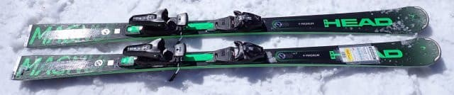
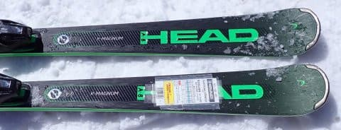
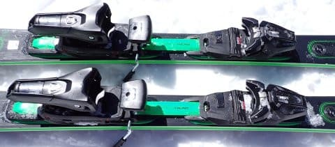
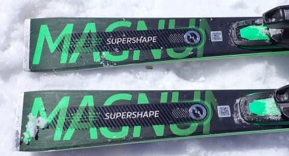
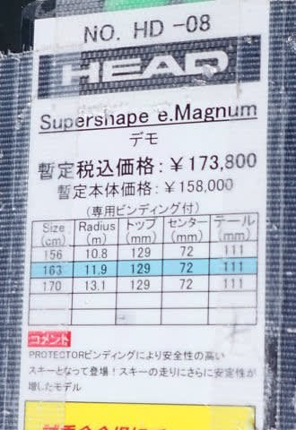

# 2024シーズンモデルのスキー板，試乗レポートその31…HEAD Supershape e-MAGNUM

📅 投稿日時: 2023-07-26 06:41:13

昨晩はまたBlogを上げる前に床で寝てしまった…

だもんで，朝更新！

2024シーズンモデルのスキー板試乗レポートも，

残るは3種類．

今回はヘッド編です．

では，どうぞ～！

〇HEAD Supershape e-MAGNUM 163cm

基礎オールラウンド

HEADのゲレンデスキーの超人気モデル，

e-Magnumです．

試乗したのは163㎝と，私が履くには

ちょいと短め．

ラディウスも11.9mと超ちいさいので，

滑る前は「どうかな～」と心配だったのですが…

履いてみると…

いや．

この板，もう少し柔らかくて優しいイメージが

あったけど．

かなりしっかりしてるよ！！

試乗した日曜は，かなり硬い斜面だったのに，

比較的しっかりグリップして，メタルの

張りも感じて気持ちいい返りも感じます！！

斜面の硬さに負けてない！！

しっかりグリップして，板が走っていく中で

強い旋回性もあって．

かなり気持ちいいカービングができます！

SLモデルとかに比べればグリップは優しい

けど…

悪くない，いい感じの優しさ．

ずれていく中でも，強い旋回性をキープ

したままずれていくので．

ずれても怖くない．

ずれてもずれた中でしっかり回り続けて

くれる板なので，エッジさえ立っていれば

硬い斜面でも怖くなく滑れます．

荒れ始めた一ノ瀬正面バーンでも，

板が粘ってグリップしてくれる感じで

怖くなく，

荒れた急斜面でも，硬いバーンでも安心して

高いポジションから谷回りを作っていくことが

できるので…

この板を履いたら，1級前後の人なら

「スキーがうまくなったかも？」と

思えるかも…？？

私のトップスピードをガンガン出すと，

もう少しグリップがあってもいいかな？

と思うけど．

2年くらい前のモデルに比べると，かなり

グリップが強くなったんじゃないかな？

たぶん，ほとんどの人はこれだけのグリップが

あれば十分と感じるはず．

センター幅が広いので，荒れたザラメに

なってきた斜面でも浮力を受ける感じで

回っていけるし．

硬めの斜面でもカッツリカービングで切って

行けるし…

なんにしろザラメの荒れた斜面でも

硬い斜面でも扱いやすく，

粘りがあってよく回っていくし．

163㎝という，かなり短い板だということを

途中から忘れるほど，スピードを出して

行っても安定感が高かったし．

板の重さを感じず，動かしやすさもあるし．

これ，1球前後の人がゲレンデ履きの

オールラウンド板として履くには，

かなり良くできた板なのでは…？
