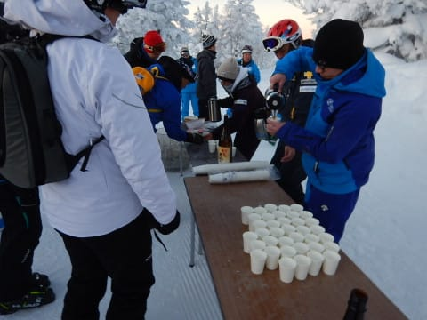
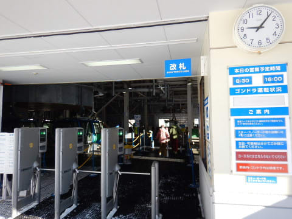
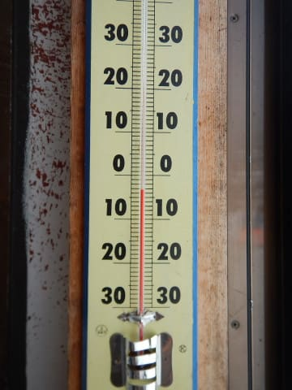
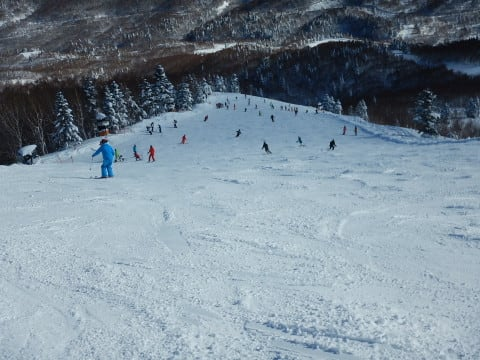

# 2019/1/1，元日の志賀高原は…晴天，雪質冷え冷えの最高の一日！初日の出も拝めたし，いい年になりそう…

📅 投稿日時: 2019-01-01 23:30:18

えー．

毎年言っていることなのですが．

いつも通り志賀高原に来ていて．

いつも通りのスキーをしているので．

あまり新年という感じがなく．

明けて何がめでたいんだろう…？

という感じなのですが．

とりあえず．

明けたらしいので，おめでとうございます．

で．

私は．

新年恒例の新春ファーストトラックに参加

してきました～！

日の出前の朝6:45からゴンドラに乗って…

まだ薄暗い山頂へやってきます．

朝の気温は-13℃．

しっかり冷えてますよ～

薄暮の山頂では，200人ほどの参加者が

初日の出を待ってますが…

振る舞い酒やコーヒーを飲みながら，

日の出を待ちます．

しかし．

普段は1月ごろはひたすら曇り空や雪が続き，

初日の出は全く拝めないのですが．

今日は10年ぶりくらいに初日の出が

拝めそう…！

ということで．

参加者はスタートラインに並び，

シマシマバーンの前で，

初日の出を今や遅しと待ちかまえると．

空がにわかに明るくなり…

来ました～！

2019年の初日の出です！！

あけましておめでとうございます！！

こんなにきれいに初日の出を見れるなんて．

今年はいい年に違いない…

…

などと，誰もゆっくり考えてないようで．

初日の出のスタート合図とともに，みんな

全力ダッシュ！！！

…例年なら．

ほぼトップを滑る私．

前を滑っている人がいる写真が

ほとんどない気がするのですが…

今年はスタートダッシュ出遅れました（涙）

いや．

スタート直後にストックを置き去りにして．

取りに戻ったとかは，恥ずかしくて言えません…

ナイショです←ここで書いている時点で全世界にばれるから

その後，午前8時のファーストトラック終了まで，

朝日がさすゲレンデをひたすらグルグル．

1本目はヨーイドンでスタートしたので，

すごい混雑でしたが．

2本目からはガラガラ貸し切りゲレンデ！

最高冷え冷え，シーズンでもそうそうない

超快楽官能脳内麻薬シマシマゲレンデを，

貸し切り状態で飛ばしたい放題っ！！

山頂付近は初日の出が出てますが．

ゴンドラ乗り場ではまだ日が昇っておらず．

ゴンドラに乗ってる間に，何度も初日の出が

見れました(笑)．

…そして．

ファーストトラックが終わって，通常営業に

入っても．

元日の朝から滑ろうという人は少ないのか，

9時過ぎになっても，ゴンドラはガラガラ！

正月休みになって初めての，すっきり晴天，

今シーズン最高のシマシマ圧雪バーンを

腹いっぱい堪能！！

いやーー．

やっぱり，晴天の下のスキーは

気持ちいいですね～！

昼間になっても，雪質は冷え冷え最高だし．

コース脇は今日も新雪が残ってるし．

昼間の最高気温は，ここ数日では割と

暖かめの-4度まであがったけど．

午後になっても，雪はトップシーズン

最高の雪のまま！

…だけど．

朝はかなりガラガラだったゲレンデ．

10時過ぎにはちょっと混み始め…

そのまま午後まで人口密度はちと

高めでした（ちょっと残念）

そのせいで，午後のゲレンデはちょいと

荒れ気味だったかな…

でも．

今日は終日天気には恵まれて．

景色も良かったし．

あぁ…

スキーは冷え冷え晴天の中でやるもの

だよなぁ…（しみじみ）

ってなことで．

天気・雪質ともに，この正月休みで最高…

というより，今シーズンで最高の一日だった本日．

夕方になると，ゲレンデはところどころ荒れた

ところもあったけど．

新雪が積もったわけでなく，比較的雪が

締まっていたので．

昨日ほどはぼこぼこにならず．

リフトストップの16:10まで，冷え冷え

最高の雪質を．

気持ちよく味わい続けたのでした…

…そして．

そうです．

今日もナイターです！

早朝から滑っていたのに．

ナイターまで参戦です！

元日からナイターをやろうという人は

少ないのか，激烈ガラガラのナイター！

朝に続き，気持ちよくエッジがかかる

最高冷え冷え圧雪を．

思う存分傾きながら滑り続けたのでした…

いやーーーー．

今日は滑った．

朝から夜まで，晴天の最高ゲレンデを

滑れるとは．

2019年も幸先の良いスタートを切れたので．

今シーズンはいい年になりそうだなぁ…

…いや．なる．

毎晩雪が積もって，朝は晴天ピカピカ，

一年中最高雪質の日が続く年に

なるはずっ！！←夏も最高雪質が続くと，それは地球気象の危機では…？？

…ちなみに．

今，志賀高原はかなりの雪になってます…

また明日から4日朝くらいまでは，

降り続けそうです．

またパフパフデーが続きます！

…明日，2日の朝は．

またブーツパフから脛パフくらいの

新雪になるかな～．

3日の朝も、ブーツ～膝パフになりそう。

…でも．

もう少し晴れの日が続いてほしかった…（正直な感想）

## 💬 コメント一覧

### 💬 コメント by (もりや)
**タイトル**: 新年
**投稿日**: 2019-01-02 06:56:44

新春ファーストトラック初参加し、いきなり初日の出が観れるという最高の新年スタートを切る事が出来ました！子供達も初めて見る初日の出に綺麗と感激していたと思ったら、ファーストトラックスタートの合図と共にジュニア組は一気に急加速を始めトップスピードのままGSコース1.2位を獲得しました。毎年SさんがGS1位とお聞きしてましたが、今年は娘さんが1位を獲得しましたね！Sさんの失態を娘さんがカバーするとは(笑)

### 💬 コメント by (Skier_S)
**タイトル**: もりやさま
**投稿日**: 2019-01-02 23:44:20

いや，あの新春ファーストトラックは，かなり思い出に残る1本でしたね(笑)．

私も，ついに娘に抜かれた，記念(？)の会でした(笑)

では，また明日にお会いしましょう～！

### 💬 コメント by (hanakokuma)
**タイトル**: 目撃しました
**投稿日**: 2019-01-03 19:37:52

初めまして。

志賀高原をメインゲレンデとしています。関西在住、hanakokumaです。

ブログは楽しく拝見しています。

御来光ファーストトラック、参加してました。

スタート後、前を避けながら加速していると、逆行してくる方が！？

あれはSkier_Sさんでは？ブログで確信 笑

主人が撮った動画にも写っており、インスタアップされてます。#yakebitaiya

今回は2回ほどゴンドラ１台違いというニアミスがありました。お会いした時はお声かけしたいなぁーと思っています。

### 💬 コメント by (Skier_S)
**タイトル**: hanakokumaさま
**投稿日**: 2019-01-04 05:15:28

始めまして～！

コメントありがとうございます．

…しまった．変な所見られていたようですね…

そうです．

それが私です（涙）．

志賀がメインゲレンデということであれば，

今後お会いすることがありそうですね．

怪しげな銀のお札（？）をお渡ししますので，

次はぜひお声がけください～！

