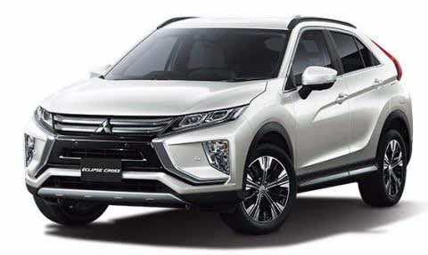

# プロジェクトX2…三菱エクリプスクロスに乗ってみた！

📅 投稿日時: 2018-06-15 02:16:21

🏷️ カテゴリ: [車試乗](c07dec5709d34bd74e1f6cb9c8291061b.md)

ということで．

スキー試乗レポートを一回挟みましたが．

三菱ディーラーで，アウトランダーPHEVに

乗ってきたので．

そのついでに，最近デビューしたばかりの

エクリプスクロスにも乗ってきました～！

（三菱自動車HPより拝借）

車のサイズ的には，XV，CX-5くらいのクラスに

なってくるこの車．

基本的にはアウトランダーのシャーシをベースに，

全長を詰めてダウンサイジングの

1.5Lターボエンジンを載せた車らしいのですが…

三菱がかなりの気合を入れて作った車ということで，

ちょっと気になっており．

ちょうど試乗車があったので，乗ってみました…

乗ったグレードは，4WDのG Plus Package．

一応，最高グレードになるようです…

まず．

トランクを見てみますが…

やはり，レガシィより全長が30cmくらい短い

ということもあり．トランクはちょい狭め…

家族でスキーに行くには，ちょいとトランクの

奥行きが足りない感じですが，

まぁ，車のサイズから言ったらこんな感じでしょう．

リアシートの広さは…

20cmほど前後スライドするので．

まぁ，一番後ろにすれば，驚くほどの

広さではないですが．

そこそこの広さがあります．

そして．

運転席に座ってみたところ…

うーむ．

最高級グレードで300万越えと考えると．

インパネのシボの質感が，ちょっと惜しい感じ…

ステアリングも本革らしいけど，なぜか

プラスチックのような手触り．

うーーーん．

もうちょっと内装は頑張ってほしい感じかな～．

最上級モデルは，インパネのセンター部分に

ナビの代わりのディスプレイがあって．

スマホと連動させて，スマホのナビアプリの利用や

オーディオ再生をさせるようです．

シフトレバー手前ついているタッチパッドで

このディスプレイが操作できるように

なっていますが．

…うーむ．

逆に言うと，最上級モデルには普通のナビが着けられない

ということか…

そして．

エンジンを始動してみますが．

うむむ！？？

なんだ！？

メータークラスター上部に，ヘッドアップディスプレイの

投影用スクリーンが電動でせりあがってきた…！

なんだ，これは…？？

エンジンを止めると，また収納されるのですが．

…いちいち，電動で出したり入れたりしなきゃならない

モノなのかな…？（笑）

ちなみに，普通に走っていると，

このヘッドアップディスプレイには

速度が数値表示されるだけです．

オートクルーズを使ったときには，

その設定情報が表示されるみたいですが…

ってな感じで．

エンジンをかける際に，ちょっと

びっくりしましたが．

とりあえず，車を動かしてみましょうか…

動き出すと，

ステアリングはちょいと軽めに感じます．

エンジンは…

え？

ターボだけど，ものすごくレスポンスがいい．

ゼロスタートでも，アクセルを踏んでから，

すぐ太いトルクが出ます．

ゼロスタートも，レヴォーグ1.6のように

2000回転以上まで引っ張って，やっとブーストが

上がって加速していく…

という感じではなく．

それほどローギアードで引っ張らず．

動き出してすぐから，十分な加速感があります．

この，スタートダッシュ時点から強烈に

ブーストが効いてる感じは…

ターボが異常に小さい？

あるいは低回転時から，ウェイストゲート

基本閉じ？

この車．

インタークーラーがレヴォーグのように

エンジン直上じゃなく，

フロントグリル下にあることを考えると．

インタークーラーの配管もかなり長く，

コンプレッサー下流容積が大きので．

これもレスポンスが悪くなる要因

なんだけど…

でも．驚異のアクセルレスポンス．

トヨタ車なんかは，水冷インタークーラーを

使ってまでコンプレッサー下流

容積を小さくしようとしているのに…

かなり小さいターボで，アイドリングから

ブーストをかけているのがデフォルト？

ブースト計が無いので分からないですが…

そのくらいじゃないと出ないレスポンス．

トルコンもスタートからガッツリ食いつく，

スタートダッシュ型．

おそらくCVTのカバレッジレシオが

6を超えて，7に近いほど大きいので．

あまりトルコンでのトルク増加作用は

期待せず，

トルクコンバータは容量少なめの

ほぼ流体クラッチで．

すぐロックアップかけてるのかな．

アクセル開度が小さめの，街乗りなんかの

領域でのピックアップがいいので，

トルク感は十分あります．

登り坂も登ってみたけど，

エンジン回転数がそれほど上がらず

登り坂を登っていく…

かなりのトルク感．

…ただ，アクセルをガッツリ踏み込んだ

領域では…

やはりタービンが小さいからか．

回転数が伸びてもターボが詰まって，

それほどパワーが伸びていく感じは無いかな．

そして，

エンジン音は，アクセルを踏み込むと勇ましいです．

でも，排気系の音をわざと聞かせている感じで．

低めのきれいな倍波の太い音が響くので．

不快ではないです．

とりあえず，低回転でのトルクの出方，

アクセルを踏んだ時のピックアップは

驚くほどいいので．

アクセルと加速感のリニアリティが高く，

全体的にものすごく運転しやすいですね～．

パドルシフトで8速マニュアルシフトコントロールが

できて．

このあたりもいい感じ．

…でも，パドルはステアリングと一緒に

回ってほしいかも…

次はハンドリングですが．

車長の短さを考えると，

コーナーを曲がった感じは

思ったほどクイックではないです．

ホイールベースが比較的長めだし．

ステアリングセンター付近であまり

敏感に動かないように，

ステアリング系にちょっとだけ

コンプライアンス要素をわざと

とってあるように感じる…

ただ，一旦車が旋回を始めると，サスが

しっかりストロークして，路面をちゃんと

ホールドしていきます．

フロントのボディ剛性は高そうですね…

路面の継ぎ目なんかも，軽やかに乗り越える．

おそらく，サスの横剛性も高そう．

足回りも，かなり真面目に作りこんでいる感じで．

アウトランダーよりは乗ってて楽しい車です．

ってな感じで．

…足回りはちゃんと作りこんでるし．

エンジンも，ダウンサイジングターボと

思えないくらいのレスポンスの良さで．

頑張って作っているんだけど…

…これだけ低回転からブーストが効く

仕様になっていて．

さらにレギュラーガソリンってのもあるかもしれないけど．

最近の直噴ターボとしては圧縮比も10と低め．

吸気バルブ位相調整の差動角を，

そんなに大きくとってないのかな？

あまりアトキンソンサイクルで動く

領域を大きく取ってなさそうだから．

…これは，燃費悪くなるだろうな…

…と思って調べると．

JC08モードのカタログ値．4WD車は14km/L…！

車重が重くて，2.5LのNAエンジンを積んだ

アウトバックより燃費が悪いじゃないですか…！

うーーむ．

あまりダウンサイジングターボの意味が

ない気がする…

インタークーラーやターボのための補器類を

入れると，エンジンのサイズも重量もそれほど

変わらないから．

これなら，素直に2.5Lエンジンにした方が，

いいんじゃなかろうか…

ダウンサイジングターボの意味を考えてしまう

車ですね（笑）．

あと，内装ももう少し頑張ってくれれば…

とりあえず．

一生懸命作ったことは伝わってくる車でしたが．

ダウンサイジングターボのネガを消そうとして．

燃費改善（≒CO2排出削減）という，

本来のダウンサイジング化の目的が

完全に消えてしまっている謎設計だなぁ…

と思った，Skier_Sなのでした．

## 💬 コメント一覧

### 💬 コメント by (おおすぎ)
**タイトル**: Unknown
**投稿日**: 2018-06-15 14:38:29

お久しぶりです、こんにちは！

志賀高原FFミニバン運転講習では大変お世話になりました！

おかげさまで、スムーズに行き来出来ました（途中のチェーン交換所も流石にS様と言わせるほど完璧な場所でした！）

うちも、つい最近嫁車ですが、プロジェクトXして来ましたよ！

突然ブツケテ来たので、逆来店一発狙いでやって来ましたが、色々乗れて楽しかったです。

S様や志賀高原常連の方には４駆の設定が無いので初めからスル～だと思いますが、もし時間がありましたら是非、スパーダハイブリッドの試乗もお願いします♪

１．８トンの巨体がまるでスポーツカーのような加速で飛ばして行く加速は病みつきでした（わたし元サンデーレーサーです）

ホンダ設計者によると、エンジン+モーター出力で、386馬鹿力になっているようです・・・

そんなにあっても使用する所がありませんが・・・（もっとトロロッソを速くしてくれた方が私的には嬉しいのですが・・・）

S様のプロジェクト、楽その行方を楽しみにしております！！（S様の事、もう一回車検は無いと、竹下ケイコに3000点・・・古！！！）

### 💬 コメント by (Goku)
**タイトル**: たしかに・・・
**投稿日**: 2018-06-15 20:11:15

ダウンサイジングターボとしたら、この燃費はちょっと残念な感じですね。

カーゴルームもリアの形状から想像すると小さそうでちょっと中途半端な大きさなのかな？

### 💬 コメント by (しんちゃん)
**タイトル**: トランク狭し
**投稿日**: 2018-06-16 00:07:40

エクリプスクロス、まず言いにくいですよね(笑)

それと、トランクは狭いです。

ゴルフバッグはリアシートを倒さないと駄目でした。また、180cmの大回り用スキー板は、シフトレバー付近まで来ちゃいます。

走ると楽しいんだけどなあ。

### 💬 コメント by (Skier_S)
**タイトル**: エクリプスクロス，1.5Lターボである必然性は？？？
**投稿日**: 2018-06-16 01:00:28

＞おおすぎさま

お久しぶりです～！

志賀高原にも無事行けたようで，何よりです…．

で．

奥さんの車，プロジェクトXしたのですね！

スパーダハイブリッドですか？

ガソリン車は乗ったことがあるのですが．

ハイブリッドはまだ乗ったことがないです…

そんなにすごいんですか？

ホンダは最近4WDが少ないので候補に

上がらないのですが，シビックも実は

気になってます…

私の方のプロジェクトX，結果を楽しみ（？）に

お待ちください！

＞Gokuさま

そうなんですよ…

燃費が良くならないなら，

大排気量NAの方がピックアップも早いし

インタークーラーの取り回しとかもないし，

故障する部品も少ないし…

大排気量NAの方がいい気がしてます．

トランクもちょいと狭い感じ．

インプレッサの方が広く感じました．

＞しんちゃんさま

「クロス」をつけないで，エクリプスでも

良かった気がするんですが．

…しかし，先代エクリプス．

懐かしいなぁ…

走ると楽しい車でしたが，我が家で乗るには

ちょいと小さすぎるし．ディーラーも家から遠いから，

ちょっと私の購入候補には上がらない感じです…

