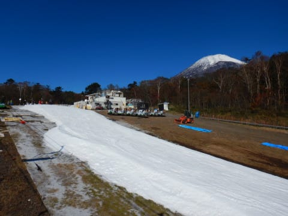
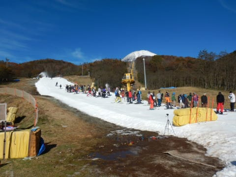
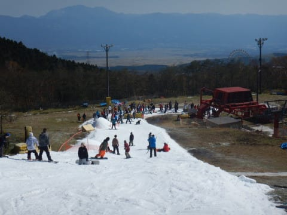
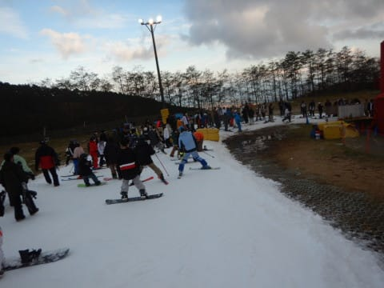
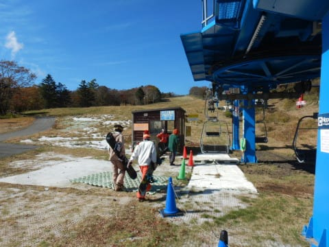
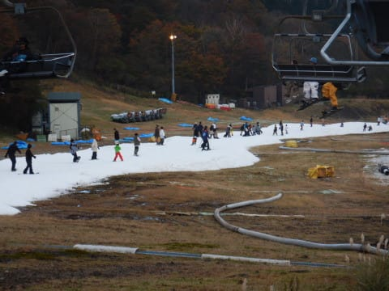
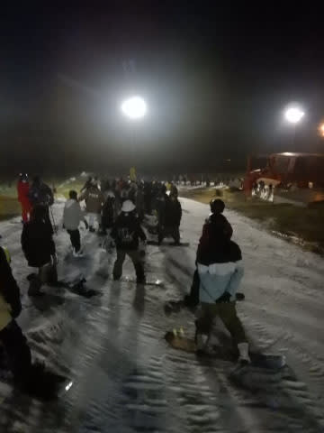
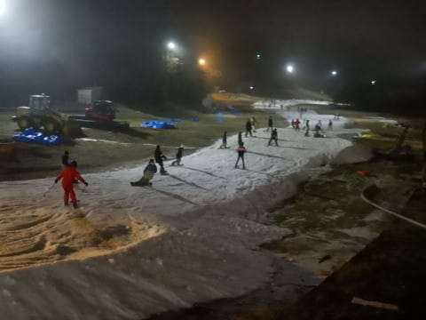

# 2021/10/30(土)，オープン1週間後のイエティ速報レポート！…今日はかなりリフト混雑（涙）コース混雑状況の動画あり

📅 投稿日時: 2021-10-31 01:30:53

ということで．

イエティのオープンから1週間が

経ちましたが．

今日もイエティで滑ってきました～！

今日もナイターまで滑って，帰宅後いろいろ

やってて遅くなってしまったので．

今日のイエティの状況，

速報モード＆ゲレンデ動画

にてレポートします～！

えー．

まず，朝イチは晴天ガラガラのゴキゲン

でスタートだったんですが…

気持ちよかったのは，あさイチの

2-3本だけ．

人が一気に増えて，スタートから一時間も

しないうちに，リフト待ちがかなり長く

なっちゃいました…（泣）

ガラガラだった先週とはえらい

違いだ…（涙）

と嘆いていたら，10時から並行する

ペアリフトが営業開始して，リフト待ちは

ちょっとマシな状況に．

ただ…やっぱりピーク時はこの程度は列が

並んでましたが…

でも，ペアリフトが動いてからは，最大でも

10分待たなかったですね．

ちなみに，ペアリフトは終日ほぼ待ちなし

でした！

…リフト降りてからゲレンデまで，

結構歩くのがめんどくさいので，

このペアリフトに乗る人は少なめですね．

ペアリフトは待ち時間なく乗れたとはいえ．

コース幅は先週オープン時とそれほど

変わってないので，コース上の

人口密度はかなり高めでした（泣）

そして．

今日の恐怖は，ナイタータイム．

ペアリフトが動かず，クワッド1本のみの

ナイターなのに．

昼間と同じくらいの人がいたので…

すごいリフト待ちになってました（激涙）

あぁ…先週の快適さはいずこへ…

ということで．

さすがの私も，この異常に伸びたリフト

待ちに耐えられず，ナイター開始1時間

ほどで撤退しちゃいました…

いや．この待ち時間には耐えられない（涙）

ってな感じで．

先週のガラガラ快適は夢だったのか？？

と思うほどの混雑したYetiだったわけで．

混雑のおかげで，滑れた本数は先週の

半分程度と，かなり残念な感じの

一日でした　…（涙）

あ，今日の天気は，朝は晴れ，午後は曇り．

晴れると暑いのですが，曇ると冷えて

ジャケットがあった方がいいかな…

というくらいの気温でしたよ～！

…

明日の日曜は曇り空，時折雨が降る

残念な天気になりそうですが．

天気が悪い分，人が少なくて

混まないかも？？

ってなことで．

今日もYetiで滑った時の定番，ゲレンデ状況の

動画をつけておきます…

明日の記事に詳細レポート書きますので，

お楽しみに～！

…今日はもう寝ます…
