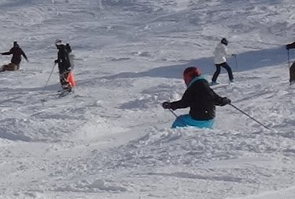

# 小学生になったわが娘…なんだか嗜好が偏ってきたかも？？

📅 投稿日時: 2015-01-30 00:36:45

えー．

小学校1年生になり．

体力も驚くほどアップした，わが娘．

相変わらず，今シーズンも

ガンガン滑ってるわけですが…

とりあえず，まぁ．

まだプルークスタンスとはいえ．

整地では，なんだか．

結構板のたわみも出して滑ってるし…

（ちゃんと外足の板がたわむポジションにのれている）

かなりスピードにも強くなり…

（果敢にポールを攻める娘）

結構な急斜面の，焼額のオリンピックコースなんかも

見てる方が怖いくらいのロングターンで突っ込んでいくし．

疲れ知らずで，夜まで滑りたがるし…

でも．

まぁ，相変わらずこぶ斜面が好きで．

コブを見ると，

「でこぼこ，滑る～！！」

と喜んで突っ込んでいく，キケンな娘に育ってしまったわけで…

この動画なんて．

コブを滑った後に，

「そこまで行くかっ！」

ってツッコミを入れたいところではありますが．

なんだか．

今シーズンから．

整地を普通に滑っているだけでは飽き足らない

感じになってきたようなんですよ…

とりあえず，整地と新雪を見せると，絶対に新雪に突っ込んでいくし．

深いパウダーを見ると，ここぞとばかりに突っ込んでいく

わが娘．

コース脇パウダーも大好きだし．

なにより，娘の最近の焼額でのお気に入りコースは，

スーパージャイアントスラロームコース（非圧雪コース）と…

それと，ミドルコース（これも非圧雪）という…

新雪が積もった日は．

絶対に圧雪コースに行きたがらず．

「パフパフ！パフパフに行くの！」

と，主張し続けるわが娘．

どうでもいいけど．「次もパフパフ凸凹コースに行く～！」と，

非圧雪のスーパージャイアントスラロームコースを

5-6本連続で行かれた日には．

…わが娘のサル具合も，極まったものよ…

と，感心すればよいのやら，あきれればよいのやら…

まぁ．

とりあえず．

スキーLOVEに育ってくれてよかった…

と，日記には書いておこう．

（華麗なジャンプを決める娘）

## 💬 コメント一覧

### 💬 コメント by (いか)
**タイトル**: Unknown
**投稿日**: 2015-01-30 11:41:48

荒れ地は前後左右のバランス感覚を身につけるにはいいですね！

滑りに安定感が出るようになります。

ただ気をつけないと、荒れ地しか滑れない荒れ地病や新雪しか滑れないパウダー病にかかってしまいますよ…笑

### 💬 コメント by (Skier_S)
**タイトル**: いかさま
**投稿日**: 2015-01-30 23:20:08

うちの娘、すでに新雪かあれ地しか

滑れなくなっている気が…

もう終ってます(^^;)

