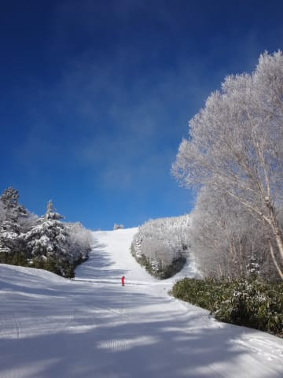

# 12月6日，日曜日の志賀高原レポート，速報モード

📅 投稿日時: 2015-12-07 01:36:11

🏷️ カテゴリ: [2016スキー滑走日記](c70c67ed5248e9432b899dcd5747048bb.md)

今日も遅かったので．

本日の志賀高原，焼額山のレポートを，

速報モードにて…

えー．

本日の天気は，時折雲が流れるタイミングも

あったものの，基本的に晴れ！

朝の気温は結構冷え込んで，

朝イチの雪は結構良かったですね～！

…でも，

今日は絶好のスキー日和で，

かつ，焼額のゲレンデ状況が

志賀高原では一番マシだったからか，

午前中はちょっと混み気味…

第2高速は待ち時間がなかったけど，

4ロマはタイミングによっては待ち時間が

結構ありました…

でも．

いつもの志賀高原の日曜午後のパターンで．

午後には，人がいなくなるんですね～．

なんだ，このガラガラのゲレンデは…

しかし．

昨日からの天然雪がほとんどなかったので．

ゲレンデは，固い人工雪の下地が出てきて．

午後は，コース全面，ちょいと固め

だったなぁ…

でも，

天気のいい中，

クワッドをガンガン滑れたので．

満足かな～．

また明日，詳細レポートします…

## 💬 コメント一覧

### 💬 コメント by (Goku)
**タイトル**: Unknown
**投稿日**: 2015-12-07 18:51:01

昨日はお疲れ様でした～

いや～娘さんの速さには驚きましたよ！

まさに親譲りのスピードキングですね。

将来は川端絵美ですね（古）

### 💬 コメント by (Skier_S)
**タイトル**: Gokuさま
**投稿日**: 2015-12-08 00:55:44

日曜はお世話になりました～！

娘はGokuさんと一緒に滑って

嬉しかったようです．

ありがとうございました．

しかし，いくら爆走娘とはいえ，

山ノ内町のスポーツ少年団には

ぜんぜんかないませんから（笑）．

