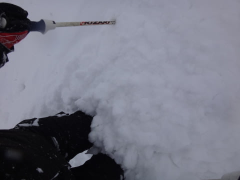
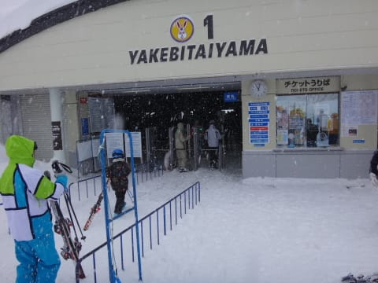

# 2月15日の志賀高原詳細レポート…吹雪の一日で，新雪も重かったよ（泣）．

📅 投稿日時: 2015-02-17 00:59:30

なんだか．

現時点の天気図を見ると．

…この日曜は．

……春がやってきそうですね．

…暖かく，雪が解ける週末になりそうな気配…

せめてもの救いは，天気は良さそうなことかな～．

ってことで．

昨日，速報をお送りした，日曜の志賀高原をば．

えーー．

朝，宿の前に出ると…

…な，なんだ，これは．

く，車を発掘するのが大変…

ってより，運転席のドアにたどり着くまでに一苦労する

レベルなんですが．

でも．これは．

前向きに捉えると．

[2月1日](e8501961c7d0d94914dace82dd761db13.md)と同じパターンで．

パフパフに大期待っ！！

ってことで．

＃ただしゴンドラが動けば

ってことで，やってきました焼額．

さて，ゴンドラが動くのか？

それとも，パフパフを目の前に，リフトで圧雪コースしか

滑れないのかっ！？？

…

をを！

減速ながらも，無事，第1，第2とも，ゴンドラ運転っ！！

＃奥志賀はほぼ全面運休だったみたいだけど

ってことで，喜び勇んで山頂へ登ると…

気温は木曜に予想した通り，マイナス10℃．

そこそこ冷えてますね！

ゲレンデに出ると…

…これは．

視界があまりよろしくありませんな…

そして，圧雪コースも10cm位の新雪が積もっていて．

前がよく見えない中，時々吹き溜まった新雪に足を取られて，

ちょいと難しいゲレンデですが．

とりあえず，パフパフを楽しみに，新雪コースへ行かねばっ！！

…と，やってきたオリンピックコース．

うはははは！

これは，膝～太ももパフだよ！

ってことで，いざ！パフパフへ…っ！

あれ？

あれれ？

なんだか．

なんだか…雪が．

雪が，すごい重いんですがっ！！？？

いつものサラサラパウダーではなく，

こんな感じで，ボソボソと固まった感じの雪で．

普通なら，板の上にさらさらと雪が流れていくけど…

今日の雪は，こんな感じで雪が固まり気味（涙）．

ちょっと板が潜って取られてしまい，快感度が低いんですけど…

…おかげで，新雪を滑っている人は，楽しむというより

苦しんでいる感じ…

うーーーーん．

残念！

…でも．

太板だったら，こんな雪でも軽々と滑れるのかな～…

＃買いませんっ！買いませんから！←繰り返し主張しておかないと…

とりあえず．

圧雪コースへ戻ってみると…

うむ．

前が見えないよ（涙）．

そして…

地吹雪っぽいんですが．

風が強いんですが．

おかげで，ゴンドラは減速運転で遅いものの，

人は少なめで…

ゴンドラ待ちも，最長3分ちょいってところだったのが救いかな～．

しかし．

この日は，

午後になっても，視界が遮られるほどの地吹雪が続き…

雪質はいいんだけど．

なんだか，結局．

リフトストップまでずっと，滑る意欲を失わせる

ような強風が吹き付ける一日だったのでした…←リフトストップまですべってるやん（基本的ツッコミ）

とりあえず．

朝まで雪が降り続け，風が強い…という予想は当てたけど．

午後に向かって雪が止む，というこの日の予想．

見事に外してしまったのは，黙っておこう…←だから，ここに書いてる時点でバレバレだってば

…きっと．

誰か．

日ごろの行いが悪い人がゲレンデにいたからに違いない…っ！！！←責任転嫁

## 💬 コメント一覧

### 💬 コメント by (れお)
**タイトル**: 雪が重かったですね…
**投稿日**: 2015-02-17 13:38:04

日曜日は、ヤケビに向かう途中、高天が原の駐車場に雪で埋まっている車をたくさんみて、「これは、ディープパウダー」が期待できる♪」とウキウキして、１ゴンに乗ったのですが、雪が重かったですね…。残念（泣）

風のせいなんでしょうか？

まあ、駐車場でＳさん拝めましたし、ラッキーなところもあったかも（笑）

日曜日から気温上昇ですか…。あと数回は冬将軍に頑張ってもらいたいな～。

### 💬 コメント by (Goku)
**タイトル**: Unknown
**投稿日**: 2015-02-17 19:34:22

さすがの志賀でさえ雪が重かったんですね。

私は朝の時点で志賀は諦め、近場の飯綱に午後出勤でした。

### 💬 コメント by (べべ)
**タイトル**: 暖冬
**投稿日**: 2015-02-17 22:14:47

私は札幌のテイネスキー場に行ってきましたが、少し重めでした。

今後は暖冬傾向みたいなので、さらさらパウダーはなかなか望めないですかね(T_T)

そうなると重めの雪でも楽しめる太い板が…(笑)

### 💬 コメント by (すぎぃ)
**タイトル**: Re: 雪が重かったですね
**投稿日**: 2015-02-17 23:44:20

＞れお様

雪が重たかったのは貴殿がいうように

風のせいみたいです。

降った雪が風で剥がされて

叩き付けているのが原因だったようです。

### 💬 コメント by (Skier_S)
**タイトル**: いや，重い雪でした…
**投稿日**: 2015-02-17 23:53:08

＞れおさま

朝に会ったっきり，全然お会いしませんでしたね…

こちらは昼前に一の瀬に戻り，午後は娘と

吹雪の中（＾＾；），一の瀬で滑ってました．

しかし，雪は見事なウインドパックな感じでしたね～．

風が弱ければ，もう少し軽かったと思いますが…

残念ながら，日曜は気温はプラス5度くらいまで

上がっちゃいそうです．

…そのあとは，冷えてくれるといいんですけど…

＞Gokuさま

いやー．

湿った重さというより，風で固まった，

見事なウインドパックって感じの雪質でした．

終日吹雪くし，期待したパウダーも，重くて

残念な感じで…

飯綱に行って，正解だと思います（；_；

＞べべさま

テイネでも重かったんですね…

北海道は，今年は雪が少ないみたいで．

でも，志賀は寒い日が多い気がするんですが…

そして，今年はパウダーのあたり日が多い気が…

で，太い板が…

おっと，危ない，危ない．

太い板なんて，買わないぞ～（弱々しく）

### 💬 コメント by (Skier_S)
**タイトル**: すぎぃさま
**投稿日**: 2015-02-17 23:56:50

そうなんですよ．

見事に風で固められた感じの雪でした…

気温自体はマイナス10℃と低かったので，

フワフワを期待したのに…（涙）．

風だけでここまで重くなるんですね…

