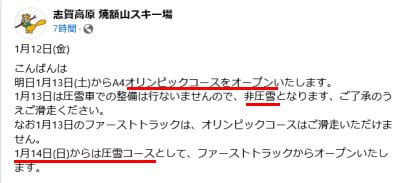

# 今度の週末はちゃんと1泊2日で志賀高原にスキーに行けるぞ！！土曜は雪，午後強くなる．日曜は晴れていい感じになりそう…！

📅 投稿日時: 2024-01-13 01:20:15

🏷️ カテゴリ: [日記](cc4b5682fb7b8b144980957a978653fb0.md)

ってなことで．

先週は

妻の発熱によりスキーができない悶絶の3日間

を過ごしましたが…

今週末は無事スキーに行けます！！

行きます！！

でも．

今日は夜10時半という，私にしては

かなり早めに帰宅したけど…

家で一つやっつけなくてはいけない

仕事があり．

仕事をやっつけているともうこんな時間…

夜中の1時過ぎたよ（涙）

それでも，明日朝4時発で出かける！！

スキーに行く！

先週スキーができなかった恨みエネルギーが

溜まりまくっているので，

もう，徹夜でも行く気マンマン

なのだ！！←でも，先週3連休の前，2日仕事しただけで

その前は5泊6日で滑ってたよね…十分滑ってたよね…

とりあえず．

焼額山は明日の土曜から，ついにやっと

オリンピックコースがオープンします！！

（[焼額山スキー場Facebook](https://www.facebook.com/yakebitaiyama/posts/pfbid02SddrSxdSH5EVtUdSCURpLMDmLwHsRLBemViS9aduUpEhCx7h4GWWdjEDKPzFamzPl)より）

土曜は非圧雪だけど，日曜は圧雪でオープンする

ようで…

これでまだオープンしていないのは，SGSコースと

ブナ，ミドルコースですね．

で．

土曜の天気はおおむね予想通り，

朝から雪

です！！

朝までに20cmくらい積もってくれるかな～．

雪は午前中は弱めだけど，午後に強くなりそう．

昼間も雪が積もり続けるので，ゲレンデの

雪不足が解消するといいんだけど…

でも，午後は吹雪気味で寒く，根性のない

スキーヤーふるい落とし機能が発動します．

そして，ナイターの時間まで降り続けそう…

ただ．

ナイターが終わったころには雪が止む

という，リフト営業している間だけ

降るような，嫌がらせの雪です（泣）

土曜から日曜にかけて，夜の間に降って

くれればいいのに…

でも，その代わり．

日曜は朝から晴れそう！！

（朝早くだけ，ちょっと雲が残るかも…）

朝は柔らか圧雪の最高のバーンに

なりそうな感じ…！

ってなことで．

冷え冷え雪降りでオリンピックコースもオープンし，

ゲレンデ雪不足が改善していく土曜と，

雪が積もった後の晴れの日曜という，

いい感じになりそうな週末．

実に10日ぶりにスキーに行ってきます～！！！

…でも．

あと2時間半しか寝られないんだけど…（安定の睡眠不足）
