# 2024年8月，今年も座間味で親子ダイビング！その16…この旅行のラストダイブ終了．満足の6本のダイビング，全て完了！

📅 投稿日時: 2024-09-13 04:00:07

🏷️ カテゴリ: [ダイビング日記](ce3a7a8d424d112fce83ee85c81a0e344.md)

今日も昼間の一言更新しかできません

でしたが，かなりヤバい日々が続いて

ます…（涙）

最近まれにみるピンチ．

今日は4日ぶりに布団で寝られるのか…！？？

（今からすぐ寝ても2時間半しか寝られない…

　でもまだ仕事が終わってない…（泣））

こんなBlog書いている場合じゃないのに，

大丈夫か？

とりあえず．

途中まで書いてあった記事を仕上げて

投稿！

いつもの座間味ダイビング日記です…！

ーーー

（[前回はこちら](e8510a8134cad4811a88bdf16688dfb48.md)）

ってなことで．

このポイントの目的の根にやってきましたが…

いい感じでキレイで，写真映えしそう！！

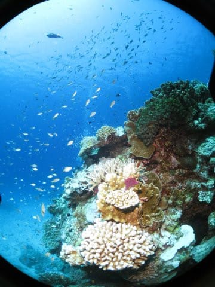

見よ，キラキラ感を…っ！！

ダイビングしたことがない人でも，

これ見たら潜りたくなるんじゃない

かな～…

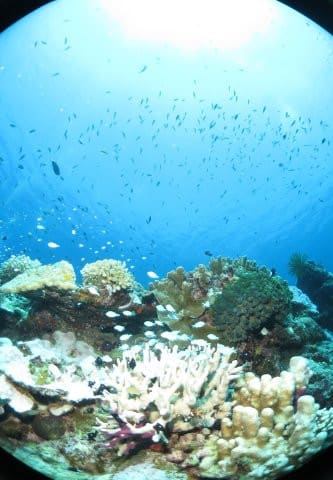

そしてこの根もキンメモドキがいっぱい

いますが…

サービス精神満載のアオウミガメさんたちと

違ってシャイなのか，なかなか岩の隙間

から出てきてくれず…

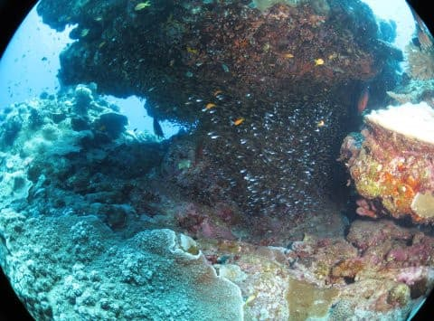

ブルーの海を背景とした写真は撮れず（泣）

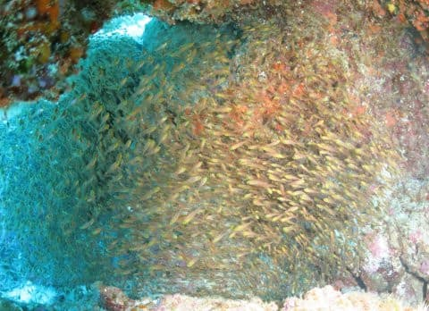

根の主っぽい感じで，キンメモドキを

守るように泳いでいるユカタハタが

と一緒の写真が撮れましたが…

外敵から守る代わりに，ときどきキンメ

モドキをお食事に頂いているこの魚．

キンメモドキにとってみれば，村を

守ってくれる代わりに生贄を差し出さなくては

いけない，人身御供みたいな感じ

でしょうね…

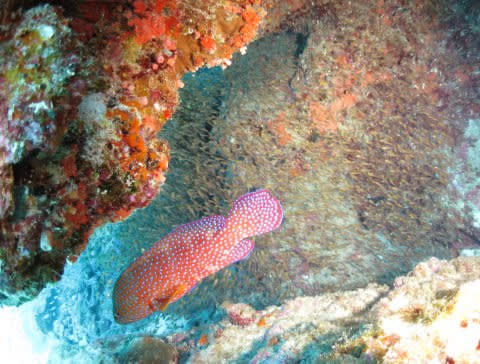

娘も必死に写真を撮ってますが．

この根の周りに，いっぱいお魚がいるのが

分かると思います…

いや．

お魚いっぱいの，見ごたえのある根でした！

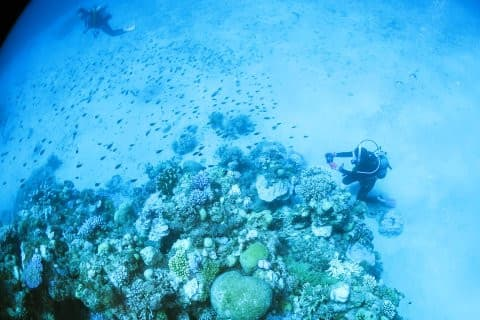

ってな感じで．

結構この根で粘ったのもありますが．

最初のカメさん連発で時間を食ったのも

あり．

もうダイブタイム終了間近…

ボートの下に戻ってきました．

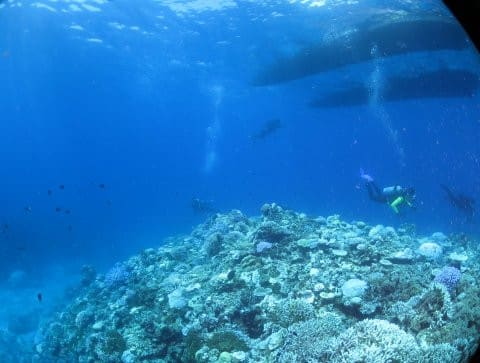

あぁ…

これで，この旅行のダイビングも終わりか…

と思いながらも．

いや．

このボートの下も，結構見ごたえのある

感じですよ！

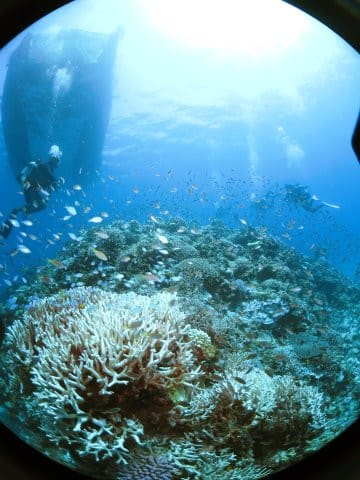

見ごたえのある感じのサンゴの上で

しばし安全停止を兼ねたフリータイムを

過ごしたら…

残念ながら，ラストダイブも浮上の

時間となりました（涙）

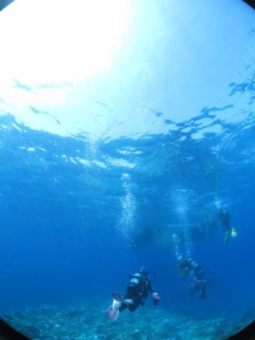

ってなことで．

残念ですが．今回のラストダイブも終了！

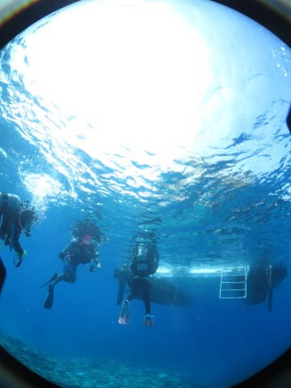

あぁ…

ラストダイブも終わっちゃった…

というわけで．

ラストダイブを終えたボートはポイントを

後にし，港へ戻りますが…

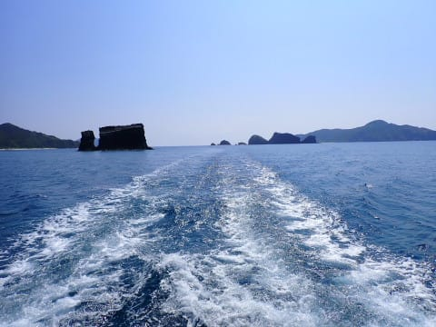

ラストダイブが終わったので，

今日は器材を持って帰らなくてはならず．

メッシュバッグに器材を全部詰め込みます…

この作業も，ダイビングが終わった感が

あって，すごい寂しさを感じる作業ですね（涙）

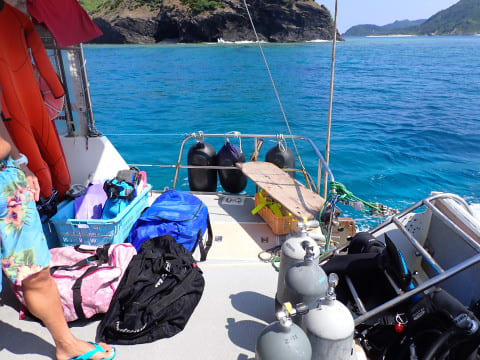

娘も今回の旅行の最後の特等席を，

名残惜しそうに味わってます…

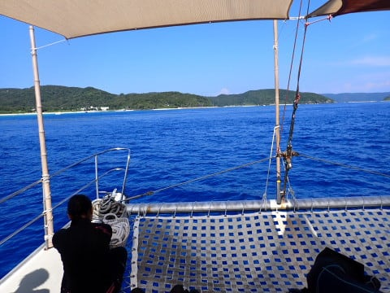

3本目のポイントは，港からちょいと

遠めのポイントではありましたが…

でも，ポイントから15分ほどで，

座間味の港に戻ってきました．

（[続く](eb29f9340f43d8498e3582ca2d4ae2654.md)）

## 💬 コメント一覧

### 💬 コメント by (1kamakura)
**タイトル**: Unknown
**投稿日**: 2024-09-13 06:57:46

江戸の秋

ため息が出そうなきれいな海！

こんなきれいなところに潜ってみたい。

沖縄でダイビングした事が無かったのです😭

だいたい伊豆（爆）

海外はバリとフィジーだけ。

もし沖縄に行く事があれば、体験ダイビングやろうと思います。

オープンウォーター持っているのに、情けない😂

### 💬 コメント by (Skier_S)
**タイトル**: ＞江戸の秋さま
**投稿日**: 2024-09-14 02:44:27

ええ？？

沖縄で潜ったことがないのですか…

ぜひ慶良間で潜ってみてください．

昔は八重山も良かったのですが，最近は慶良間ばっかりです…

ザマミセーリングさん，体験ダイビングもやってますよ！

