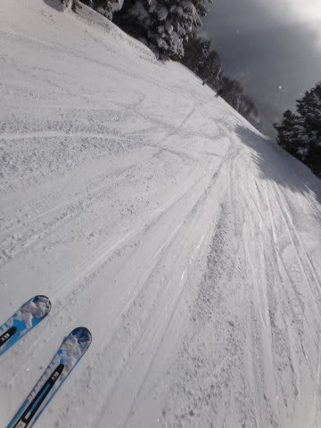

# 2月17日の志賀高原は…今シーズンのベストコンディションかも？？

📅 投稿日時: 2013-02-18 00:55:07

🏷️ カテゴリ: [2013スキー滑走日記](c91dbe557f9a69230b1600e48622fdd61.md)

うふふふふ．

うふふ．

[天気予想](e6f7f02adfd31545647a35f6b0225b538.md)に…

日曜は，朝はパウダーパフパフ．

それも，昼に向かって天気が良くなり，日が射すという．

で，気温は低くて雪はいいまま．

…このままの天気図なら，最高の一日になるんじゃないかな？？？？

って書いたとおり．

…まったくそのとおり．

むはははは．

最っ高の一日だったのだっ！

ただ，朝の積雪は…

この程度だったので，ちょいと予想より少なかったかな．

でも，気温は，こんな感じで．

マイナス17度．

今日も寒いよ！

朝のうちは，予想のとおり雪が残り，ちらちら降ってましたね～．

んで．

…雪が軽い！

これは，パウダーを求めて行かねば！

…と，オリンピックコースへ行くと…

うひょーーーーっ！パウダーが．

パウダー深さはせいぜいブーツ程度だったけど．

ありえないくらいパウダーが巻き上がる，超軽パウダーが！

でも．

だけど．

…この程度の深さのパウダーでは物足りないのだ．

体がもう少し深いパウダーを求めている…っ！

…ってことで．

エキスパートコースへGo!

ここは…

ふはははっ！

膝パフの新雪がっ！

そして，日差しも降り注いできました．

私の日ごろの行いの良さがここにきて現れたかっ！

＃天気予想通りだってば

では，いただきまーーーーすっ！

…

ああ．

最高．

最高だよ…

しかし．

このパフパフ，

残念ながら，ゴンドラ3-4本滑るとおおむね食べつくされてしまったので．

今度は，圧雪コースにでも行ってみましょうか…

パウダーとはうって変わって，

やわらかい雪がぴかぴかまっ平らに圧雪されてます．

普通，パウダーの日は．

圧雪バーンも雪が積もって，もさもさになっちゃってるのが普通だけど．

パウダーの後に，こんな快適なぴかぴかフラットバーンをトップスピードで気持ちよーーーく

大回りできるとは！

うほほほほっ！

さ，最高だぁ～っ！！！！！！

11時を過ぎると，天気も完全に晴天に．

ああ．私の日ごろの行いが良いからに違いない…

雪よし，天気よし，そしてリフト待ちもなし…

昼間の最高気温もマイナス8度で，天気が良いのに雪はまったく緩まず．

そして．

今日も午後3時に，焼額第1ゴンドラ山頂で無料で配布しているホットドリンクをもらって…

夕方まで滑りましたが．

人が少なかったからか，夕方でもこんなにフラットなまま．

…最高なんですけど…．

オリンピックコースはコブってましたが．

雪は適度にやわらかく．

これはこれでまた良し．

って感じで．

天気良し，雪よし，パウダーあり，快感大回りの圧雪バーンもあり．ゲレンデもがらがらの今日一日で．

今シーズンのベストコンディションを腹いっぱい満喫できた本日．

ああ…幸せ（はぁと）

## 💬 コメント一覧

### 💬 コメント by (gokuraku skier)
**タイトル**: Unknown
**投稿日**: 2013-02-18 20:43:18

日曜日は栂池に浮気をしてしまったので志賀に行かなかったのですが、そんなに良かったとは・・・やっぱり行けば良かった。

それにしてもガラガラな志賀に比べ栂池はメチャ混んでました。

志賀大丈夫でしょうか？

### 💬 コメント by (ひろりん)
**タイトル**: Unknown
**投稿日**: 2013-02-18 23:43:49

いいですねぇ、志賀の新雪♪

膝パフ！！丁度いい感じ？

自分の経験では東館で首パフってのがｗｗｗ

前、全然見えないんですが滑れてしまうというｗｗｗ

で、スキー、私は月末までお預けです。

平日なら4WDチェックしてないので私のFRでも行けます♪

### 💬 コメント by (Skier_S)
**タイトル**: gokuraku skierさま
**投稿日**: 2013-02-18 23:56:50

あら．

今週は栂池だったんですか…

志賀も土曜は微妙な天気＆ゴンドラ待ちでしたが，

日曜は良かったですね～．

日曜レポートの写真，ゲレンデに人があんまり写ってないってのが

混んでなさをあらわしてますが…

ホントに営業大丈夫か，心配になります．

栂池は混んでたんですね～

### 💬 コメント by (Skier_S)
**タイトル**: ひろりんさま
**投稿日**: 2013-02-19 00:02:55

日曜朝は予想より積雪が少なかったんですが…

土曜にクローズだったエキスパートコースだけ

前日からの積雪が残り，膝ぱふでした…

私は腰パフまでは経験ありますが，首パフはさすがに経験ないです…

転んだら危険な状態ですね(笑）．

次は月末，平日志賀ですか？？

2月下旬はすごい冷えて，いい雪が

いっぱい積もりますよ～

期待できますよ～っ！

