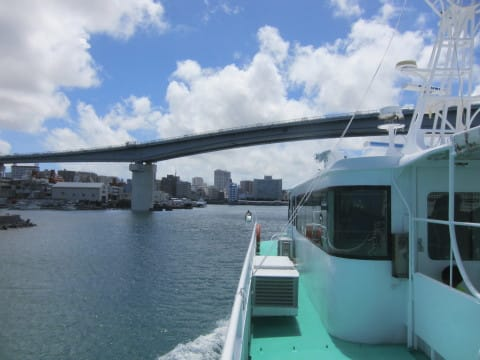
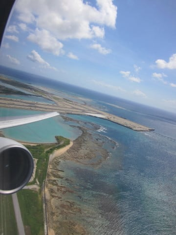

# 2019年8月，座間味で小6の娘と親子ダイビング！その18…那覇空港へ，そして羽田への飛行機に搭乗

📅 投稿日時: 2020-07-14 01:02:53

この週末も，基本的にK奈川県を脱出せずに

過ごしていたわけですが．

かの月山では，ついにこの日曜日，

Tバーが営業終了になったようです…

（[月山観光開発HP](https://gassankanko.jp/honjitu/2020-07-13/)より）

これでついに，残るは月山の残雪か乗鞍で

ハイクアップして滑るしかなくなりましたね…

（乗鞍は大雨の影響を受けているようですが…

　大丈夫かな？）

あ，根性無しの私は，歩いて登って滑るなんて

不可能ですから．

今シーズン，スキー不足に苦しんだけど．

それでも，歩いて登ってまで滑りませんから…

月山が終わったら終了です(笑)．

ってことで．

名実ともに，スキーシーズンが終わってしまった

今日は，いつものダイビング日記です！

ーーー

…座間味にお別れを告げた高速船は，

昨日まで潜っていたポイントの

そこかしこの横を通っていき…

途中，阿嘉島に立ち寄って，

1時間ほど走ると…

那覇，泊港に戻ってきました…

うーん．

座間味にしばらくいると，

那覇がすごい大都会に見えますね…

…ってなことで．

ほぼ定刻，11:15に泊港着です！

ここからモノレールで那覇空港まで

移動しようかとも思ったけど…

うみそらトンネルで空港までショートカットできる

那覇西道路ができて，泊港からのタクシー代も

安くなり．

3人分のモノレール代とそんなに差額が

無くなったので，巨大ダイビング器材を

抱えて駅まで歩くよりは…と，

ゼイタクにタクシーで那覇空港まで

移動！

空港到着がちょうどお昼で，飛行機搭乗まで

2時間弱あったので…

空港でお昼ご飯を食べますが．

わが娘．なぜかここでも，

「家に帰ったら食べられない！」

と，大好物のモズクの天ぷらやら

海ぶどうやらを選んで食べてます…

お前，どんだけ沖縄料理が好きなんだ…

後はお土産屋さんに寄ったり，ラウンジでくつろぐと…

14時過ぎ，搭乗！

さようなら～！沖縄～！

と，RWY36から離陸しますが…

向こうに，沖合に建設中の新滑走路が

ほぼ完成しているのが見えますね…

この沖合滑走路，今年の3月から

もう運用を開始しているようですが．

滑走路間のセパレーションを取るために，

かなり沖合に離れてるので，スポットから

滑走路までの移動時間が結構かかりそう…

離陸後，向こう遥かに慶良間諸島，

その中に座間味が見えていて．

あぁ…サヨナラ，座間味…

また来るね…

と，再び座間味にお別れを告げましたが．

…このまま機首を左に向けて，

また座間味に戻りたいなぁ…

と．

あらぬことを思いながら，東京行きの

機上の人になったのでした…

## 💬 コメント一覧

### 💬 コメント by (Unknown)
**タイトル**: Unknown
**投稿日**: 2020-07-14 13:31:43

2017年に なってるぴょん‼️

### 💬 コメント by (Skier_S)
**タイトル**: ＞Unknownさま
**投稿日**: 2020-07-14 23:03:38

ぐはぁっ！

ご指摘ありがとうございます！！

直しました…

