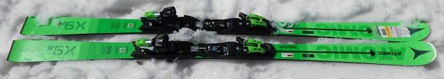
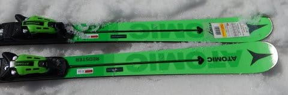
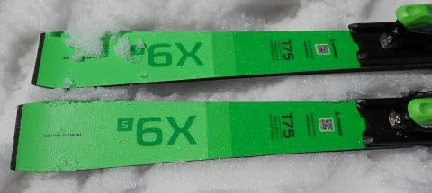
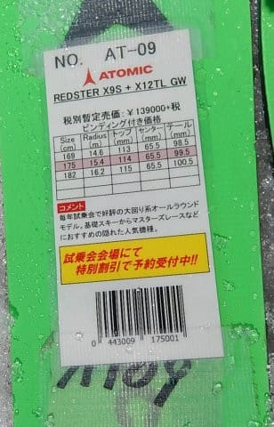
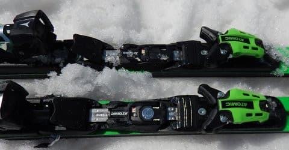

# 2020シーズンモデルのスキー板，試乗レポート…ATOMIC編その2

📅 投稿日時: 2019-05-28 03:00:28

えー．

本日は．

本来なら昨日速報レポートした，

かぐらファイナルの詳細レポートを

行きたいところなのですが．

…なぜか本日は，帰宅がご無体時間…（涙）

なので，残念ながら，かぐら詳細レポートを

書いている時間が無いので．

書きためてあった，スキー板試乗レポートです…

本日はアトミック編．

アトミックの緑の板です．

かぐらレポートはまた明日書きますので，

しばしお待ちを…

ってなことで，試乗レポート，Go!

○ATOMIC REDSTER X9S 175cm 

基礎オールラウンド

ショートのS9，ロングのG9との中間にあたる，

このX9Sですが．

R=15.4とはいえ，長さ175cmだと．

結構ロング寄りな感じですね…

ビンディングは強めのXビンディングはなく．

TLビンディング付きしか選べないようです．

滑ってみたところ…

え？？この板，ホントにRが15.4mなの？？？

それよりずっと大きく感じるんですが？？

試乗したコンディションは，かなり

ザブ雪になってしまった午後だったので．

コアがしっかり硬いのか．

板が十分にたわませられず．

かなりまっすぐ走る感じを受けました．

うーむ．

同じR=15m台のKeo's GPとはえらい違いだ…

この板の前に，FISCHERのR=18mの板を履いたけど．

その板よりもまっすぐ進み，縦に縦に

落ちていく感じを受けます．

谷回りで硬い板を動かして，自ら谷回りを作っていき，

山回りでもたわみで切れ上がっていくというより，

斜滑降に近い感じで斜めに切っていく感じ．

G9iは，かなりフレックスが柔らかく感じて，

板がたわんでターンが切れ上がっていくけど．

この板はG9よりもフレックスが強く，

直進性が強い，回転半径が大きい板に感じます．

硬い斜面ならガッツリグリップしてたわんで

旋回半径が小さくなるかな…

と，比較的バーンが緩んでいなかった

パーフェクターも滑ってみましたが．

やはり予想よりまっすぐ行く板です．

この板の求めるスピード域は，もしかすると

かなり高いのでは？？？

あるいは．4月の柔らかい雪で履くことが

間違えている板だったのかも…

とりあえず．

ATOMICの本格的な強い大回りの板が欲しいけど．

G9iは柔らかくて…

という人は．

この板ならば，かなりハイスピードな

リアル大回り板として一つの選択肢になるかも．

## 💬 コメント一覧

### 💬 コメント by (ふく)
**タイトル**: 試乗レポート
**投稿日**: 2019-05-28 08:17:52

試乗レポートありがとうございます。

スキー雑誌に載っているものより分かりやすく参考になります。

### 💬 コメント by (Skier_S)
**タイトル**: ＞ふくさま
**投稿日**: 2019-05-29 02:12:17

コメントありがとうございます～！

役立ったなら良かったです．

…しかし，レポートしているのは所詮ど素人ですので，

そのあたりご容赦を…

