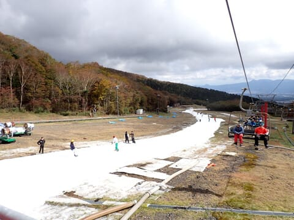
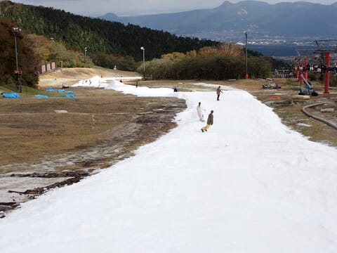
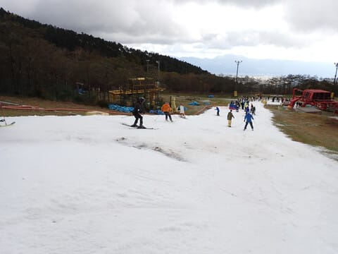
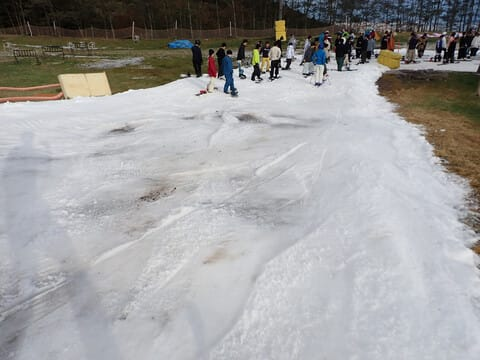
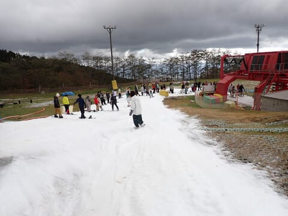
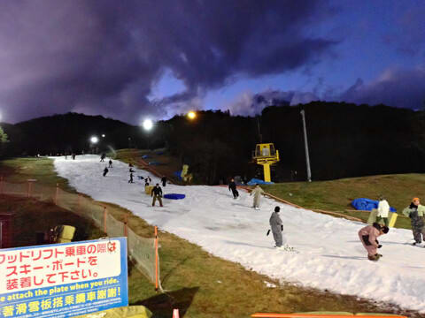
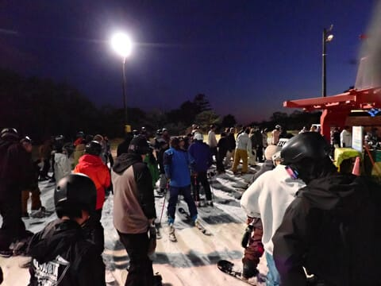

# 2023/10/21(土)，2024シーズンオープン2日目のイエティの速報レポート＆コース状況動画，雪はちょっと薄め，ゲレンデの人は多いけどリフト待ちはそれほどでもない

📅 投稿日時: 2023-10-22 03:08:00

🏷️ カテゴリ: [2024スキー滑走日記](c453f687e8a0f05679e95831d0a02cd0c.md)

ということで．

今日は予告通りイエティで2024シーズンイン

してきました～！

いや～

始まりましたよ，2024シーズンがっ！！！

…でも，睡眠時間3時間ちょいで

滑りに行き．

ナイターちょっと滑って夜9時に帰宅したのですが．

かなりきわどい状況で滑りに行ったので，

帰宅後，今まで仕事してました…（泣）

そろそろ起きてからの活動時間が

21時間を越える…眠い（泣）

ということで．

もう眠いので，本日のイエティ，

速報モードにて…！

今日の天気は時折日が差す時があったものの，

終日曇り．

ただ，曇り空のおかげで，雪がドロドロに

溶けることなく，終日雪は比較的滑り

良かったかな～

ゲレンデ状況は，この時期としては

平均的な広さの，せいぜい5m程度の

コース幅ですが．

どうも，リフトに向けて落ち込む，

最後にちょっとだけ急斜面になっている

部分．

ここの雪を広く広げすぎたのか…

幅は広めながらも，朝9時過ぎには

土が出始めて，10時ごろには

完全にヤバい状況に…

リフト乗り場手前，一番最後の部分は

終日こんな感じ．

今日はかなり石ころがデンジャラスな

コース状況でした…

リフト待ちは，平均的にこんな感じかな．

いつも，オープンした週末はそれほど混まない

という経験則があるのですが．

今シーズンのオープン週末もそこまでひどくなく，

リフト待ち平均5分以下．

平行してかかるペアリフトが動かない

レベルで…

待ちのストレスがそれほどない混雑具合

でした．

午後2時を過ぎると，ゲレンデはかなり

荒れてきて．

リフト乗り場付近の穴も広がって，

結構厳しい状態に…

で．

ナイターでコース整備されるので，

コース整備後の復活したゲレンデを滑ろう！

と，初日からナイターに参戦しましたが…

でも，ナイターもかなり人が多く（涙）

夜，薄暗い中これだけの人がいるとちょいと

怖いし…

リフト待ちも昼間よりひどくなったので，

夜6時ころに切り上げました…

ってなことで．

コース状況の動画も上げておきます．

## 💬 コメント一覧

### 💬 コメント by (真美子)
**タイトル**: Unknown
**投稿日**: 2023-10-22 07:04:51

シーズンイン、おめでとうございます。

スキーヤー様のブログ効果で、イエティは人が多いのではないでしょうか。

12月28日から30日に志賀高原焼額山へ行きます。

人工股関節になったので、転ばないよう、チンタラ滑ります。

見かけたら、声を掛けてくださいませ。

### 💬 コメント by (カンタロス)
**タイトル**: Unknown
**投稿日**: 2023-10-22 15:54:24

Ｓさま、こんにちは。

動画を見る限り、近年で１番穴があいてる感じですね…(泣)

1、２週間してもう少しゲレンデが改善されたらシーズンインしようかな？て感想です。

Ｓさまには人柱になっていただいて、ゲレンデ情報をあげて下さいますようおねがいします（笑）

追伸、菅平高原の裏情報を入手しました。

運営会社は日本スキー場開発なのはみなさんよくご存知かと思いますが、日本スキー場開発の顧問（だったかな？）が東京都スキー連盟の偉いひと。

東京都スキー連盟は毎年菅平高原で１２月に指導員研修会を行ってますが、近年の温暖化で研修会でまともに滑れない事もあったり。そのために、アイスクラッシャー導入したのでは？と、まことしやかに噂されてます（笑）

あくまでうわさですので、信じるか信じないかはあなた次第です。

### 💬 コメント by (Skier_S)
**タイトル**: コメント回答遅れました
**投稿日**: 2023-10-24 00:39:48

＞真美子さま

人工股関節手術されたんですね！

これで関節の痛みから解放されたならばよいのですが…

でも，スキーができるくらいだから大丈夫だと思いたいところ．

私は12月29日か30日から志賀高原入りです！！

またお会いしましょう～！

＞カンタロスさま

そうなんですよ…ちょっと雪を薄く広げすぎちゃった感じですね（涙）

雪を積み増して，今週末までに回復するかどうか…

菅平，都連行事が昔から多かったですが，日本スキー場開発の偉い方が

都連関係者でもあるんですね…

でも，ファミリーゲレンデはアイスクラッシュ設置するには急すぎるし，

普通の人工降雪機をファミリーに置いたほうがよかったのでは…？

と思ってます．

