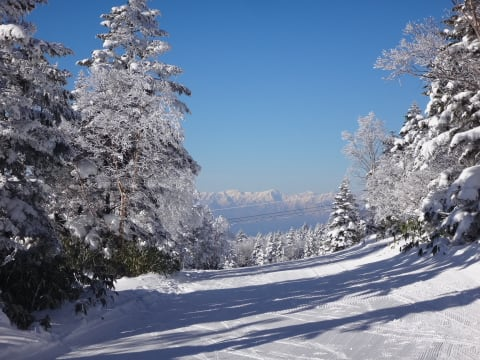
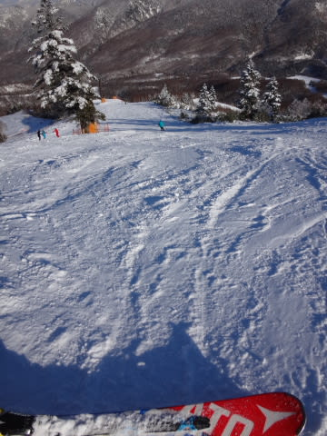

# 12月18日（日）の志賀高原は…晴天！朝イチ最高！あったかい，絶好のスキー日和の一日だったよ

📅 投稿日時: 2016-12-19 02:06:44

🏷️ カテゴリ: [2017スキー滑走日記](c7d777cecfc91bdf0fa464ad62c6d49ab.md)

ということで．

本日も志賀高原でリフトストップまで滑ってきて．

深夜に帰ってきました…

でも．

今日は頑張って，速報モードでないレポートを

書くのだ！

…というわけで．

本日，日曜朝．

昨晩からの積雪はほとんど無かったようですが…

すっきり晴れの放射冷却で，

車はガチガチに凍り付くほどに

冷えてますね～

で．

いつも通り朝イチゴンドラに乗って，

焼額山頂へ向かうわけですが．

天気はもう，すっかり気持ちいい晴れ！

で．

山頂の気温は…-5度ですか．

そこそこの冷えですな．

ゲレンデに出ると…

ををっ！！！！

うほう！！！

こ，これは…

最高の，エッジがガッツリ効く締まった，

エクストラスーパーハイクオリティ圧雪では

ありませんか！！！

もう，朝のうちは人がいない，ガラガラの

最高に締まった圧雪シマシマバーンを

飛ばしたい放題！

うひゃーーーー！！

最高っ！！！！！！

午前9時半ごろには，コース上の人が

ちょっと増えるタイミングもあったけど…

でも．今日は終日ゴンドラは飛び乗り状態！

朝10時くらいまでは，雪質も結構良くて．

コース脇の新雪も楽しめるところがあったし．

第2ゴンドラ側のパノラマ-サウスコースは，

時間帯によっては多少混んだみたいだけど．

第1ゴンドラ側のGSコースは，人が少なめ！

…トップシーズンもこのくらいガラガラだったら

シアワセなんだけどなぁ…←そうなったら，スキー場つぶれるから．ダメだから

しかし．

終日すっきり晴天で．

日差しも結構強かった本日．

昼間は気温が0℃をわずかに超えちゃったので…

日があたる，南斜面のゲレンデの一部．

昼ごろには，ちょっと固まる重めの雪に

なったところも…

でも．

南斜面じゃなければ，昼間も比較的いい雪を

キープしてたのが，良かったかな…

そして．

昼を過ぎると．

いつも通り…

全く人がいなくなるんですが！？？？

2ゴン側のパノラマコースも，ちょっとマズい

くらい，ガラガラになったのですが？？

経営，大丈夫か～？？（ちょっと心配）

で．

昼を過ぎてくると…

ちょっとコースがわずかに荒れてきましたか．

そして．

日が短いこの時期．

午後2時を過ぎると，早くも昼間に緩んだ雪が，

固くなり始めます…

日陰になったコースの新雪は，完全クラストに…

そして．

一部はちょっとツルツルバーンに．

だもんで．

荒れたコースは，気持ちよく滑るのは

ちょっと難しい状態になってきました…

そして．

ちょっと荒れ気味のコース．

南向きで雪が緩んだごく一部ですが．

ありゃー…

土が出てきちゃったか…（涙）．

これからの積雪の積み増しが期待できないので，

3連休は，ヤバいかも…（泣）．

でも．

日が暮れ始め，全く誰もいなくなったGSコースを．

今日も，16時の営業終了まで滑り続けたのでした…

とりあえず．

この週末は，すごい楽しめました～！

満足っ！！！

あとは．

…3連休までの間に，雨が降らないことを祈りたいのだけど…

だけど…

あんだーー！！！

この，22日の高温は…

平年比+12℃の，グラフ上限を突き抜ける高温って…

雪不足の昨シーズンを思い出させるんですが（涙）

…3連休のちょうど前日に，こんな高温に襲われるなんて…（激泣）
