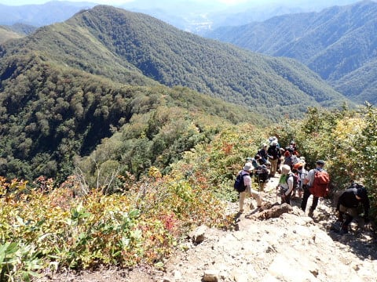
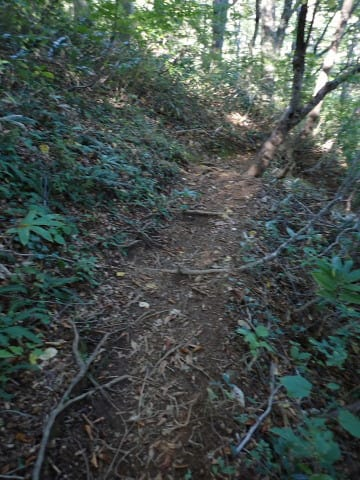

# 2022年10月，谷川岳→茂倉岳に登ってみた…最終回　谷川岳から下山！しかし下山後に悲劇が…？？

📅 投稿日時: 2023-09-02 00:39:23

えー．

明日，ホントなら山に行きたかったんだけど．

今週は激務すぎた…

いや．

ホントによく耐えた…（自画自賛）

炎上案件処理で周りに心配されるほどの

激務だったので．

明日はちょっと山に行くのはあきらめて，

ちょっとゆっくりします…

（持ち帰り宿題はあるけど（涙））

久しぶりに，明日の土曜は昼過ぎまで寝よう…

ってなことで，本題へ．

長らく続いた谷川岳レポート，ラストです！

ーー

（[前回](ea1a268ae2be8c6f550d6447573f095ac.md)から続く）

とりあえず，人がほとんどいなかった

茂倉～谷川岳オキノ耳までは56分で歩いた

けど…

人が多いオキノ耳からトマノ耳までは

かなりの渋滞に巻き込まれ（涙）

トマノ耳到着は茂倉から1時間15分後．

行きは7－8分で移動したオキノ耳～トマノ耳

間に，20分近くかかってますね（泣）

そして，トマノ耳から肩の小屋までも，

かなり人が多い中，流れに沿って

歩いていきますが．

肩の小屋の前も，すごい人ですね…！

天気もいい絶好の登山日和の，

メジャーな山は混雑がすごいんだと

再認識．

肩の小屋から先は，人が多めではあるものの，

道幅も広いので，遅い人はコースを譲る

余地が十分あって，渋滞というほどではない

ですが…

それでも，人が多いですね～…

ところどころ鎖場もありましたが．

まぁ，鎖がなくても降りられるレベル．

ってなことで．

天神尾根の避難小屋に到着しますが．

山頂から下山スタートして1時間50分．

ここまで，トマノ耳から35分もかかったか…

ここまでの1時間50分，茂倉岳山頂の

下山スタートから無休憩で来たし．

ちょうど12時のお昼時だったので，

ここで7分間ほど休憩し．

12:25にスタート！

避難小屋から15分ちょいで，田尻尾根との

下山コース分岐にやってきます．

ここから先は，ロープウェーで上り下り

する人とは別ルートの田尻尾根で下山なので．

人が全くいなくなるから…

マイペースで降りられるはず…！

ここまでペースが遅かったので，

残り駐車場まで2.9㎞のタイムアタック！

斜度はそこそこあるけど．

西黒尾根ほどはきつくなく．

よく踏まれていて歩きやすいルートですね．

ところどころ急で，滑りやすいところも

あるので，かっ飛ばして走るのは厳しい

ですが，そこそこのハイペースで下山できる

ルートで…

ただ，一度足を滑らせて，しりもちをついて

しまいましたが．

その直後にあったこの案内を見て．

「その通りだな…」

と納得（笑）．

泥っぽい土で滑って転んで，

田んぼで転んだようなお尻になるから

「田尻尾根」なんだ…

ってな感じの田尻尾根下山ルートを

しばらく降りると，林道に出て…

上にロープウェーが見えるところに

出ました！

ここからは，こんな沢沿いの林道を…

ひたすら走るのみ！

下り坂のフラットな道なので，重力に任せて

加速して行きますが…

なんだか，

足元がちょっと引っかかる違和感

を感じながらも．

ゴールまであとわずかなので，走る！

林道の最後のほう，いくつか分岐していて

ちょっとどっちに行けばいいのか迷って

しまったけど…

違う道を選ぶと，Garminさんがすぐに

教えてくれるので，間違いは最小に抑えられ

ました…！

ってなことで．

無事駐車場につながる道へ出ることができ…

無事，駐車場へ到着！

茂倉岳山頂から土合ロープウェー乗り場の

駐車場まで休憩含めて3時間5分と，

かなりハイペースな下山だったな…

オキノ耳からしばらくの渋滞がなければ，

3時間切ったかな？

ということで．

無事下山したものの．

途中，林道で感じた足の引っ掛かりは

なんだったんだろう…と，靴を見てみたところ．

うぎゃーーーーーー！！！

私が絶大な信頼を置く，HOKA ONE ONEの

Speedgoat MID GTX君のソールが

見事にはがれてしまってるんですが…っ！！（涙）

まだ，5－6回くらいしか使ってないのに…！！

高かったのに…！！

と．

景色が良い，最高の登山だったにもかかわらず．

最後にやられたショックで，失意とともに

帰路に向かったのでした…

PS1．

最終的に，[このシューズを購入したスーパー
スポーツゼビオさんの通販部門のご厚意で
返金扱いとなった](e6d8d0cbeb661cece1a838efadaa9fbfe.md)のは以前報告の通りです…

PS2.

今から考えると，靴を破壊した程度で済んだなら…

[蛭にやられまくって肋骨まで折った蛭ヶ岳](e7dc41681642c5dcac9954a261d3b620d.md)

に比べれば，かなりマシだったんだな…
