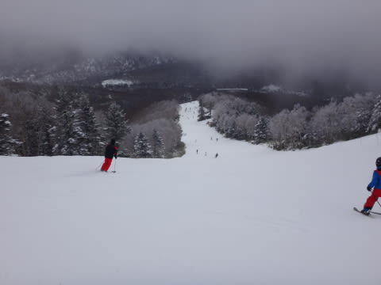

# 1月11日の志賀高原，詳細モード…曇りのち晴れ，積雪増加ほぼ無し．ブッシュエリア拡大中（涙）．

📅 投稿日時: 2016-01-13 01:18:42

ということで．

昨日速報した，3連休最終日の志賀高原．

本日は詳細モードにて…

えー．

まず．

前日の夜に雪が降り始め，

積雪が期待された朝ですが．

朝，外に出てみると…

…

あれ？

すっきり晴れてるんですけど…？？？？

そして，路面の積雪もほとんど増えてないんですけど…？？

ヤバい気配を感じつつ，

焼額第1ゴンドラの山頂へ登ると．

うむ．

ちょっと積雪があったようだけど…

…これは．

わずか3cmだな（涙）．

ただ，山頂の気温は-10℃と，結構冷え込んでいたので．

朝イチは，冷え冷え圧雪に軽い雪がうっすら乗った，

かなりいい状況ではないですか！

と，喜び勇んでゲレンデに飛び出すものの…

…

わずか3cmの積雪では，昨日のブッシュさんは

隠しきれなかったのか．

朝イチから，はやくも石ころが出てきてるんですが…（涙）．

そして．

人工降雪の下地が掘り返されて，氷のコロコロも

ちょっと出てきちゃってるんですが…（悲）．

ああ…

人が少ない朝イチだというのに．

快感度がイマイチ…（泣）．

そして．

10時近くになってくると…

あらら…

3連休最終日だから，それほど混まないかな～，と

思っていたけど…

ちょっと人がおおいよ（涙）．

ただ，ゴンドラ待ちは最大1-2分．

ゲートの外にまで人が並ぶことはほとんどない

くらいの混雑で済んだのが救いかな…．

で．

多くの人が滑ったゲレンデは，昼にはもう

残念な感じに…（涙）

…3連休前に必死に人工雪を付けて，なんとか

完全にカバーした，第1ゴンドラのGSコース．

石ころを踏まずに滑るのは，かなり厳しい状態に

なっちゃいました…（泣）．

第2ゴンドラ側のパノラマコースも，人工雪が無い

頂上付近の一部だけですが，かなりの石ころ状態．

そして，第3高速のイーストコースも…

人工降雪がないので，リフト降り場から100mほどは

かなり危険な状態（涙）．

そういう状況の中．

…第2高速沿いの唐松コースと…

第2ゴンドラの下半分，サウスコースは

しっかり人工雪がつけてあるので，石ころは全く出てません．

…しかし．

そのかわり．

ゲレンデ下地は，人工雪が固まったアイスバーン（泣）．

人が大勢滑って表面の雪がはがされると，

ちょっとツルツルな感じに…（涙）．

ちなみに，この日も奥志賀に行ってみましたが．

やはり，ゴンドラ側のダウンヒルコースは，

石ころを踏まずに下山するのは難しい感じで…

第2ペアリフト側のエキスパートコースも，

避けられるレベルとはいえ，かなりの石が浮いてます…（涙）．

ダメです．

志賀高原．

まだ，新しい板で滑れるレベルではありません…（落涙）．

で．

朝イチの一瞬は晴れたけど，

そのあとは曇り空のこの日．

昼間も気温はそれほど上がらず，-6℃と

しっかり冷え冷えな一日だったので．

これで，雪さえ．

雪さえ降ってくれれば，最高のコンディションなのに…．

なぜ，なぜ降ってくれないのか…．

そして．

志賀高原の常として．

午前中は混んでいたけど．

休みの最終日の午後ということで，

昼にはゲレンデに人が全くいなくなり…

…ゲレンデは，ガラガラのゴーストタウン状態に．

ああ…

雪がある場所は，雪質はいいんだけどなぁ…（涙）．

ってことで．

午後3時ごろには，雲が切れて，

晴れてきたこの日．

雪は残念な感じだったけど，

夕日に照らされた雲海も見ることができ．

…まぁ．

アイスバーンでも驚かない精神力と技術力（？）をもち．

石ころ踏んづけてもいいような板で滑れば．

…午後は人も少なく，好きなラインで滑れたし．

夕方は日も射して，いい天気だったし．

冷え冷えで，雪がひどく溶けてザブザブになるような

こともなかったし．

…そう．全く雪がなくて滑れない状況に比べれば．

…きっと，今日は楽しい一日だったんだろう…

…と，自分に暗示をかけつつ．

夕日が沈むラストまで滑り続けた，

Skier_Sなのだった…

ああ．

雪が．

早くどっさり積もってほしい…（切望）．

## 💬 コメント一覧

### 💬 コメント by (デーコン)
**タイトル**: Unknown
**投稿日**: 2016-01-13 19:57:39

こんばんわ。

三連休のレポお疲れ様です。

お蔭様で、15年ぶりの志賀高原の様子が即座にわかり

楽しい家族でのスキーが楽しめました。

第一ゴンドラでSkier_Sさん探しましたがわかりません

でした。

日曜日は、午前中はいい天気でGoProdでいい画像がと

れました。

今度は、来年かな？

### 💬 コメント by (Skier_S)
**タイトル**: デーコンさま
**投稿日**: 2016-01-14 00:41:36

久しぶりの志賀高原はいかがでしたか？

…しかし，私を発見できませんでしたか．

本人を見るとイメージが崩れるので（なんのこっちゃ？）

発見できない方が良かったのかも…

引き続き，謎のキャラクターSkier_Sとは

どんな人物か，想像の中でお楽しみください（笑）．

では，引き続きご愛読お願いします～．

