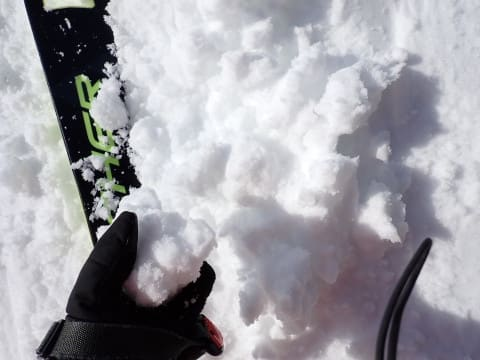
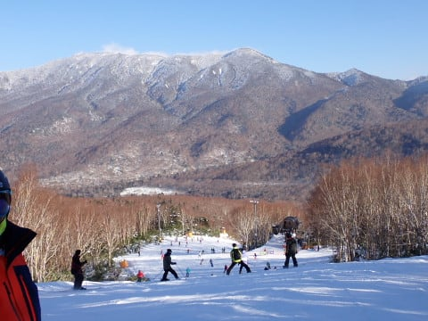

# 2023/12/29(金)，年末休初日の志賀高原焼額山は…ゴンドラ動いたけど雪が薄い(泣)．そしてコースは激込み(涙)

📅 投稿日時: 2023-12-29 22:28:34

🏷️ カテゴリ: [2024スキー滑走日記](c453f687e8a0f05679e95831d0a02cd0c.md)

ということで．

本日から正月休みで志賀高原に来ていますが…

一言でいうと．

かなり残念な感じ

でした…（涙）

いや，子供のころから志賀高原に来るように

なってから，はや30年以上ですが．

これまでで最悪の正月休みです（涙）

ここまで雪がない正月休みは，初めてです…（激泣)

とりあえず．

本日はいつも通り8:30の営業開始を狙って

焼額にやってきましたが…

到着が微妙に遅れ，ゴンドラ乗り場へは

営業開始5分後到着（涙）

本日から営業開始の第1ゴンドラ，

誰もいなくてガラガラ！

ということで．

今シーズンもようやく第1ゴンドラが

営業になり…

やっと我が家に帰ってきた感がありますが．

ただ…

ゴンドラを降りても，いつものGSコースは

まだ閉鎖されています（涙）

滑れるのは第2ゴンドラ側のパノラマコース

のみ．

1ゴン山頂から2ゴン方面へ向かいますが…

本日オープンのこのコース．

一見，全面雪に覆われていて．

本日オープンのため，まだ誰にも踏まれて

いないコース脇なんかは，一見気持ち

よさそうに見えますが…

圧雪してあるところを見ると．

うーーーーーーん．

雪が薄そう…（涙）

ただ，朝の1本目は，多少バーンが

カリカリした感じはあったものの，

そこまでひどいブッシュはなくきれいに

整備されていて…

久しぶりのゴンドラのロングコース，

あさイチは気持ちいいじゃないですか！

2ゴンもそんなに混んでないし．

1ゴン側への連絡路も，意外としっかり

雪がつけてあり…

1ゴンへつながるプリンス東館の前も，

周りから雪をかき集めて道を付けてあり．

そして，1ゴンはガラガラとくれば…

意外と悪くないかな？？

…と，思ったスタートだったけど．

なぜか．

朝10時前に，今シーズン営業開始から

1時間半もたっていない第1ゴンドラ，

故障で一時運転見合わせ（涙）

そのせいで…

第2ゴンドラに人が集中して，待ちが

すごいことに…（泣）

おそらく，20分待ちくらいまで行ったかも？

とはいえ，第2高速は一ノ瀬から流れてくる

人で一瞬ゲートの外まで並んだものの，

10時半には空いてきたし．

4ロマ側はそれほど混まず．

リフトに逃げれば待ち時間は無かった

ですが…

でも，ゲレンデの人口密度は10時過ぎには

かなり上がってきて…

うーん．

快適というからはほど遠い人口密度に

なってきちゃいました…（泣）

10時半過ぎには天気もすっかり晴れ上がり．

無事第1ゴンドラも運転再開して，

第1ゴンドラはその後ずっと待ち0で

飛び乗りだったものの…

日差しで雪が緩み，さらに大勢の人で

薄い雪が削られていくので…

コースは凸凹になり．

そして，圧雪がかかってない部分はもう

ブッシュ祭りになっていき…

コースのそこら中に石は出てくるし．

ブッシュだらけになっていくし．

ゴンドラで上に上がるパノラマコース側は，

かなりやばい感じでした（泣）

でも．

そんな中でも，コースをちょっとでも

良くしようと，スタッフが必死に雪を

コースに入れてましたが…

うん．

コースコンディションをよくしようという

焼額スタッフの努力はすごい．

素晴らしい！！

…でも．

全体から見ると，焼け石に水かな…（涙）

第2高速側の唐松コースは，

人工雪がしっかりつけてあるので

ゴンドラのパノラマコースのように

ブッシュや石ころが出てくることは

なかったけど．

南斜面の日差しで，雪が緩んだので…

昼過ぎには，コースがボコボコになり．

かなり人口密度が高いコースを，

人をよけつつ凸凹をクリアしていく

必要がある高難易度コース（泣）

そのせいもあり，リフト自体はそこまで

混んでませんでしたが…

楽しいか，というと微妙な感じ…（ちょい涙）

しいて言えば．

第4ロマンスでサウスコースを

ぐるぐるすれば．

多少人口密度は高いものの，ブッシュの

心配はなく，コース幅いっぱいに滑れて．

コブもそこまで出ておらず，

一番まともだったかも…

ってなことで．

今日の午後は，人口密度が高いうえに，

ボコボコになっていく唐松コースを

第2高速で滑るか…

ゴンドラは待ちなく乗れるけど，

ブッシュ地獄のパノラマコースを

ゴンドラで攻めるか…

リフトは遅いけど，コース幅いっぱい

滑れて，ブッシュの心配がない

サウスコースを4ロマで滑るか．

なかなか究極の選択の一日

だったのでした…

…でも．

どのコースも夕方ラスト，16時近くまで

人は多かったし．

ちょっと残念な感じの一日でした…（涙）

あぁ…

雪が足りない．

12月第1週は新しい板でも大丈夫

だったというのに．

今日は石ころふみ用の板じゃないと

滑れない感じ．

絶対新しい板では滑りたくない感じで．

なぜ12月第1週より状況が悪化してるんだ

と，あふれる涙を禁じ得ない状況でした…

1ゴンから見たGSコースも，この写真だと

雪があるように見えますが，まだ雪が

薄くて地肌が見えてるところもあるくらい

だったし…

…果たして，いつになったら全面オープン

してくれるのか…（涙）

いや．

それ以前に．今晩も積雪0cmなので．

明日のゲレンデ状況が改善されるわけもなく．

明日は今日より状況が悪化することが確実

なわけで…

あぁ…せっかくの正月休みなのに．

残念だ…

とりあえず．

12月31日の夜からの雪に期待します…

## 💬 コメント一覧

### 💬 コメント by (新米パパ)
**タイトル**: Unknown
**投稿日**: 2023-12-30 16:41:06

明日からうかがいます。

が、明日31日は厳しそうですね、昼までは、、。

混んでそうだなー、、涙

### 💬 コメント by (ねも)
**タイトル**: Unknown
**投稿日**: 2023-12-30 18:41:01

Ｓさん　あちらに返信ありがとうございます(^^;)

なかなかお気の毒なゲレンデのよう💧　お気持ちお察しします🙏

同じ志賀高原でも熊ノ湯や横手山はどうなんでしょう？　ちょっとはマシでは？

安比高原は一昨日から穏やかなスキー日和、快適でした⛷️　懸念された人出もさほどではなく✌️　年末スキー最高！

明日からの新雪をお祈りしています。

### 💬 コメント by (Skier_S)
**タイトル**: 雪が足りない…！
**投稿日**: 2023-12-30 22:23:19

＞新米パパさま

31日は厳しいと思います…

雨が降ったらもうどうしようかって感じです（泣）

でも，雨が降ったらがら空きになると思いますよ！！

＞ねもさま

お気の毒ゲレンデです…（泣）

横手山も，人工降雪がないので結構悲惨みたいです．

熊の湯は…まだイベントコースや第1ゲレンデが開いてないので，

どうでしょう．

第2の馬の背も微妙な感じと聞いています．

どこも似たような感じかと．

安比，いいなぁ…

