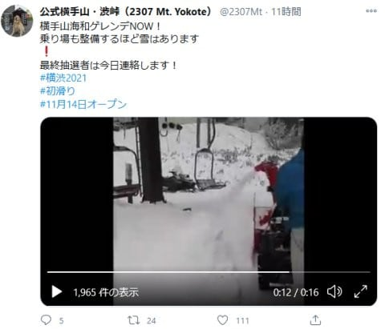
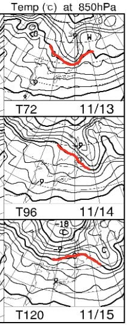
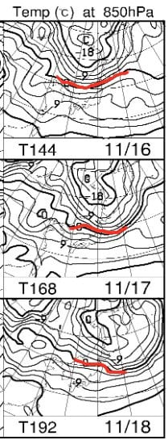

# 志賀は引き続き降雪＆人工降雪機フル稼働！…だけど，12日から18日までは気温が上がって人工降雪が打てなさそう（涙）

📅 投稿日時: 2020-11-12 03:05:00

えー．

今日は睡眠不足で死にそうなので，記事は短めで…

とりあえず．

横手山は順調に人工降雪の積み増しが進み，

リフト乗り場の整備も始まっているようです…！

（[横手山公式Twitter](https://twitter.com/2307Mt/status/1326371847856926725)より）

今年度大量に降雪機を導入した横手山．

かなりの造雪能力のようですね…

一の瀬ファミリーも，来週オープンに向け

人工降雪を打ち続けているようです！

…ただ．

人工降雪機が動かせるのも，明日の朝まで．

明日の昼からは，人工降雪が無理な

気温に上がっちゃいます…（涙）

そのあとの850hpa気温を見てみると…

13～15日は，赤い0℃線が長野・新潟

方面まで下りてきている日は無いので．

…人工降雪は打てませんね（泣）

そのあとの16～18日はどうだ！？？

冷えるのか…？？

と，期待して見てみますが…

…

…

…ダメですね

赤い0℃線，一度も長野・新潟まで

下りて来ません（激涙）

ということで．

12日の朝を最後に，

13日～18日は気温が上がって人工降雪が

打てず，天然雪もなさそう

です．

うーーーん．

21日からの3連休，ヤバそうな感じ…（涙）

なぜ，10月にかなり冷えたのに．

ちょうどスキー場オープンを控えた

人工降雪が山場となるこの時期に，

気温が上がるかなぁ…（泣）

これは…

誰か日ごろの行いの悪い人がいるに違いないっ！！！←自分でしょ

とりあえず．

これから3連休にかけて．

ひたすら日ごろの良い行いを心がけ．

そして祈り，例の踊りを踊り続けるのです…！！
