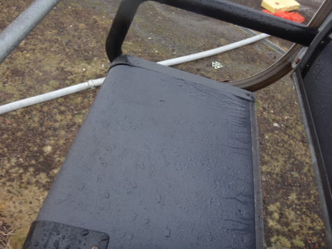
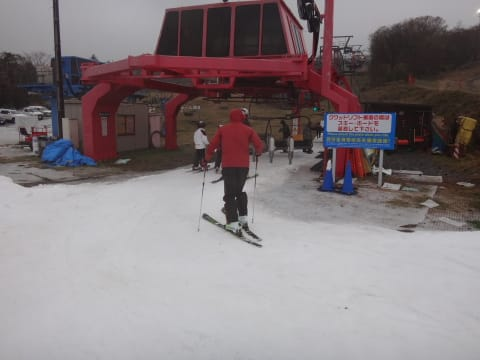
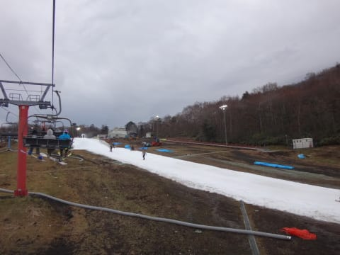

# 2015シーズンのオープンから3週間…11月9日のイエティのコース状況の動画

📅 投稿日時: 2014-11-10 02:02:39

えー．

今日もちょいと夜が遅かったので，

詳細レポートは明日に譲って，

今回は速報版ということで…

えー．

天気は，朝からかなりの雨でした．

ええ，かなり本格的な雨でした…

ただ．

10時半ごろには雨が上がり．

そのあとは，2-3回ほど，気にならないほど

ぽつぽつ降るくらいで．

それなのに，リフト待ちはほとんどなく，ガラガラ．

終日リフト待ちがなかったので，

ガンガン滑れました！

10時半までは，

「最低～」

でしたけど，

10時半以降は雨が降ってないのにガラガラという，

「最高～！！」

という状況でした！！

とりあえず．

いつものコース状況＆混雑状況のわかる動画を

のせておきます～

詳細は，また明日！

## 💬 コメント一覧

### 💬 コメント by (komu)
**タイトル**: 祈りが通じました
**投稿日**: 2014-11-10 20:54:43

ご一緒くださりありがとうございました。

いや～、やはり普段の行いは大事ですね。

この時期で空いてるイエティは初めてでしたよ。

で、結局リフト60本回したのですか？

### 💬 コメント by (ひろちゃん)
**タイトル**: 雨にもまけず、頑張りました
**投稿日**: 2014-11-10 23:50:25

雨、覚悟してたが、ブーツインナーチャプチャプ、久しぶりに、準備不足に、泣き。そして、今日インフルワクチン接種、大丈夫なのか笑。しかし、平行スタンス、重心位置ありがとうございました。御身体、ご自愛しましよ

### 💬 コメント by (Skier_S)
**タイトル**: 雨にもマケズ…
**投稿日**: 2014-11-11 01:46:01

>komuさま

昨日はご一緒いただき，ありがとうございました～．

ガラガラでよかったですね！！

やっぱり，日ごろの行いは良くしておかないと

ダメですね（笑）．

リフトは結局52本でした…（＾＾：

>ひろちゃんさま

いやー．

朝のうちの雨はたまらんものがありましたよね…

ちゃぷちゃぷインナーは乾きましたか？？

パラレルスタンスと内足の使い方を

これから鍛えてやってください！

### 💬 コメント by (komu)
**タイトル**: 52本ですか
**投稿日**: 2014-11-11 02:01:39

あれから10本滑ったのですね

やはり壊れてますね

で、物欲選手権はいつ頃開催予定ですか？

みんな期待してますよ～

### 💬 コメント by (Skier_S)
**タイトル**: komuさま
**投稿日**: 2014-11-11 02:44:28

いや．

もう，壊れてるのは十分承知してますから…（笑）．

物欲選手権は…

できれば開催したくないんですが（汗）

でも，板を買わないわけにはいかんのですよね～

なるべくぎりぎりまで買わずに引き伸ばしたい

ところではあります…

