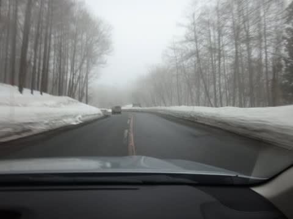

# 3月1日の志賀高原のゲレンデは…雪重し．視界悪し(涙） …日ごろの行いか…

📅 投稿日時: 2014-03-01 23:55:59

えー．

なんというか．

もう．

…あれですね．

シーズンも終わりが近づいてますね(超泣）．

朝，上信越道ではところどころ雨に降られ．

志賀に登る道路は，スキー場まで全く雪がなく，ウェット状態…

この時期，志賀高原の道路が雪道じゃないなんてっ！

ありえないっ！

2週間前にありえないドカ雪が降ったばかりというのに…

この段階で，すでにいやな予感満載ですが．

…とりあえず，山頂に出ると，気温はマイナス．

…朝イチというのに，山頂でマイナス3度って

あったかすぎだけど…

まだ，プラスになってないだけまし…

ということで，自分を慰めてみる．

山頂はガスっていて視界は悪く…

なんだか．

雪は水を吸って重い感じの．

春の雪ですな…

コースの下のほうに降りてくると，もう，なんだか…

えーと．

これは．

4月の雪ですか

えー．

まだ3月です．

まだ，3月になったばかり．

昨日まだ，2月だったんですが．

神様，なにか天気を間違えてませんか～

…そして．

さらに．

コースはガスって見えない(涙)

さらに追い討ち．

午前11時ごろには…

…ゴンドラ5分待ち(涙)

なんだかな～(泣）．

…これは，まぁ，11時半にはこんな感じになって，

混んでたのは一瞬だけだったのが，まぁ救いか…

しかし．

今日は一日中，コース上半分はガスが上がらず．

えー．

コースが見えません．

コース状況が見えないのですが．

どうやって滑ればよいのでしょう（泣)．

とりあえず，野生のカンを繰り出して滑ってみますが…

…

…楽しくない（涙)

そして．

きっと，誰かのろわれている人がいるとしか思えない

ことに．

ゴンドラ終了の午後4時近くになってから．

…やっとガスが晴れ始めるという…

なぜ，営業終了間際になって…

呪われてるかな～(涙)．

そして．

今日は夕方まで雪は重いままで．

…せめてもの救いは，雪が重すぎたからか，

コロコロは出てきたけど，バーンがそれほど

ぼこぼこにならずに済んだことくらいかな～

…おかしい．

私の日ごろの行いは極めて良いはずなのに．

なぜ．

なぜ，こんな状況に…

先週の渋滞といい．

先々週の大雪といい．

その前の吹雪で全リフトストップといい．

ここしばらく，毎週何か，不運が…

呪われてるのかな～(泣泣泣）

とりあえず．

滑れるだけまし，ということで．

ナイターにも繰り出してみましたが．

ナイターはシマシマでよかったんですが…

…ナイターまで気温が高いまま(悲）．

雪ががちがちに固まってしまわなかったので．

これはこれでよかったのかもしれないけど．

…とても，2月が終わったばかりのナイター状況とは思えない…(涙)

明日も，今日みたいな感じの天気になりそうなんだよな～．

奇跡が起きて，朝起きたら激冷えパウダーが1mくらい

積もってないかな←ありえないでしょ
