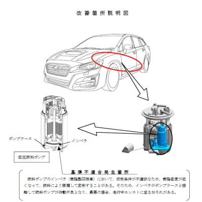

# LEVORG 77777km！…そして，リコールに出してきた

📅 投稿日時: 2021-09-14 05:43:09

🏷️ カテゴリ: [車](cba0e8330b3f2ded7c1addfacc75d4547.md)

この7月に初車検を終えたばかりの

我がVMG LEVORG君ですが．

その直後に[リコールに引っ掛かり](e61a854262f92b7058135c5ea4125cc8b.md)．

なかなかディーラーのピットの空きがなく，

作業が延び延びになってましたが…

つい先日，ようやっとディーラーでリコール

作業してもらいました～！

作業内容は，燃料ポンプの交換のみ．

（[国土交通省ホームページ](https://www.mlit.go.jp/report/press/content/001416824.pdf)より）

当然のごとく，0円での作業です！

しかし…

前のLEGACYでも[ワイパーのリコール](e8790ecc6e0ca42007c85d731fe9640f8.md)に引っ掛かり．

今回のLEVORGでもリコールに引っかかるとは…

何だか，やはり私は

何か強い引きを持っているみたいですね(涙）

…宝くじ買ってみようかな…←日本では宝くじで1等当たるより，交通事故で死ぬ確率の方が高いんですけど…？

で．

その際の代車は．

[サンバー](e89c59157670eec668c354fcb08445487.md)じゃなかったです…

（ちょっと期待していた）

今回は，最新D型のXV 1.6Lでした！

…乗ってみたところ，C型までの

XV1.6Lとはかなり変わった感じだったので，

また暇があったらこいつの試乗レポート

書きますね…

そして．

我がLEVORG君．

3年と1か月ちょいにして．

ついに77777km突破しました！

普通の状態であれば，私の車で3年ちょい

というと，もう10万kmを超えているところ

ですが．

コロナのせいで，このVMG LEVORG君，

走行距離が少なくて，いつもより

長持ちしそうな予感…

コロナのおかげで行動には制限がかかって

悲しいこともいっぱいありますが．

スタッドレスも3シーズンもったし，

スキーに行く回数が減って宿代や

交通費等，スキー費用も減ったし．

ダイビングにも2年行ってなくて，

ダイビング遠征費用も浮いてるし…

それに，仕事関係の飲み会が圧倒的に

減ったおかげで．

この1年ちょい，出費はすごい減ってます…！

これで，車もいつもより数年長持ちして

くれれば．

お財布にはちょっと優しいという，

かすかなメリットがあるなぁ…

…とは，思いながらも．

お金がかかってもいいから，

そろそろ娘も成長し，これからあまり一緒に

出かけてくれなくなってくるだろうから．

今のうちになるべく家族で旅行にも行きた

かったし．

なにより来シーズンは毎週スキーに行かせてくれ

と，強く願うSkier_Sだったのでした…

## 💬 コメント一覧

### 💬 コメント by (アリス)
**タイトル**: Unknown
**投稿日**: 2021-09-14 17:40:47

S様

愛車の初車検お疲れ様でした♪

機械ですから、故障しない、壊れないはあり得ないですよね♪燃料ポンプ、ワイパーはどこのメーカーでもありがちです。

それをリコールという形で保障してくれるわけですから、日本メーカーの素晴らしいところだと思います。お客様志向で正直商売。

S様

投資が予定より減ってるようですね♪

いっそ、焼額山スキー場を買ってみませんか？

私は、小さい投資ですがスタッドレス2年目で、思い切ってブリザックVRX3に替えてみました。

前履きのVRX2と同じ条件で制動距離の試験をするつもりです。

### 💬 コメント by (Skier_S)
**タイトル**: ＞アリスさま
**投稿日**: 2021-09-15 01:32:37

今回の燃料ポンプも，ちゃんとリコール扱いで無償交換ってのは

ありがたいと思ってます…

フロントストラット異音も無償交換してくれましたし．

…そして，焼額を買う話は魅力的ですが．

どなたか私に20億円ほど寄付してくれたら買おうかな．

でも，VRX3行きましたか！

私も今シーズンスタッドレス買わなきゃならないのですが…

出費が痛い…

