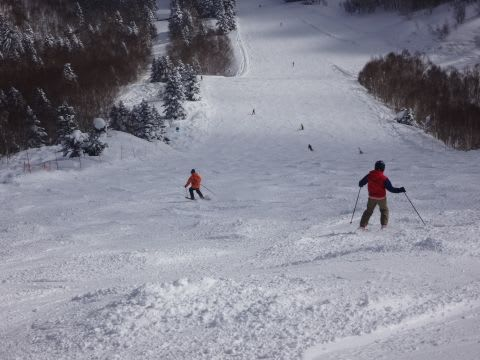

# 2月11日の志賀高原は…朝の積雪はわずか10㎝．雪が降ったり時折日が差したりの一日

📅 投稿日時: 2017-02-12 00:17:14

🏷️ カテゴリ: [2017スキー滑走日記](c7d777cecfc91bdf0fa464ad62c6d49ab.md)

えー．

天気予想外しました

…おっきな声で言えないので．

小さい声で言います．

天気予想外しました（涙）

いや…

ホントはドサドサ積もるはずだったんですよ．

ドサドサと．

…だけど，本日．

そんなに積もらなかったうえに，

さらに時折日が差すような天気でした…

…．

いやね，[きのう](ebc03032f5cbe363841f5fcc245f634bd.md)書いたみたいに，

変なプチ低気圧が発生したおかげで．

志賀高原は完全に西風だったんですよ．

500hpaに-36℃の寒気が入っていたから，それでも

ぱらぱら雪が降ったけど．

寒気が入ってなければ完全に晴れるほどの

西風になっちゃったわけですよ．

すべて，

予想天気図になかった，プチ低気圧のせいです！！←人のせいにしていないか？？

そう．

本日の予想を外したのは．

私が天気図を読み間違えたのでは無くて．

水曜段階で予想されてなかったプチ低気圧が

悪いのですっ！！！！

…と．

必死に天気予想を外した言い訳をした後は．

本日のスキー場レポートへ…

はい．

ってなわけで．

本日．

朝の気温は-14℃．

予想の-12℃より冷え込んだ，

冷え冷えの朝でスタートです！

…なのですが．

…あれ？

雪が…

パフパフ新雪が積もってないよ！？？？（泣）

圧雪コース上にはうっすら数cmしか

新雪がないんですけど…

でも．

昨晩から非圧雪のオリンピックコースは，

パフパフに違いない！

…って行ってみたけど．

あれ？？

…積雪，わずか10cm（涙）

ブーツパフレベル…（泣）．

コースわきのわずか，ちょっとだけ深めの

パウダーが残ってましたが…

でも，コース上はほとんどがブーツパフ．

うーん．惜しい！！

10時を過ぎると．

コース上はちょっと荒れはじめ…

昼前には，オリンピックコースは

新雪タイムが完全に終わり．

普通のこぶ斜面化（涙）

まぁ．

でも．

昼過ぎまで，雪はやわらかくてふわふわ

だったので，まだ救われたかな～．

そして，今日の混雑具合ですが．

10時ごろには．ゴンドラも3分強の

待ち時間が発生（涙）．

まぁ，2月のトップシーズンと考えると，

少ないかもしれませんが…

でも．

11時には列も短くなり．

この後，ゴンドラ駅舎の外まで列が並ぶ

ようなことはなかったです…

そして．

午後になっても．

天気は小雪～曇り．

時折雪が降ったり…

日が差すタイミングもあり…

で，気温は冷え冷えで雪質は最高！！！

ちょっとゲレンデ上，人が多めではあったものの．

…

で．

人が多かったので午後はちょいと

コース上が荒れてきましたけど（ちょっと涙）

でも．

夕方まで，ゲレンデの雪は冷え冷え最高のままキープし．

コースは凸凹になってしまったものの．

トップシーズンらしい，

いい雪の焼額山を．

16:30のリフト終了まで，楽しんだのでした…！！

で．

終わらない．

はい．

いつも通りの，ダイヤモンドナイターへ！

今日のダイヤナイターも…

うはははは！！！

最高雪質の，気持ちいいシマシマ！

トップシーズンらしい冷え冷え雪の

シマシマを，たっぷりたらふくいただいたのでした…

いやー．

今日も滑ったな！！

…で．

ナイター中も雪が降らず．

「あれ？明日も積もらないのかな…（ちょっと涙）」

と，思っていましたが…

今，かなりの勢いで降ってます．

明日の朝は，水曜の「ブーツパフ～脛パフ」って予想が

当たって．

まぁ，ブーツパフ．

運が良ければ脛パフくらいまで行ってくれるかな～．

## 💬 コメント一覧

### 💬 コメント by (かず)
**タイトル**: 金曜の再来の予感がします
**投稿日**: 2017-02-12 00:53:09

この感じだと非圧雪でもも位いきそうですね　SさんB好きなんて意外でした　イメージ的に受け付けない人なのかと思ってました笑

### 💬 コメント by (いか)
**タイトル**: Unknown
**投稿日**: 2017-02-12 04:42:33

ヤケビ圧雪隊情報だと、降雪50センチとか…、降りましたね！白馬も里で10センチではないくらいなので、スキー場はもっとあるはずです。おまつり開幕です！

### 💬 コメント by (れお)
**タイトル**: ファーストトラック
**投稿日**: 2017-02-12 07:31:49

早く着いたので、奮発してファーストトラックでもやろうかと思ったら、大雪で中止でした…。

一ゴン駐車場の除雪は、一応されてて入れます。

ちゃんと時間通りにゴンドラスタートするかな〜?

### 💬 コメント by (れお)
**タイトル**: ファーストトラック
**投稿日**: 2017-02-12 07:31:50

早く着いたので、奮発してファーストトラックでもやろうかと思ったら、大雪で中止でした…。

一ゴン駐車場の除雪は、一応されてて入れます。

ちゃんと時間通りにゴンドラスタートするかな〜?

### 💬 コメント by (れお)
**タイトル**: 15分遅れで一ゴンスタート
**投稿日**: 2017-02-12 08:30:14

↑二重投稿すいませんm(_ _)m

スタッフから案内が有りました〜

### 💬 コメント by (Skier_S)
**タイトル**: れおさま
**投稿日**: 2017-02-12 08:55:06

こちらは車でヤケビあきらめて、８時50分にバスでヤケビ着きました。

5分遅れで1ゴンのりました～！

### 💬 コメント by (Skier_S)
**タイトル**: かずさま
**投稿日**: 2017-02-12 08:57:41

いや…今日は逆に予想以上に積もりましたね。

これから1本目です～

わたしはB結構すきですよ～！

### 💬 コメント by (Skier_S)
**タイトル**: いかさま
**投稿日**: 2017-02-12 23:51:00

すみません…

いかさまのコメントだけ，返答遅れました．

今朝のヤケビはすごかったですよ～！！

ちょっと雪が重めだったのが残念でしたが

八方はどうだったでしょうか…

### 💬 コメント by (FCAMEL)
**タイトル**: お札ありがとうございました。
**投稿日**: 2017-02-13 10:13:16

久しぶりにお会いでき楽しかったです。

（相変わらず速いですね、、、)

20,000メートルクラブのお札ありがとうございました。

転倒防止のお守りにさせていただきます！

