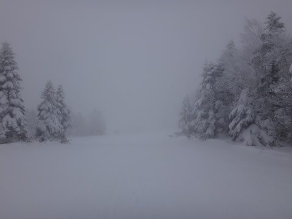
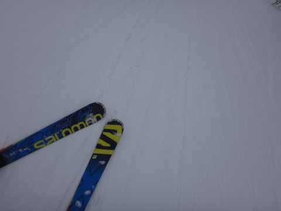
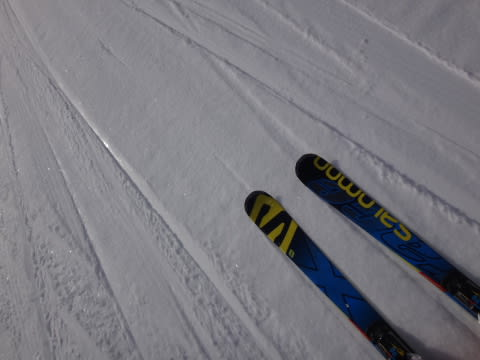
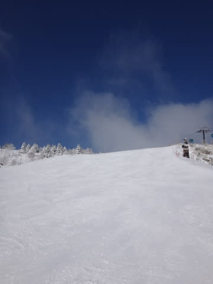
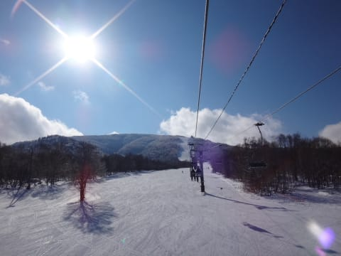
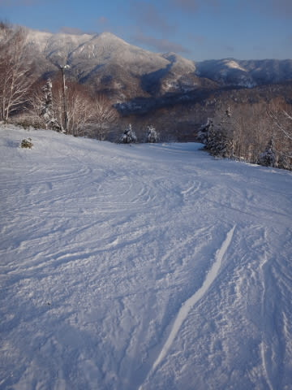

# 1月31日の志賀高原，速報モード…小雪→午前中から晴れ！予想以上にいい天気！

📅 投稿日時: 2016-02-01 00:44:37

🏷️ カテゴリ: [2016スキー滑走日記](c70c67ed5248e9432b899dcd5747048bb.md)

ということで．

今日も，いつも通り，リフトストップまで滑ったので．

こんな時間の帰宅になってしまいました…

…んだもんで，いつもの詳細モードで．

えー．

本日．朝は小雪で始まりました．

…ってか，山頂はガスです（涙）．

ゲレンデは，圧雪にうっすら新雪という，

予想通りの雪で…

朝イチの圧雪は最高！

…そして．

なんと．

朝9時ごろから雲が切れ始め…

10時過ぎには，すっきり晴れちゃいました！！

まさか，こんなすっきり晴れになるとは…！！

これは．

きっと．

…そうです．

私の日ごろの行いが，極めて良かったからです！←違う．断じて違う．

ってことで．

今日は一日，日の射す快適な天気の中．

いい感じのゲレンデを楽しめました～！

午後には多少荒れ気味になった場所もあったし，

…ところどころ，ゲレンデの硬い下地が出たところがあったけど（残念）

人も少なく，

リフトストップまで，ひどく荒れることもかったので．

すっきり晴天の中，

結構楽しめた一日だったかな～．

また明日，詳細レポートしますので，

お楽しみに…！

## 💬 コメント一覧

### 💬 コメント by (Goku)
**タイトル**: Unknown
**投稿日**: 2016-02-01 18:34:52

アイスバーンが隠れなかったのは私の晴れ晴れダンスのせいです。スミマセン・・・

今週は皆さんの分まで志賀を見ながら降れ降れダンスしときますのご勘弁を～（笑）

### 💬 コメント by (Skier_S)
**タイトル**: Gokuさま
**投稿日**: 2016-02-01 23:37:18

晴れ晴れダンス，効きすぎです…（笑）

今週は必死の降れ降れダンスをお願いします…！！

