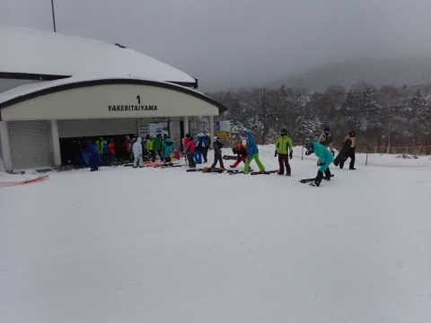
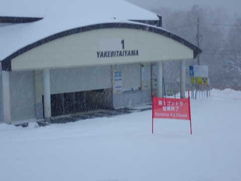

# 2022/12/25(日)の志賀高原焼額山スキー場レポート…雪はそれほど積もらず(涙)．1ゴンは混まなかったけどコースの人口密度は高め

📅 投稿日時: 2022-12-28 03:43:00

🏷️ カテゴリ: [2023スキー滑走日記](cd943df30cfcc3d0896469e2ff98720cd.md)

えー．

志賀高原ですが，ぼちぼちと滑れるコースが

広がってきて．

明日28日には，焼額も第3高速が動き出し

全リフトが営業を始めるし．

奥志賀も第4リフトが動き出し，ついに

全面オープンします！！

…しかし，まだ寺子屋や東館，西舘上部，

ジャイアントなどが動いてなくて…

全面オープンまでもう少しかかりそうですね(涙)

で，本日…

というか，日付が変わっているので，

昨日27日(火)の志賀高原の状況が，

特派員より送られてきましたが．

前日からほとんど積雪が無かったので．

焼額のバーンは締まり気味の圧雪で，

滑り良かったみたいです！！

そして．

平日だけどスクールやら団体さんやらが

多く，意外と人口密度が高かったとの報告が．

で．

焼額もGSコースは朝から雪が薄く．

ところどころ下地が出てくるところもあり…

一番最後の落ち込み部分，早くも結構

土が出てきちゃってるようですね…（涙）

うーむ．

もう一降り欲しいところ…

でも．

天気図を見ると…

29，30日は冷えそうだけど，

西風で積もらなさそうだし．

2日間でせいぜい10cm～20cm程度かな…

うーん．年内いっぱい，雪の積み増しは

あんまりなさそうです…

この理由はおそらく．

私がこの正月休み，仕事その他で忙しく

あまりスキーに行けないので．

私の雪よ降れ降れ念波が弱まっている

からです．

いや．

どうせ正月休みに滑りに行けないなら，

雪が降らなくてもいいよな…

いや．

むしろ降らない方が，あきらめがついていいよね…

という思いが通じているからなんです！！

ということで．

皆さん諦めてください．←いや，あなたが志賀高原の

天気を決めてるわけじゃないんだから…

ってなことで，本題へ．

昨日書く予定で書けなかった，25日の日曜の

志賀高原スキー場詳細レポートです～！！

まずは，朝．

あさイチの天気は雪降りですが．

昨晩からの積雪は2-3cm程度しかなく．

残念ながら，今日は第1ゴンドラは

動くものの，第1ゴンドラ側のGSコースは

オープンせず（涙）

とはいえ．

ついに今シーズンの焼額第1ゴンドラ

営業開始です！！！

実に7か月半ぶりに，第1ゴンドラ前に

並びますが…

懐かしい…何もかもみな懐かしい…

ってなことで．

実に久しぶりの我が生息地，

第1ゴンドラに乗車！！

いやーーー．

帰ってきたよ…

山頂にやってくると…

これもまた久々の，山頂温度計と

ご対面！！

いやーー．久しぶり！

元気そうでなにより！！←温度計に挨拶しているよ…

今日の朝イチは，-10℃とそこそこの

冷え込みですね…

ただ．

第1ゴンドラ山頂から下るGSコースが

ネットで封鎖になっているのが寂しい…

だもんで．

第1ゴンドラに乗った場合．

毎回第2ゴンドラ側にトラバースして，

パノラマコースを滑ることになります…

本日オープンのパノラマコースは…

ブッシュもなく，雪もたっぷりで

コース幅いっぱい滑れます！！！

雪質は柔らかめのシマシマ圧雪！！

ちょっと柔らかすぎる感じもあるけど，

でも，天然雪らしい柔らか圧雪を

滑れるシアワセ…

さらに，これも本日オープンの白樺コース

にも行ってみますが…

こっちも雪は十分！！

あさイチは，コース幅いっぱいに柔らか

圧雪が広がって，シアワセ度MAX！！！

いや…

いいよこれ．

朝のうちはガラガラで．

冷え冷え柔らか圧雪のフラットバーンを

飛ばしたい放題で，

シアワセ…

と思っていたら．

朝10時前には，第2ゴンドラも10分待ちになり．

コース上の人も増えてきました…

特にパノラマコースは，第1ゴンドラ側の

GSコースが滑れないのもあって，

第1と第2の2本のゴンドラで人が

送られてくるので…

全体的に人口密度が高めでしたね（涙）

第2高速も，午前中はゲートの外に列が

伸びるほどで，そこまでひどくないけど

待ち時間が多少出てきました…（泣）

でも．

GSコースが開いてなくて，第2ゴンドラ側に

トラバースしなきゃならない第1ゴンドラは，

終日待ちなし！！

待ってもせいぜい搬器1-2台程度と，

ガラガラでした…

そして，昼ごろには一瞬だけながら

日が射すタイミングもあって…

うーん．

晴れないでいいから，積もってほしいんだよね…

と思いながらも．

日が射した中，ひえひえの最高雪で

滑るのは気持ちいい！！！

ただ，晴れたのは一瞬．

すぐに曇り，午後になると激しい雪が

また降り始めました…

そして．

朝から雪が柔らかめだったこともあり．

コース上の斜度のあるところは，コースに

凸凹ができてきました…

でも，多少飛ばされながらも大回り

できるレベルだったし．

午後になると人が減って，滑り良くなって

来たし．

何よりもゴンドラで効率よくロングコースを

滑れるようになったので，満足度は高い！！！

ということで．

我が住み家，第1ゴンドラが動いた喜びもあり．

今日も営業終了まで，ひたすら1ゴンをグルグル

し続けたのでした…

いやーー．

ゴンドラが動いたおかげで，これまでに比べ

一日の滑走標高差が倍近く滑れるようになり，

今シーズン初の滑走標高差10000m越え．

今シーズン一番滑れたな…と満足感が高い

一日でした…！！

やっぱりゴンドラがあるといいな～…．

やっと私の本格シーズンが始まった感じ！！
