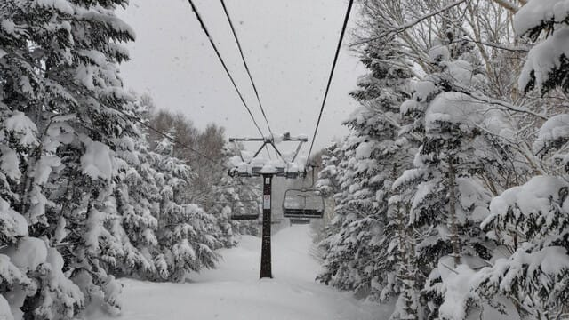
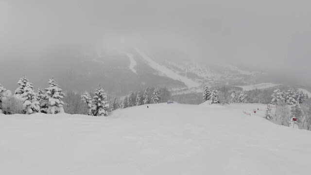
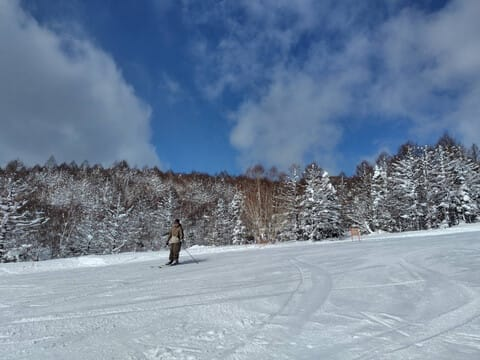
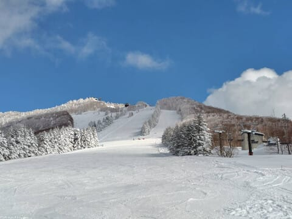
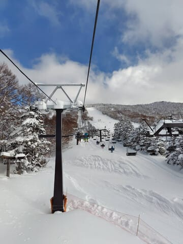
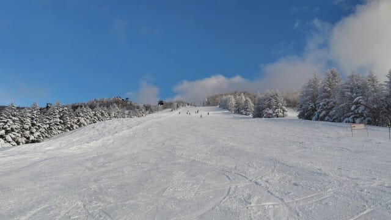

# 2月21日(金)の志賀高原スキー場は，特派員によると雪のち晴れ！積雪20-30cm．そして今週末は土曜は晴れ→雪，日・月曜は終日雪．

📅 投稿日時: 2025-02-22 00:55:01

なんと．

今週末3連休だったんですか？？？

…すっかり忘れてた…

いや．

この週末，月曜はやっつけなくてはならない

仕事があって，土日しか休めないので，

すっかり3連休だということを忘れてました…

あぁぁ…

せっかくの3連休，3日とも滑りたい…(涙)

とりあえず，

今日，21日金曜の志賀高原ですが．

特派員から送られてきた写真を見ると．

朝のうちは雪が降っていて，昨晩からの

新雪は20-30cmだったようで．

圧雪コースにも軽い新雪が乗っていて，

結構気持ちいいバーンだったとの

報告があり…

うううーーーーーん．

うらやましい…っ！！

と，思っていたら．

なんと！

午前中から雲が減っていき，

ときおり青空ものぞくようになってきたようで…

そして，午後はいい感じで晴れたよう

です…！！

うぎゃーーーー！！！

冷え冷え雪の晴天って…

滑りたい！！

滑りたいぞっ！！

まぁ，午後もずっとすっきり晴れという

わけじゃなく，雲は多めだったようですが…

でも，冷え冷え雪質で，こんな人が少ない

バーンを見たら…

滑りたい！！

滑りたいぞ！！！

明日も晴れてくれないかな…？？？

…ってなことで．

この3連休（すっかり忘れてたけど），

私はこんな冷え冷えのいい雪の晴れ間を

滑ることができるのか否か．

天気詳細を改めて予想しなおしてみましょうか…

天気図の解説を書いてる時間が無いので，

あっさりと結論だけ書くと．

22日(土)：朝は雲が多いけど，晴れてるかも？？

　朝までの積雪は10cmほど．

　朝イチの気温は-14℃ほどと冷え冷え！

　朝は冷え冷え最高のシマシマの上に

　ごくわずかに新雪が乗ってるところもある，

　滑りいい冷え冷えバーン！！

　ただ，日が射すのは午前中だけ．

　昼頃には天気は崩れ，雪が降りはじめ，

　午後は時折雪が強く降る．

　午後だけで5-10cmくらい積もるかも…

　結構寒いよ！

　午後はバーンが荒れていく

23日(日)：朝から雪．終日強く降ったり

　弱くなったり．

　朝までに15~20cm積雪．

　朝の気温は-15℃と冷え冷え！

　朝は柔らかめの圧雪シマシマに

　新雪が数㎝乗ったバーン．

　運が良ければ，プチ高気圧が発生

　して，日が射すタイミングも

　あるかも…

　この日も昼頃にはバーンが荒れて

　凸凹していくものの，雪質は良く

　楽しめる一日になるかな．

24日(月・祝)：この日も終日雪．

　朝までの積雪は10~20cm．

　朝イチの気温はこの日も-14℃程度と

　かなり冷える．

　この日の朝イチも柔らかめの圧雪に

　うっすら雪が乗った感じ．

　昼間も時折強く雪が降るタイミングが

　ありそう…

　運が悪いと朝はちょっと北風が強く，

　奥志賀ゴンドラがヤバくなる可能性も．

　…まぁ，たぶん大丈夫だと思うけど．

　昼間にも積雪があるし，かなり寒く

　なりそうで，午後はバーンが

　結構荒れそう．

っていう感じでしょうか…

かなり冷え冷えの3連休になりそうで，

雪も毎日20cmずつくらい積もって

くれそうな感じです～！

来週末はちょっと気温が上がりそう

なので，今週思いっきり冷え冷え雪を　

楽しんでおきたいところ．

ってなことで，

いつも通り，あと2時間半後に出発です…

また睡眠時間2時間で300km運転して

滑りに行くのか…(涙)

とりあえず．

また今週末も志賀高原で会いましょう～！！

## 💬 コメント一覧

### 💬 コメント by (地元民)
**タイトル**: Unknown
**投稿日**: 2025-02-22 22:57:27

郷はたいしたことなく、山は降りまくり。理想的なパターンですな〜。

今回、郷も大量に降るかと思いましたが、ほとんど降らずに寒波終わりそう✌️

なんか天気図の読み取りに自信なくなってきた。今まで、ほぼほぼ当たったんでしすが🤔

### 💬 コメント by (Skier_S)
**タイトル**: ＞地元民さま
**投稿日**: 2025-02-22 23:34:00

今，中野市のいつもの国道沿い某ホテルにいますが．中野市街は意外と雪が少なかったですね～．

今日は山のうえは昼間だけで40cm以上積もりましたよ…！

いつもこんな感じで，スキー場だけ雪が降ってくれればいいんですけどね(笑)

私の感覚では，高気圧に覆われてるけど寒気が入って北風が吹くときは

ふもとには降らず，山にだけ降るイメージです…

今回は天気図にはあまり明確に出ないプチ高気圧が本州中心部にあった感じかと．

### 💬 コメント by (地元民)
**タイトル**: Unknown
**投稿日**: 2025-02-23 00:05:00

なるほど。

通常の天気図だけ見たら、大雪パターンすよね？

### 💬 コメント by (Skier_S)
**タイトル**: ＞地元民さま
**投稿日**: 2025-02-24 00:48:15

そうです…

日本のマクロ天気図を普通に読めば，かなり雪が積もるパターンです…

