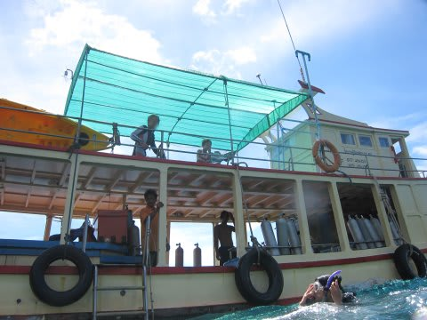
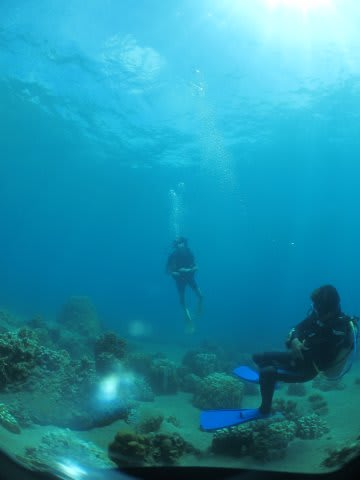
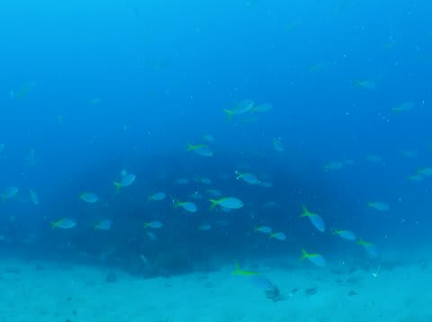
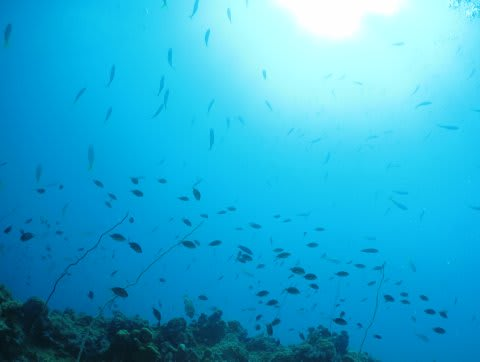
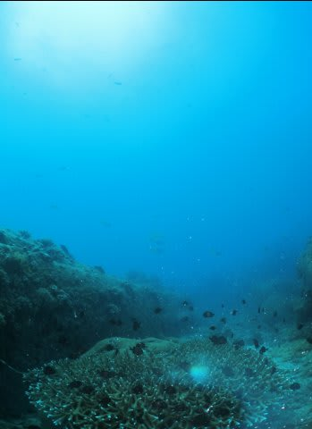
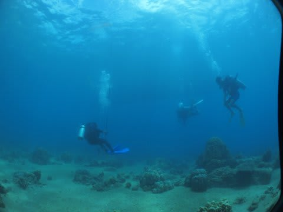
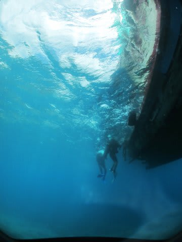
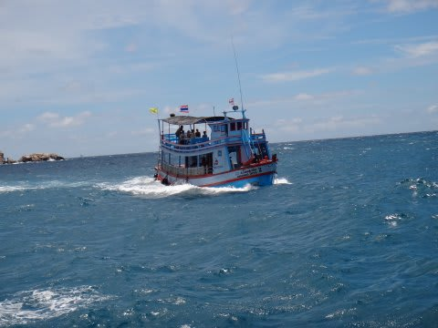
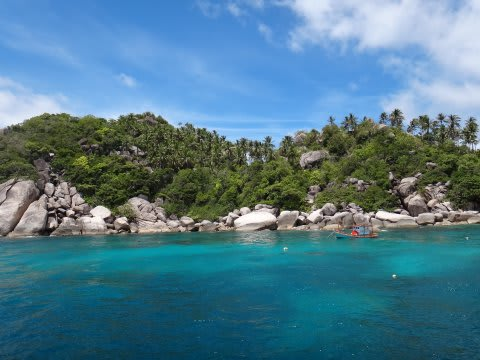

# 2013年9月　子連れタイ・タオ島ダイビング旅行記　その13　2日目午前のダイビングは

📅 投稿日時: 2013-10-23 01:28:30

🏷️ カテゴリ: [ダイビング日記](ce3a7a8d424d112fce83ee85c81a0e344.md)

えー．

ダイビング日記に戻すと，読者数が確実に減ってしまう今日この頃．

みなさまいかがお過ごしでしょうか．

…でも．

めげずに今日もダイビング日記に行くのだ．

----

ってことで．

本日午前のダイビングへ…

船の上から娘が見送ってくれる中，エントリー．

けど…

うーむ．

透明度がやっぱりあんまりよくないなぁ…

時折，魚の群れも通りますが…

なんだかこの海，カラフルなはずの魚も

かなり黒っぽくて，写真栄えしないなぁ…

…全体的に，ちょっと寂しい感じ…

…

…ってことで．

あんまり見るものも無く，

本日午前のダイビング終了．

まぁ…内湾はこんなものかな…(ちょっと落胆)．

で．

午前2本のダイビングの後，お昼はホテルの桟橋に戻って食べるのが

ここのパターンなので．

船は出港した場所へ戻っていくわけですが…

天気は回復し，日が照ってきたものの．

風は強く，なんだか波は高いままなんですけど…

となりを走っている船も，ざっぷんざっぷん揺れてます．

そして…

ホテルの桟橋前に帰るはずが．

なんだか，見慣れないところで停泊しちゃいました．

…あれ？

ホテルに帰るんじゃないの？

ショップの人「波が高すぎて，リゾート前に戻れないってことで，

　ここで上陸して，車でリゾートへ戻ってお昼ごはんです～」

げげげ．

そんなことが…

私「こーゆーことって，しょっちゅうあるんですか？」

ショップの人「…そんなに無いです．珍しいです…」

がががーーーん．

よっぽど運が悪いようで…

ってことで．

車に乗って，ホテルへ戻ることに…．
