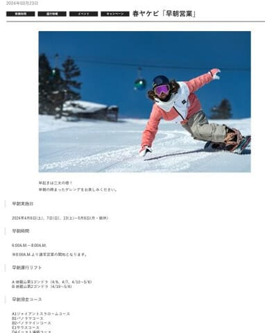
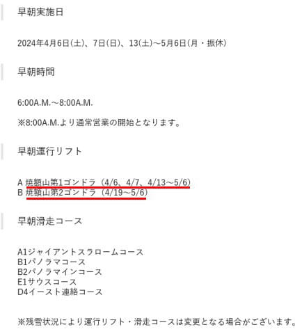
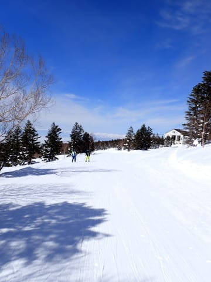
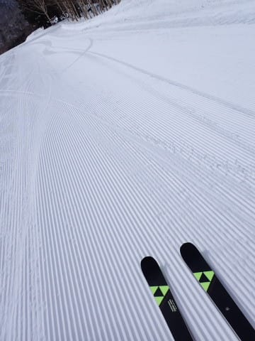
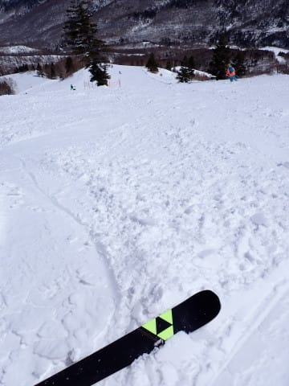
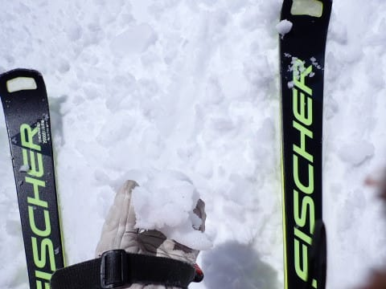
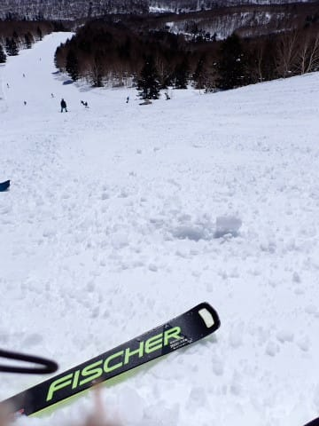
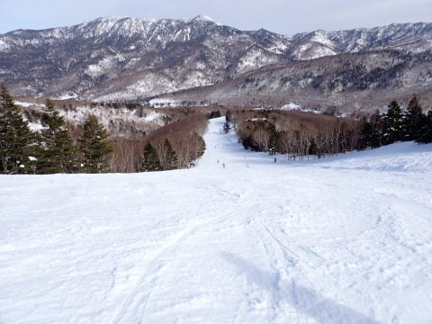
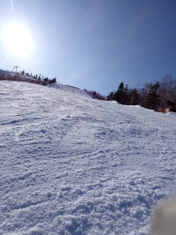

# 2024/3/24(日)の志賀高原焼額山スキー場，速報レポート！…天気予想外して終日晴天！でも気温が高いので雪はちょっと滑りが悪い重めの雪に

📅 投稿日時: 2024-03-25 03:13:37

ってなことで．

今日もラストリフトまでしっかり滑って

帰ってきたのですが…

帰りの高速であまりにも眠くて，

SAで仮眠を取ろう…

と軽く休むつもりが，

ガッツリ1時間以上寝てしまい，

帰宅したら12時過ぎ(涙)

だもんで，今日も帰宅日恒例の

速報モードで今日の志賀高原を

レポートしますが…

その前に，連絡事項を二つほど．

まず一つ目．

これから水曜にかけての天気ですが．

日曜に私に志賀高原であった人は，

月曜・水曜が雨…と，金曜段階の

天気図ベースでの予想をお伝えして

ましたが…

最新の天気図では．

月曜：志賀はぎりぎり降らずに済むかも？　

　降っても夕方にポツポツ程度．

火曜：月曜の深夜から液体が降りはじめ…

　火曜は本格的に降ります（涙）

　一日中，結構強い雨です（泣）

　昼過ぎ～夕方にかけ，雪に変わって

　行きます

水曜：前日からの積雪20cm．

　もう少し積もるかも？

　積雪朝は曇り～小雪，昼前後から

　晴れてい．く気温は低めで，

　コンディションいいかも？

という予想です…

火曜がかなり強い雨，

火曜夕方から朝にかけて，また雪が

積もってくれそうです…！！

で．

連絡事項…というか，お知らせの2件目．

焼額スキー場の春の早朝営業の

案内が出ました～！！！

（[焼額山スキー場ホームページ](https://www.princehotels.co.jp/ski/shiga/informations/early_morning_skiing/)より）

こいつをよく見ると…

ええええ？？

週末だけの営業じゃなく，

4月13日からGWまでは，平日も毎日

早朝営業してくれるの？？

そして，GWまで第1ゴンドラが営業予定

ってのもうれしいニュースだけど．

4月19日からは第1と第2のゴンドラ2本で

早朝営業？？？

（[焼額山スキー場ホームページ](https://www.princehotels.co.jp/ski/shiga/informations/early_morning_skiing/)より）

ホントですか？？これ？？

史上最大の春スキー営業規模…

雪が残る限り，ゴンドラ2本で

GS・パノラマイン・パノラマ＆サウスを

滑れるとは…！！

素晴らしい…

素晴らしすぎるっ！！！！！

早朝2時間券は4000円と高いけど．

焼額限定一日券5000円，2日券9800円

(Web購入)で早朝が滑れると考えると，

かなりコストパフォーマンス高いかも！

ちなみに，早朝営業開始の4月6日からは，

早朝が6～8時，

通常営業開始がこれまでより30分早まり，

8時ちょうどからの通常営業になります…

しかし，雪が残ってホントにGWに

ゴンドラ2本が動くんだったら，これは

かなりいいニュースですね…

…ってなことで，本題へ．

本日の志賀高原の速報レポートです！

まず．

本日は…

天気予想外しました（泣）

曇りで時折日が射すかも…

という予想だったけど．

実際は終日晴れでした．

めちゃくちゃ気温が高く，

暖かい春スキーの一日でした～！

とりあえず，

気温はあさイチからプラスだったんですが．

昨晩は雨にならなかったので，昨日の雪が

そのまま圧雪されたいい感じの

バーンであさイチはスタート！！

いや…

これ，めちゃくちゃいい感じでエッジが

効くし．

適度に締まったちょうど絶妙な硬さの

バーンで…天気もいいし，もしかしたら

今日が今シーズン最高の朝だったかも！！

気温が高めだったので，ちょっとダマっぽい

感じの雪になってきたけど，午前中は

かなりいい感じ！

…でも．

最高気温が+6℃程度まで上がり，

日差しも強かった本日．

昼頃には，雪はしっとりとした

感じの雪になり…

昨日積もった雪に強烈な日差しが

当たって，ゲレンデ下部の平坦な

ところは，一部滑りの悪い雪に（涙）

でも，昨日雨が降ってザラメに

なったとかではないので，気温が

上がってもざぶざぶ雪にならず，

下地はしっかりしているし．

コース上の人は少なかったので…

バーンは多少凸凹はあったけど

そこまでひどく荒れず，

ガンガン大回りできるレベル！

午後になると，コース上の人の

数もぐっと減っていき…

晴天でこんな気持ちよさそうな

バーンを貸し切りで滑れるシアワセ！

リフト営業終了の時間になっても，

結構荒れるGSコースでもこの程度の

荒れ具合で．

ザラメやザブザブ雪になることもなく．

3月下旬とすれば，かなりいい感じの

雪質の一日だったんじゃないかな？？

…とりあえず．

3月下旬と考えればいい状況が

続いてますし．

ここしばらくのどっさり積雪で，

雪不足だった今シーズンも，今になって

まさかの例年並みの積雪になってきた

感じがあります…

このまま行ってくれれば，GWの

2本のゴンドラ営業も夢じゃないかも！！

ってなことで．

明日，記事を書く精神力が残っていたら

日曜の志賀高原の詳細レポート書きます～！

## 💬 コメント一覧

### 💬 コメント by (TAR（takaaturyou）)
**タイトル**: Unknown
**投稿日**: 2024-03-25 12:39:11

昨日は、突然のお声掛けで、戸惑われたかもしれません。

何処から聴き覚えのある声が… S氏だとわかりました！

平日系スキーヤーなんで、なかなかお会い出来ませんが、

次回、ご一緒に滑走お願いします。

### 💬 コメント by (地元民)
**タイトル**: Unknown
**投稿日**: 2024-03-25 21:35:02

こんな雪ばかりの3月、初めてかも。

自然って、ちゃんとバランスとるのね。自然って偉大。

### 💬 コメント by (ケンイチ)
**タイトル**: Unknown
**投稿日**: 2024-03-25 21:49:46

私は土曜の焼額の後、日曜は栂池で滑ったのですが、栂池も「The 春スキー」で、土曜から日曜の1日で季節が2ヶ月進んだようでした。

1週間前の天気予報では日曜はちょい雨で、それが曇りだけになり、前日まで曇り予報だったのが朝から終日晴れっぱなしで、それはこの時期はいいことばかりではないわけで、やはり昼には滑らない雪に…。

朝イチの麓の緩斜面は固めで、それはそれで春っぽいなという感じだったのですが、山頂付近はちょうどいい感じのシマシマ圧雪で、ちょっと下がったあたりも柔らかめの快感圧雪。雪がいいので忘れがちですが春分すぎということでリフトもゲレンデも混まず、大回りし放題。でもそれも昼前までで、昼には緩斜面は粘り気のあるクリーミーバーンに。これならいっそ水が出てザブザブシャビシャビの方が好みなのですが、まあ、春ですね…。

焼額の早朝営業はエリア1日券で滑れるなら滑ってみたいのですが、6時にゴンドラ前＝麓泊で5時発、というのがなかなかのハードルになって行けてません。自宅からだと3時半発でも抵抗ないのに、泊り先の5時発って何だか抵抗が…。

### 💬 コメント by (Skier_S)
**タイトル**: 明日は午後はそこそこ積もりそう
**投稿日**: 2024-03-26 02:20:42

＞TAR（takaaturyou）さま

日曜はお疲れさまでした~！

ウェアが変わったのに，声でわかるとは…

長いこと会ってなくても覚えられる特徴的な声だったんですね（笑）．

今回はご一緒できませんでしたが，また次の機会に一緒に滑りましょう！

＞地元民さま

いやーー．

この3月，積もりましたね～！

2月段階では予想できない大逆転劇の展開ですね（笑）．

このまま4月までこの調子で行って，GWまで雪がもってほしい…

＞ケンイチさま

いや…日曜は気温がかなり上がったので，ホントは晴れより曇りが嬉しかったですよね…

白馬はかなりザブザブになってるんじゃないかと思ったけど，そちらもクリーミーバーン

って程度だったんですね．

焼額早朝営業，朝早いのは辛いけどそれだけの価値はありますよ～！！

