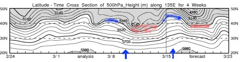
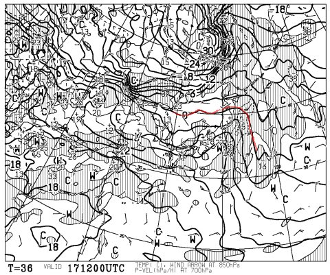
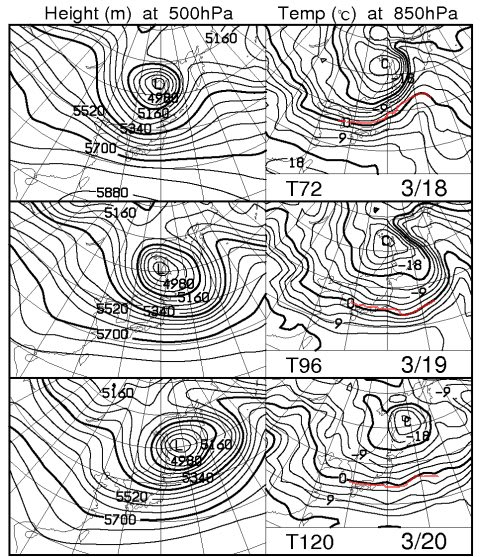
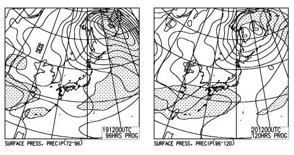

# 試乗レポートはちょっとお休みして．この週末の天気は？

📅 投稿日時: 2012-03-16 22:52:32

あー．

19日は平日ですが．

いつもどおり，強引に休みを取って．

4連続で志賀高原です．

アホですね．

さて．

試乗レポートはまだSALOMONとATOMICだけしか書いてませんが．

このあと，まだOGASAKA，HEAD，ROSSIGNOL，DYNASTAR，

FISCHER，VOLKLと，まだまだ続きますので，

お楽しみに．

…志賀高原の4日間が終るまで，しばしお待ちを．

で．この週末の天気ですが．

天気ですが．

…今日，おとといは天気も雪も良く，最高だったというのに．

今週末にスキーに行く人は，日ごろの行いが悪いんでしょうね…

土曜は終日雨です．

標高2000m以上でも，雨．

どうして週末前まで最高で，それが終ったのを狙ったように…

こんな感じで，500hpa高度の傾向を見ると，網掛け部分，5400mの高度線

が北緯40度以上にあがるところ（青でマークした部分)，すなわち

気温が上がって雨になるところが，ここ2週間，見事に週末（青やじるし）と

重なってます．

で，雪が良くなる，5400mの高度線が南に下りてくる部分（赤で

マークした部分）は見事に週末を避けているという…

悔しいなぁ．

で，土曜は．

朝のうちはそんなひどい雨じゃないでしょうが…

昼ごろからはしとしとしとしと，いやな感じで夜まで降り続けそうです…

ザーッと降る感じじゃないのが救いかな．

17日夜9時の850hpa面気温がこんな感じで…

0度の赤線がかなり北に行ってしまってます．

ということで，標高2000mクラスでも絶対雨です．

降れば雨です．終日雨です．

うーん．残念．

日曜の朝は…

志賀高原は曇が多いですが，時々日が射すかも．

新潟の標高が低いところは雨か，みぞれっぽい雪がちらつくか．

気温は，前日よりは低いものの，ちょい高め．

前日に雨が降ったゲレンデが，そんなにカチンコチンに凍らなさそうなのが

救いかな．

でも，まぁ雪質は昼に向かってドボドボの春雪になるでしょう…

…でも．

こんな感じで，月曜の19日から20日火曜にかけては850hpaの0度線が日本の南岸まで下がるので．

ここは冷えて雪質が良くなるかな？？

と思ったら．

こんな感じで，19日も20日も，降水がある領域を示す網掛けが

日本にかかっていないのだ．

…つまり．

この2日は冷えるが，雪が積もらないのでアイスバーンなのだ．

20日の祭日も，ゲレンデコンディションは良くなさそう…

うーーーん．

この3月，ゲレンデ状況はもう改善しないまま，4月に入っちゃうのかな…(涙)

## 💬 コメント一覧

### 💬 コメント by (雪上の翁)
**タイトル**: 残念、、
**投稿日**: 2012-03-17 10:17:01

3月だからしょうがないとは思いますが、

やっぱり雨中のスキーはきついですよね。

風邪などひかぬように(。-_-。)

### 💬 コメント by (Skier_S)
**タイトル**: 今日は…
**投稿日**: 2012-03-17 23:10:34

やっぱり雨の中のスキーでした（涙)

