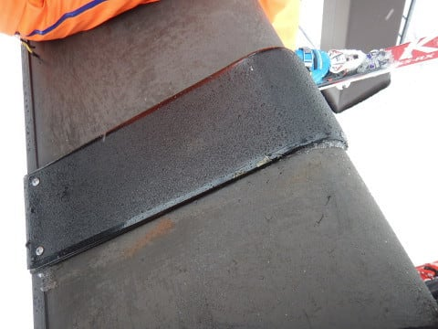

# 2019/4/14(日)の志賀高原スキー場の詳細レポート！…春だねぇ（涙）．天気は晴れのち曇りのち霙．雪は春の雪（泣）

📅 投稿日時: 2019-04-16 01:31:37

🏷️ カテゴリ: [2019スキー滑走日記](c3e4496fc0fb7f9c17ff21214a35b1ace.md)

ということで．

4月に入ってからシーズンの

最高積雪量を更新してしまうという，

奇跡の4月をもたらした，この4月上旬の

冷え冷え祭りも終わりを迎え．

今週は平年並みながら．

21日の日曜日ははすごく気温が高く

なってしまいそうな気配がする今日この頃．

みなさまいかがお過ごしでしょうか（涙）

まぁ，この週末は天気は良さそうなので．

暑いと思うほどの春スキーになりそうです…

でも，雪の量はたっぷりあるので．

まだまだシーズンは楽しめますよ～！

ってことで．

昨日速報レポートした，日曜の志賀高原．

詳細レポートをば…

日曜の朝…

健全なスキーヤーである私は．

健全に朝早起きして．

健全なスキーヤーが参加する朝6:30からの

早朝スキーに参加するわけで．

うむ．

今日は，朝6:30という早くから．

健全なスキーヤーが40人以上並んでますね…

（この後ろにも，20人ほど並んでます）

みんな，健全だなぁ…←「健全」の部分を「バ○」と読み替えた方が正しい気がする

ってなことで．

早朝営業開始のゴンドラに乗って，

山頂に出ると…

気温は-3℃ですか．

…早朝にしては，気温が高すぎ

ますね（涙）

でも．

今日は朝から，うっすら雲がかかってるけど

太陽が射していて，いい感じですよ～！

そして今日も．

早朝の誰も滑っていないシマシマバーンを

いただきまーーーーす！！

うはははははは！！

シマシマ…っ！！！

…

…

なんだけど．

ありりり？？？

このバーン．

下地は柔らかいのに．

表面だけカリカリとした感じに

固まったシマシマで．

人が滑ると，表面がぼろぼろ

崩れていくんですが…！

早朝のバーンは，はじめのうちは

コロコロが大量発生して．

ちと滑りにくい感じ…（残念）

まぁ，ガチガチに硬い氷では

無かったので．

殺人コロコロ

とまでは行かず．

半殺しコロコロ

といった感じで，そこまで致命的では

無かったですけど．

でも，せっかくのいい天気なのに．

始めのうちは気持ちよく傾ける

バーンコンディションじゃなかったのが

残念…

ただ，開始後1時間も経つと，

半殺しコロコロは緩んでつぶれ始めたので．

滑りやすくなってきたかな！

…そして．

早朝営業終了後．

通常営業開始の8:30からオープンになる

パノラマコースへ．

オープンと同時に飛び込む！

この時には．

雪の表面はそれほど硬くなかったので…

ちょうどいい感じのシマシマですよ！！

うはははは！

早朝はちょっとイマイチのシマシマ

だったけど．

今日2度目のシマシマは，

エッジが食い込み，かなり

いい感じのシマシマ！！！

いや…

数本，大変おいしくいただきました…

そして．

第2高速リフト沿い，

唐松コースにも行ってみますが…

誰もいないよ！！

写真に誰も写ってないことから

分かるように．

ホントに他に誰も滑っておらず．

ほぼ貸し切りなんですが…！！

朝10時近くになっても．

まだほとんど滑った跡が残って

いないフラットバーンって…

凄すぎ．

それ以外でも．

オリンピックコースも…

GSコースも…

今日はガラガラですね．

どこで写真を撮っても，

他のスキーヤーがほとんど写らない

ってのは，どういうこと？？

ただし．

しっかり日が射していた本日．

当然，気温はぐんぐん上がって．

昼前には，＋5℃近くに上がっちゃい

ました…(涙）

この気温と日差しが相まって．

朝から雪は緩み始め．

11時ごろには，完全に春の雪になって

しまい．

板の滑りも悪い，張り付き雪に

なってきました…（涙）

この時期だと，朝日があたらない

一の瀬の方が雪のゆるみが遅いし．

今日は午前中，一の瀬ファミリーで

大会があって．

午後はそのコースがオープンになる…

という情報もあったので．

すぐ戻るからね～…と，

焼額の呪いをちょっとだけ解いて．

一の瀬へ！

すでに正面バーンで行われた大会は

終了し，コースもオープンになって

いますね…

しかし．

正面バーンは，コースはフラットながら．

やっぱり雪はかなり重めの，

そんなに滑り良くない感じ…（涙）

パーフェクターコースも見に行って

見ましたが．

うーむ．

こちらももう，どっしり重い春の

雪ですね…（泣）

ってことで．

焼額へ戻りますが…

今日の昼前から．

太陽に日暈がかぶっていて．

これは，予想より早くから

何かが降り始めるかも…

と思っていた，ヤバい予感が当たり．

（午前11時ごろ，太陽にかかっていた日暈）

午後2時過ぎに．

なんだか，ぽつぽつ来ましたね…

それも，液体が（涙）

ただ，ポツポツと降ったりやんだり

程度で．

びしょ濡れになるほどではなかったし．

山頂付近では雪だったので．

まだ，どしゃ降りの全山雨よりは

マシですが…

でも．

中途半端な降りだったので．

雪は張り付き雪のまま．

もう，

雪の滑りは悪く．

さらに，天気まで悪くなってきたので．

もう，ゲレンデに残っている人は

誰もいません（涙）

まぁ，常識的な感覚を持っている人なら．

雨が降り始めた時点で帰るよね…←自分が普通の感覚でないことを認めたのか？

ってなことで．

時折ぽつぽつと，みぞれ～雨が

落ちてくる中．

見渡す限り誰もいない

貸し切りバーンを．

今日も16時の営業終了時間まで，

滑り続けたのでした…

…でも．

1ゴンの駅舎の周りに，まだこれだけ雪山が

あるってのは．

今年の4月，やっぱり雪が多いですよ～！

まだまだGWまで行けますよ～！！

## 💬 コメント一覧

### 💬 コメント by (ももも)
**タイトル**: Unknown
**投稿日**: 2019-04-16 23:43:15

２月にステッカーを頂いた４人家族の母です。

貴重な御守をありがとうございました。何故か子供は学校のカバンに入れて持ち歩いています！

突然ですが、本日はスキーの神様に是非相談したいことがありコメントさせていただきました。

10年ほどLANGE WCのブーツ（普通のタイプ）を使っていましたが、この度新しいものを検討中です。店員さんに勧められたのはLANGE WC RP ZA+です。

生まれて初めて紐のインナーブーツの存在を知りました。履いた感じは好感触でしたが…お気楽に滑りたいオバサンには不釣り合いな気がします。

私がブーツに求めるものは温かさと履きやすさ、オマケにフレックス130ほどです。この手のブーツは保温性はあるのでしょうか？なんの知識もないのですが、デメリットは何でしょうか?

型落ちなのでお値段は魅力的!ですが、とても悩んでいます。急いでませんので、お時間のある時にでも神のお告げを頂けると幸いです。宜しくお願いいたします。

### 💬 コメント by (Skier_S)
**タイトル**: ＞もももさま
**投稿日**: 2019-04-17 01:09:19

お久しぶりです～！

コメントありがとうございます！

…で．

LANGE WC ZA+ですか？

これって…フレックス140じゃなかったでしたっけ？

うーむ．

私だと履きこなせなさそうな感じですが…

とりあえず，これまでもLANGE WCを履いてらしたので，

店員さんも同じシリーズを薦めたのではないでしょうか．

今のブーツで問題ないなら，LANGE WCを履く選択肢もありそうですが…

でも，競技用はやっぱりブーツ幅も狭いし，インナーブーツも

なるべく反応を鋭くするために薄くなってるし，

そのせいで保温性は低いし，脱ぎ履きも硬いし，

快適かというとちょっと違う気がします…

快適に楽に履きたいなら，もう少しインナーブーツが厚い，

脱ぎ履きがしやすいモデルが良いのかと．

おなじLANGEのフレックス130でも，快適さをもとめるなら

RX130とかもありますし…

