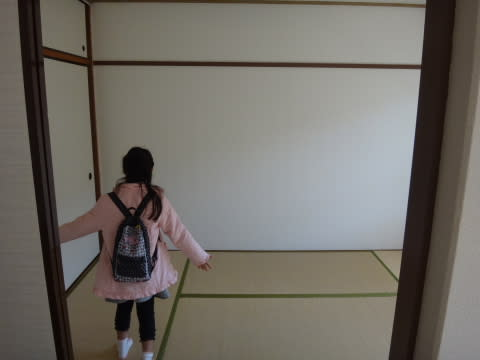

# まだ引っ越し継続中…

📅 投稿日時: 2016-04-03 23:52:29

🏷️ カテゴリ: [日記](cc4b5682fb7b8b144980957a978653fb0.md)

本日日曜．

志賀高原は，予想通り気温が高かったようで…

[このレポート](http://red.ap.teacup.com/applet/gokurakuskier/20160403/archive)によりますと．

朝のうちは晴れるけど，雲が多く．

気温が異常に上がるとういう予想通りの天気

だったようですね．

ああ．

しかし．

スキーに行きたかった…（涙）

試乗会にも行きたかったし．

ヤケビラストデーに滑れなかったのが，

すごくすごく悔いが残ってます…（強烈に残念）

とりあえず．

本日は荷物を搬出し，家はすっからかんになりました．

明日，新居に搬入です．

だもんで…本日はホテル泊まりです．

…明日から会社なのに，まだ引っ越しが続きます…

大丈夫か！？？

＃なんだかんだ言って，やっぱり毎日Blog更新してるなぁ

## 💬 コメント一覧

### 💬 コメント by (Goku)
**タイトル**: Unknown
**投稿日**: 2016-04-04 19:38:21

引っ越しご苦労様です。

大変ですよね～、引っ越しって・・・

天気予報、完ぺきでしたよ！

日曜日は日差しがもろに届かない分、ストップスノーにならず板の走りは良かったです。

それにしても、今朝の長野はかなり本降りの雨が・・・

来週滑れないだけに雪解けが心配です。

### 💬 コメント by (Skier_S)
**タイトル**: Gokuさま
**投稿日**: 2016-04-05 01:56:38

天気予想当たりましたか…！

自分が行かないので、どうだったか気になっていたのですが…

でも、長野も雨ですか(涙)

今週末の雪は、滑れるレベルをキープしてくれるのか…

