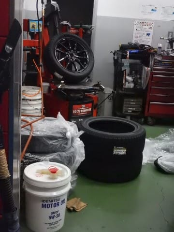
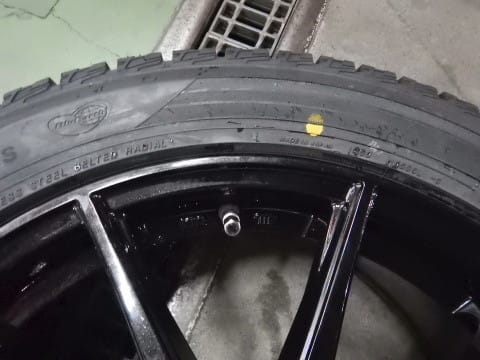
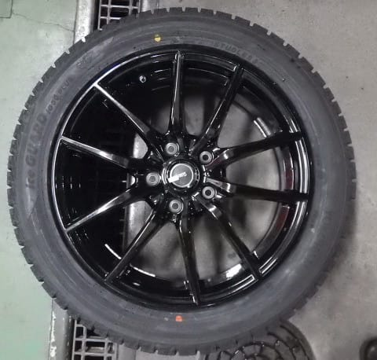
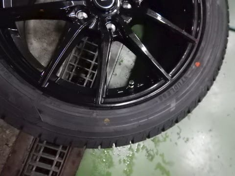
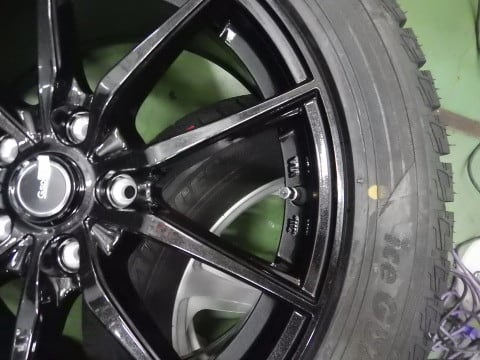
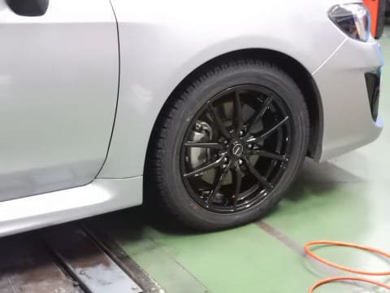
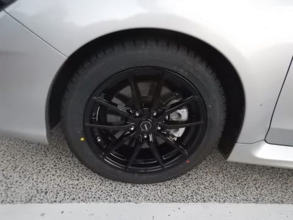

# LEVORGにスタッドレスタイヤ，YOKOHAMA iG5 plusを履かせてみた

📅 投稿日時: 2018-11-28 02:25:40

ってな感じで．

[通販で買ったスタッドレスタイヤ](e2136011c43e84e0a7abb9da8bee1ad19.md)．

YOKOHAMA iG5 plusを，LEVORGに履かせなくては

ならないわけですが．

毎度悩むのが，

持ち込みタイヤを安く取り付けてくれる店を

探さなくてはならないってことですね…

前回は．

いろいろなメンテを頼んだついでに，

[ディーラーで値切って安く取り付けて
もらいました](e3f34b55e380e0140a4c58586172eb379.md)が．

…今回は，新車を買ったばかりで．

メンテと一緒に頼む手は使えません…

とりあえず，近場のガソリンスタンドで．

持ち込みタイヤの工賃を聞いてみたところ…

ふむ．

ホイール組み込み・バランス調整・脱着で

1本3000円+税ですか…

4本税込みで13000円ちょい．

…自動車用品店に比べれば，まぁ許せる

お値段ですね．

しかし．

17インチまでは1本2000円+税ということだったので．

「ホイール組み込みをお願いするタイヤは17インチだから，

　2000円なのでは…？」

と聞いてみたところ．

外す夏タイヤが18インチなので．

やっぱり18インチの値段を取られてしまいました…（涙）

ちょいと残念…

ってことで．

ここでタイヤ交換をお願いして．

ホイール組み込み作業が始まりましたが…

組みあがったタイヤを見ると．

うむ？？？

黄色丸のタイヤ軽点マークとバルブ位置が，

かなりずれてるんですけど…（涙）

タイヤのビードが硬かったのか．

ホイールの組み込みにかなり苦労していたので．

大変そうだなぁ…と思ってみてましたが．

取り付け位置がここまでずれるとは…っ！

ホイールを見てみても．

ホイールにはユニフォーミティーマークがないし．

赤丸のユニフォーミティー合わせで

組んでる様子でもないので…

単にずれただけか…（ちょいと泣）

2本目も．

結構ずれて仕上がってきたなぁ…

…まぁ，タイヤ軽点とバルブ位置がずれていても．

ちゃんとバランスさえ取ってもらえれば，

文句はないのですが．

3本目になってようやく，

軽点マークとバルブ位置が一致しましたね…

4本目も無事に，軽点マークとバルブが一致

してました．

ってなことで．

ホイールに組み込んだスタッドレスを

夏タイヤと交換して．

無事スタッドレス化，完了！

うん．

一枚6800円の激安ホイールだけど．

黒ホイールはそんなに安っぽく見えなくて

いいかも…

ってことで．

このタイヤで熊の湯まで行ってきましたが．

うむ．

高速走行・街乗り・雪道のどれをとっても．

特に不満のないレベルですね．

もう少し走ったら，スタッドレスタイヤの

詳細インプレッションレポートやります～！

## 💬 コメント一覧

### 💬 コメント by (まいる)
**タイトル**: タイヤ交換しましたね
**投稿日**: 2018-11-28 22:45:51

Sさん、お疲れ様です

スタッドレスに交換しましたね

私も4本で同じくらいの激安アルミに225/65R17のSJ8に履き替えました。

でもなかなか寒くなりませんね・・・

### 💬 コメント by (Skier_S)
**タイトル**: まいるさま
**投稿日**: 2018-11-29 01:57:22

車を買い替えると，スタッドレスも買わなきゃいけないのが

痛いですよね…

そして，最近の車はタイヤサイズがデカいので

スタッドレスが高すぎます（涙）

とりあえず，せっかくスタッドレスかったので，

早く冷えてほしいですね～！

