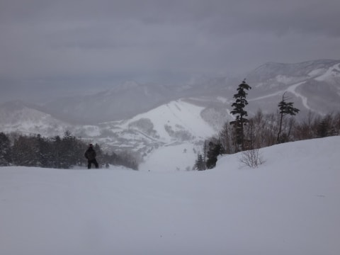
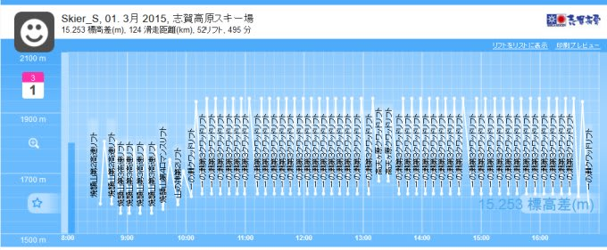
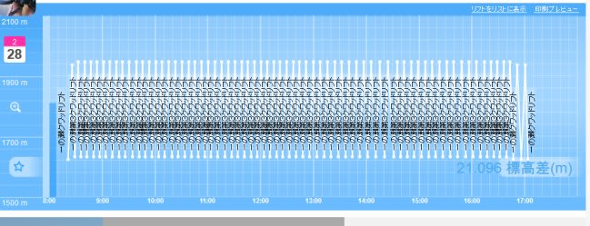

# 一の瀬を一日滑ってみて…すごい人もいるもんだ

📅 投稿日時: 2015-03-04 02:47:12

ってことで．

強風で焼額ゴンドラが2本とも止まった日曜日．

…焼額がホームの私が，ちょっとアウェー感を感じつつ，

一の瀬ファミリーをぐるぐるすることになったわけですけど．

いやー．

一の瀬ファミリースキー場には，なんというか．

…それはそれはすさまじい，20000mクラブな方々が何人かいて．

あ，20000mクラブって，私が勝手に作った呼び名ですが．

…一日，滑走標高差20000m以上を滑る人たちのことで．

んで，[この方](http://www.skiline.cc/skiing_day/1jp4l8518q4)とか，[あの方](http://blog.livedoor.jp/skivaca/)とかがガンガン滑ってるわけですよ．

今回，一の瀬ファミリーを一日滑ってみて．

思いました．

…この人たち，人間じゃ，ない．

たぶん，サイボーグ．

スキーのために改造された体をもつ，サイボーグに違いありません．

私も，どちらかというと．

朝から晩まで，かなり休まずに滑る方だけど．

そして，決して，滑るのが遅くはないはずなんだけど．

（日曜日の私のSkilineの記録…11時ごろと3時ちょっと前に抜けているのは

　ゲートをくぐったのに記録されなくて飛んでいるぶん）

…これだけ必死に滑っているのに．

あっという間に一周差がついて後ろから追いついてきて，何度も抜かれて．

…え？なに？

この人はゲレンデに3人くらいいるんじゃないの？

そうじゃないと，こんなに抜かれるわけがない…．

と，思ってしまうほど．

ホントに抜かれる．

数本滑ると1回のペースで，ガンガン追い越されていきます．

Skilineで，一日20000mの記録を見た時は．

このSkilineの記録，本当？

人間って，こんなに滑れるものなのか…？？

一日20000mって，人間が滑れるのか？？

Skiline，間違ってるんじゃないか…って疑ってましたが．

この人たちの滑りを見て．

「この人たち，間違いなく一日2万m滑ってるわ…

　たぶん…いや，間違いなく，この人たち，人間じゃないから」

と，納得してしまいました．

世の中．

おかしな人すごい人はいるもんだ…

と，感動せずにいられなかった，Skier_Sなのだった…

…そして，おそらく．

20000mな方々は，かなりの確率でここを読んでいる気が…する．

## 💬 コメント一覧

### 💬 コメント by (れお)
**タイトル**: これは凄い…
**投稿日**: 2015-03-04 17:00:50

以前、Ｓさんのskilineを私のと比べて、愕然とした記憶があるのですが、それの上を行ってますね、これは…。

ランチの時間とかも無いようですし…。凄すぎる!!

私には到底太刀打ちできないので、ヤケビグループとしては、Ｓさんにこれを上回るよう頑張ってもらいたいです!! (笑)

ところで、今週末の天気は、雨でしょうか…？

### 💬 コメント by (通りすがり)
**タイトル**: Unknown
**投稿日**: 2015-03-04 20:43:54

圧倒的なkonさん

しかしこの土曜日、konさんは去年志賀高原１位のパーちゃんに５回抜かれたそうです　　

゜(∀) ゜ エッ?

### 💬 コメント by (Skier_S)
**タイトル**: いや，ホントにすごいんですよ…
**投稿日**: 2015-03-04 23:13:31

＞れおさま

日曜のSkilineも，15000mを超えているので

まぁまぁ滑った方かとおもうのですが…

もう，20000mクラブな方々，何か突き抜けた人達ですから（汗）

20000m超えって，私には絶対無理です…

ヤケビベースのトップは，maeさんに一任でしょうか（＾＾；

これらの方々に比べると，私なんて凡人です（笑）．

…で．

今週末の天気ですが．

私の嫌いな，南岸低気圧パターンなので．

直前までどうなるか予想が難しいです…

ただ，今のところ雨にはならなさそうで．

降っても雪かと思います…

＞通りすがりさま

え！？

私をありえないペースで追い抜いて行った

konさんを，さらに5回追い越すとは…(゜.゜)

やはり，20000mクラブな方々は私の

想像をはるかに超えるレベルでの争いですね…

### 💬 コメント by (Goku)
**タイトル**: Unknown
**投稿日**: 2015-03-05 20:42:32

みんな、M○○星雲から来た、スキーを地球に普及させるために来たウルトラスキー星人です。

20000ｍ超えはヒトではムリです・・・

### 💬 コメント by (mae)
**タイトル**: Unknown
**投稿日**: 2015-03-05 23:42:49

20000mなんて、若いSさんなら無理なことないでしょう。(^^

但し、条件が良いことと（天候、斜面の状態、空いていることなど）と、あとトイレ休憩を我慢できるかですね。ランチはリフト上でカロリーメイトで十分でしょう。

ヤケビはこのところあまり滑っていません。奥志賀かファミリーが中心になってしまいました。

志賀高原のフラグシップは昔からヤカビだと思ってきましたが、２ロマ、３ロマ、１高速と廃止になり、昨年から営業開始も休日8時が無くなり、１ゴンも10分近く所要時間がかかるようになり、益々、面白みがなくなりましたね

### 💬 コメント by (Skier_S)
**タイトル**: 私も普通のヒトだと痛感…
**投稿日**: 2015-03-06 00:02:05

＞Gokuさま

20000m超え，ヒトでは無理ということに激しく同意…

一応私も，自分のProfileによると，

「サル型スキーロボット」

なんですが（笑）．

＞maeさま

…ご本人にご登場いただくとは…

日曜日滑ってみて思いましたが，

20000m超えは

「止まったらアウト」

「トイレに行ったら負け」

ですね…

私はどうやら普通の人間なので，

20000mは無理です（笑）．

これまでの最高記録は17000m台で，

18000mすら超えたことがないです…

＃ヤケビベースの宿命か？？

ヤケビが1ゴンの運転速度を落とすようになり，

