# 2020/3/1(日)の志賀高原スキー場，速報レポート！…朝から晴天！朝は最高だったけど，強い日差しで雪はちょいと緩み気味

📅 投稿日時: 2020-03-02 01:25:26

ということで．

本日も志賀高原で営業終了まで

しっかり滑ったあと，300km運転して帰宅．

その後，洗車やら板の手入れやらを

こなしていると．

…いつもの深夜コースです（涙）

だもんで．

日曜深夜恒例，本日の志賀高原，

速報モードにて！

えー．

まず．

今日も朝から晴れましたよ！

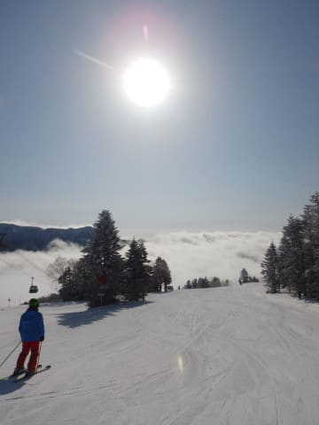

…え？

曇り予想だったはず？？

何のことかな…（聞こえないふり）

で．

ゲレンデは最高級のすっきりシマシマ！！

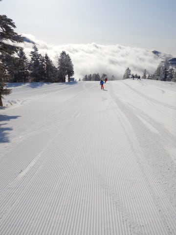

ぐほーーー！

2日続けて，こんな最高級のシマシマを

滑れるとはっ！！

最高！！

この週末，恵まれてる…（感動）

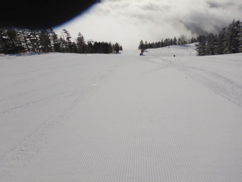

ってな感じで．

2日連続で，晴天最高朝イチシマシマを

堪能できましたが．

いやー．

この日は，朝のうちは眼下に雲海が見え，

いい景色で滑ることができ，

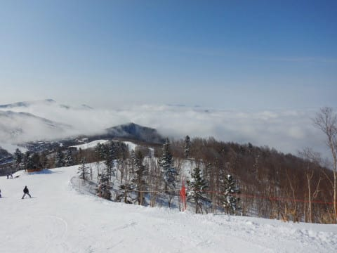

コースもゴンドラも，コロナウイルスで

外出を控えた人が多かったのか，

この時期の週末としてはありえない

レベルのガラガラぐあいで．

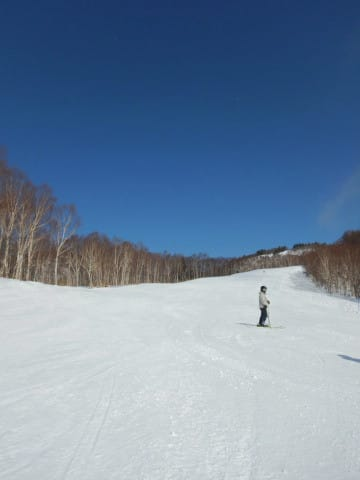

雪質も朝のうちはいい感じだったのですが…

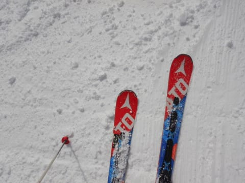

午前10時ごろには，朝日を全身に浴びる

東～南斜面の焼額山．

ちょっとゲレンデの雪がしっとりして，

重くなってきました…（涙）

だもんで．

この日は昼ごろに．

わがホームゲレンデの焼額から，

「ちょっと様子を見に行くだけ…」と，

奥志賀へ脱出！

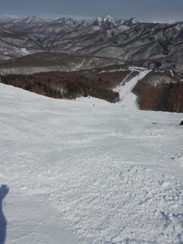

ををを！

さすが北斜面の奥志賀．

この時間になっても，雪は全く緩んで

ませんね…

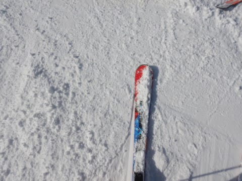

かなり予想通りより雪質がよく．

午後になっても全く雪は緩まず．

コースも結構空いていたので．

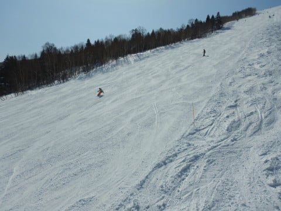

ちょっと様子を見るつもりが，

ひたすら3時間以上様子を

見続けてしまいました…

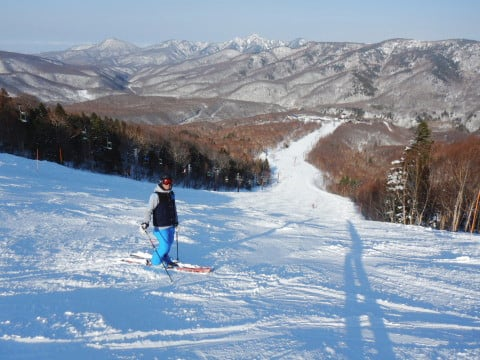

さすがに3時ごろになると，

奥志賀も結構荒れてきたので．

ちょっと様子を見に行くミッションを終えて，

ホームゲレンデ，焼額へ戻りますが…

焼額，ゴーストタウンか？

と思うほど，誰も滑ってませんね…

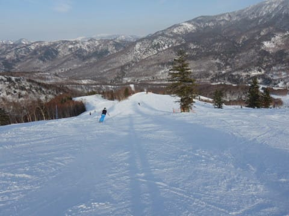

そのおかげで，多少荒れてはいたものの，

土日としては，夕方になっても

それほどひどい凸凹になっておらず，

結構楽しく滑れました…

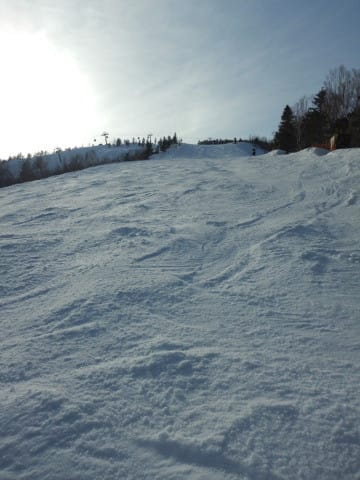

ってな感じで．

日差しが強かったので，東南斜面の焼額は

雪が緩み気味だったのがちょいと惜しくは

あったけど．

他の人の情報も合わせると，北・西斜面の

奥志賀や一の瀬はいい雪のままキープした

らしいし．

終日晴れで，朝イチは最高冷え冷え雪の

シマシマも楽しめて．

そして週末とは思えないレベルのガラガラさで，

かなり楽しめた一日だったのでした…

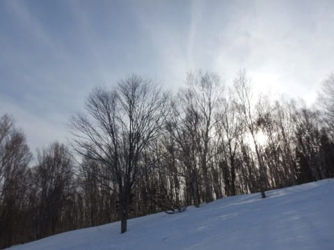

うーむ．

しかし．

コロナウイルス騒ぎで，志賀高原の宿も

キャンセルが相次いでいるようです…

ガラガラなのはうれしいけど．

また来シーズン，リフトが減ったり

宿がつぶれたりしないことを祈るばかり…

とりあえず．

明日また，詳細レポートやります！

お楽しみに…

## 💬 コメント一覧

### 💬 コメント by (Hide)
**タイトル**: Unknown
**投稿日**: 2020-03-02 07:52:18

S 様

土曜日に何度かお見かけしましたが、タイミングが合わずごあいさつできませんでした。

久しぶりにあちこち移動しましたが、やはり、奥志賀、一の瀬、高天、寺子屋は状態が良かったですね。

なんだかんだ、ほぼ全面滑走できる志賀高原はやはり安定です。

しかしホントに人が少なくて私も同じように心配してます・・・。

ジャイアントから下部のエリアは来年以降もダイジョウブか？？と思っちゃいます。

### 💬 コメント by (さち)
**タイトル**: Unknown
**投稿日**: 2020-03-02 08:04:40

居ないなぁと思っていたらそういう事でしたか！(笑)

### 💬 コメント by (焼額山現地特派員)
**タイトル**: Unknown
**投稿日**: 2020-03-02 11:14:33

月曜日の速報

出た!妖怪足つかみ。10時過ぎに下の方で出ました。雪温はプラス5度。朝から強風で、奥志賀ゴンドラは閉鎖。

1ゴンスタート、雪温マイナス2度で快適だったのに。

ならばと早めの昼食で、これから一の瀬に期待をかけます。

かずさんは奥志賀のバスまわしにとりかかるそうです。

以上、特派員報告でした。

### 💬 コメント by (ホームはアサマだけれど最近志賀が多いm&t)
**タイトル**: Unknown
**投稿日**: 2020-03-02 12:27:23

昨日は終礼まで参加。普段のゴーグル、ニット帽、ヘルメット姿と違う素の皆さんを見れて、何だか嬉しくなりました。滑っているとサイボーグの様な皆さんも、普通の?人間なんだと感じられました！また日曜日に出没しますのでよろしくお願いします。

### 💬 コメント by (焼額山現地特派員)
**タイトル**: Unknown
**投稿日**: 2020-03-02 14:37:20

月曜日の速報

昼前、ダイヤモンドに巨大な妖怪足つかみが出ました。

ファミリー、パーフェクタ、パノラマ、どれも快適。気持ちよく幸せに酔いしれていたら、緩斜面ではどこでもやっぱり妖怪が。その時の雪温は５度。

でも、楽しかった。

それと、子供さん連れが、ぼちぼち出現するようになりました。閑散としたスキー場は、かなり安全かと。

### 💬 コメント by (匿名で)
**タイトル**: Unknown
**投稿日**: 2020-03-02 19:10:31

コロナウイルスで皆さんが外出を我慢している日に(特に子供達)がこのブログを見たらどう思うのでしょうか？

日本が緊急時に自己満足を公開するのはやめて下さい。

### 💬 コメント by (ゆーき)
**タイトル**: Unknown
**投稿日**: 2020-03-02 22:31:32

なんだか荒れはじめていますが、ほっときましょ。

予定通り土曜は戸隠、

午後は結構緩みましたが、日陰はまずまず。

日曜は野沢、最上部のやまびこは最後まで緩まず、気持ちよく、

真ん中の上ノ平は、さておき、その下はゆるゆる。。。

Sさんの予想通り、野沢は標高は低いので、

ゆるゆるでした。。。

でも、天気も良く気持ちもよく、

最終まで楽しめました。

### 💬 コメント by (西館)
**タイトル**: 特派員の皆様、貴重な情報ありがとうございます！
**投稿日**: 2020-03-02 23:04:06

今週も木～金辺りで寒波が来る！、きっと来る、来ますよね？

やっぱり大好きな志賀高原を応援しなければいけないので今週末は行きますよ、志賀高原に!!

ところで一の瀬ナイターのリフト券の販売は当日18:30～でしょうか。かなり並びますか？。

先日、窓口で聞いたら18:30販売開始と言われましたが、少し早めから売って欲しいと思いました。

だって、滑る時間が減っちゃいますよね。

リフト開始と同じ時間からの販売ってどうなのよと思ってしまいました。

### 💬 コメント by (Skier_S)
**タイトル**: 5日は冷え冷え雪が降りそうだけど…
**投稿日**: 2020-03-03 02:00:44

＞Hideさま

あら！？？

見られてましたか？？

でも，お会いできず残念です…

スキー場はこの騒ぎでかなりの打撃です．

このままだと，いろいろ営業がヤバそうな宿とか

出てくると思います．

スキー場も，修学旅行キャンセルで数千万円の損失を受けているようです…（涙）

来年，営業が縮小されないことを願うばかり…

＞さちさま

そういう事でした（笑）

＞焼額山現地特派員さま

あさイチは良かったけど，そのあと残念な雪質に

なってしまったようですね…

うーーむ．

まだ3月になったばかりというのに（涙）

これから強烈冷え冷えの毎日が来てほしいものです…

＞m&tさま

日曜は，終礼まで参加，おつかれさまでした～！

焼額は，最後の終礼までがスキーです（笑）．

また日曜も，終礼までご参加ください～！

＞匿名でさま

…すみません．無償でこんなものを公開しているBlogなんて，

自己満足ですので…

（匿名希望さま＆その返信は，私のコメントと誤解されそうなので削除しました）

＞ゆーきさま

戸隠は混んだのですね！

そして野沢は，やっぱり雪が緩みましたか…

天気が良かったのが救いですが，2月末＆3月初めとは

思えないコンディションでしたね…

これから冷えてくれるのを祈るばかりですが，次の

週末もあまり期待できなさそうです（涙）

＞西館さま

はい！木～金は冷えます！！

…が，土日は…（涙）

で，一の瀬のナイターですが，リフト券は営業開始10分くらい前から販売してますよ！

大丈夫です．

