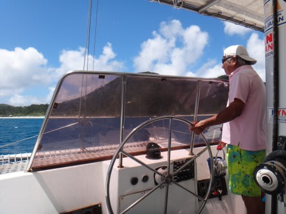
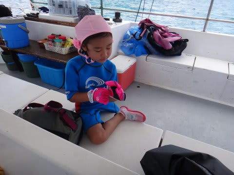
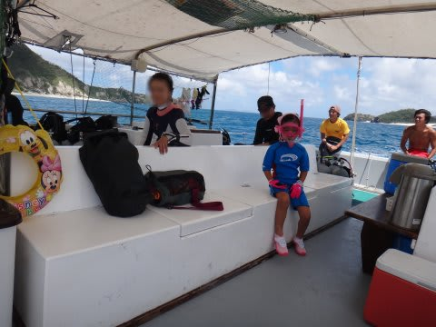
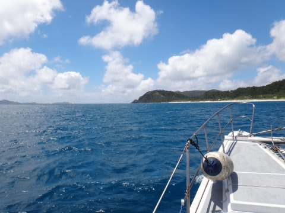
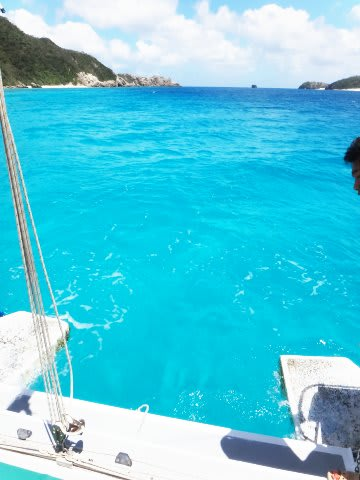
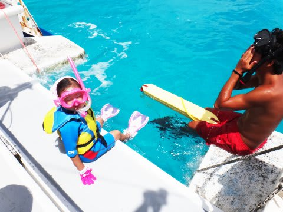
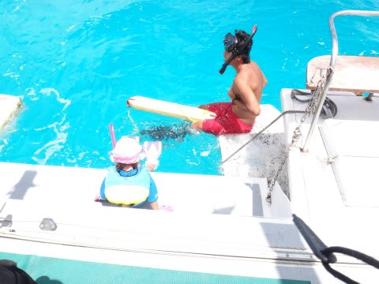
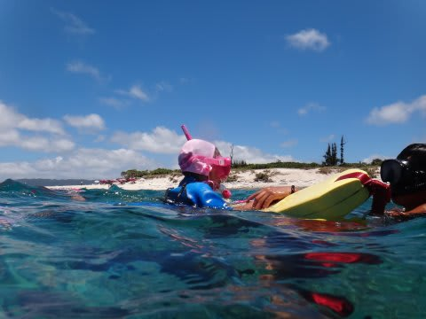

# 2013年7月　子連れ座間味ダイビング旅行記その4…座間味の海へ

📅 投稿日時: 2013-07-25 01:03:13

っつーことで．

座間味の港を出港したティンガーラ号．

オーナー，ガイドの泰平さん，アシスタントの雄大さんの3人のスタッフが

運航するこの船を，今日は我が家族だけで貸切という，超ゼイタクな一日です．

ボートは1本目のダイビングポイントへ向かいますが…

出航した直後というのに．

娘は，もうシュノーケリングする気満々ですね～．

買ったばかりのウェットスーツをさっそく着こんで…

しっかりグローブまでつけてます．

なんだかもう，準備は万端ですね～．

本日は，アシスタントの雄大さんが一日中，娘の面倒を見てくれる…

ということなんですが．

いきなり娘を慣れてない人に預けるのはあれなので．

私は1本目のダイビングに行かず，娘と一緒に泳ぐことに．

ということで．

ダイビングポイントに到着すると．

海の色がきれいですね～．

きれいな海を見て．

「泳ぐ～っ！およぐ～っっ！！！！」

と，ガマンできない状態の娘．

今回は，アシスタントの雄大さんがフロートを持ってサポートしつつ．

一緒に泳いでくれることに．

で．

とりあえず，ダイビングポイントですから．

足がつくような，浅い軟弱な海ではないです．

さらに，台風の吹き返しで多少波も出てますし．

1本目は大事をとって．ライフジャケットを着せましょうか…

さて．

娘にとって，今年初の海水浴．

…っていうか，シュノーケリングです．

シュノーケルは，ちょっと間違えると

海水を効率よく飲むための超巨大ストロー

に化してしまい，危険です．

…去年，ちょっとやっただけのシュノーケリング，

大丈夫かな～．

とりあえず，

最初はフロートにつかまって様子見から…
