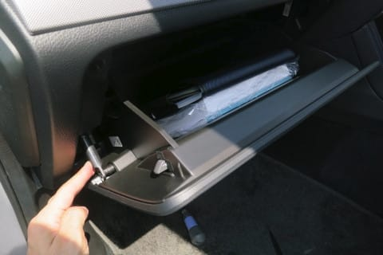
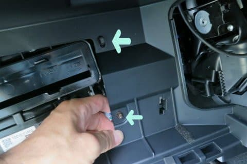

# プロジェクトX2第2章…LEVORG E型にKENWOODナビ連動ETCを取り付ける！助手席側インパネ分解方法

📅 投稿日時: 2018-08-02 02:32:59

🏷️ カテゴリ: [車](cba0e8330b3f2ded7c1addfacc75d4547.md)

ってなわけで．

ETC車載器をグローブボックス内に着けることに

決めたわけですが．

この赤マーク部分に車載器を取り付ける場合．

ETC車載器の後ろに接続するケーブルを

通すため．

水色に塗った部分に，穴を開けなくてはなりません…

そのためには．

また，ばらさないといけないわけですね…！←なんだかばらせることを

喜んでないか？ばらすのが手段じゃなく，目的化してきたのでは？

ということで，まずはグローブボックスを外します．

最初にこの部分のダンパーを外します．

手で押さえている，ダンパーが刺さっている

部分を．

素直に外れる方向に引っ張れば外れるので…

あとは，グローブボックスの両端の壁を挟むようにして．

蓋が開く限界よりちょっと引っ張ってやると．

ポコンと外れます．

そのあとは，このインパネパネル．

こいつは，横の隙間に爪を突っ込んで．

手前に引っ張れば…

驚くほど簡単に外れます．

次は，ドアモールをちょっとだけ外して…

あ，これも引っ張れば簡単に外れていきます．

そして．

このサイドパネル．

こいつも，爪を突っ込んで，

この写真にあるように横に引っ張れば

簡単に外れます．

その次は，インパネ下のガード．

こいつも，ねじ止めされてないので．

下に引っ張るだけで外れます．

…そして．

最後の大物．

助手席側インパネ下部を外すのですが…

まず，ここにあるネジを外して．

そのあとは，この写真で示すネジを

外していきます…

で．

このネジ計5本を外したら．

それだけで外れると思ってはいけません．

次に，天井に着いているグローブボックスの

照明を外さなくてはなりません．

これは，照明がついているパーツを下側に

軽く引っ張ると…

こんな感じで外れます．

そのあとは，奥についているハーネスクリップ

2か所．

こいつを向こう側に押し込んで

外してやります．

ここまでやれば．

ようやく，助手席側インパネ下部を

外せます…！

助手席側インパネ下部を外すとこんな感じですが…

この，手で触っているのがグローブボックス照明．

外したインパネ下部はこんな感じですが…

この矢印部分の穴に，グローブボックス照明が

嵌ってます．

こいつを外し忘れないように…

さて．

これにて助手席側インパネがばらせたので．

こいつを加工して，ETCが取り付けられるように

しましょうか…

（続く）←一体，ナビが全部取り付けられるまで何回の連載が続くんだ…？？
